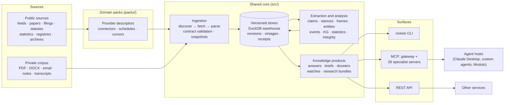

# Noesis

**Noesis is a local-first evidence and knowledge engine for agents.** It
collects documents and structured public data, turns them into a versioned,
cited knowledge base, and serves that knowledge over MCP, a REST API, and a
CLI. It covers news, papers, filings, statutes, statistics, registries, and
private files. Every answer an agent gets back can be traced to the source it
came from, checked offline, and replayed as of any earlier point in time.

Noesis has no chat UI and no hosted service. Other programs call it: Claude
Desktop, your own agents, research tools such as Modulo, and other services.
It runs on one machine with an embedded DuckDB warehouse. It needs no Docker,
cloud account, API key, or model download to start.

> Noesis began as **NeuroNews**, a news-analytics pipeline. It has since become
> a general knowledge engine. News is now one of 31 domain packs. Deprecated
> `NEURONEWS_*` names still work (see [Configuration](#configuration)).

---

## Contents

- [What Noesis is, and what it is not](#what-noesis-is-and-what-it-is-not)
- [The evidence contract](#the-evidence-contract)
- [How it works](#how-it-works)
- [What it knows about: domain packs](#what-it-knows-about-domain-packs)
- [What it can do](#what-it-can-do)
- [How to use it](#how-to-use-it)
- [Getting started](#getting-started)
- [Configuration](#configuration)
- [Argument-mining models](#argument-mining-models)
- [Contributing](#contributing)
- [Status and history](#status-and-history)
- [Documentation](#documentation)

---

## What Noesis is, and what it is not

| Noesis **is** | Noesis **is not** |
|---|---|
| An evidence layer that agents call through tools | A chatbot, a hosted SaaS, or a model wrapper |
| A versioned store that keeps sources, revisions, claims, and provenance | A search index that discards the original after indexing |
| A system that says `uncited`, `unverifiable`, or "insufficient evidence" | An oracle that always returns an answer |
| A set of domain packs over one shared core | A news dashboard (that was NeuroNews) |
| A local tool whose private corpus stays on your machine by default | A service that uploads your documents |
| Deterministic and replayable: the same inputs as of the same time give the same answer | A best-effort pipeline whose results drift silently |

---

## The evidence contract

These rules are tested in the code and specified in versioned contracts under
[`contracts/`](contracts/). They hold on every surface: CLI, MCP, and REST.

- **Every factual line is cited or visibly `uncited`.** A citation points to an
  exact locator in a retained source: a character offset, page, section, or
  version. Uncited lines are flagged, never hidden.
- **Answers can refuse.** `kb_answer` returns a
  [`noesis-answer-v1`](contracts/noesis-answer-v1.md) evidence plan. Each
  statement lists supporting and contradicting citations separately. When the
  evidence is not enough, the answer says so explicitly.
- **Claim checks have three outcomes: `supported`, `contradicted`, or
  `unverifiable`.** A claim with no matching data is reported as unverifiable,
  not guessed.
- **Corroboration counts independent origins, not articles.** Ten outlets
  reprinting one wire story count as one probable origin
  ([Evidence Independence Graph](contracts/noesis-evidence-independence-v1.md)).
  Unknown provenance stays unknown.
- **Numbers carry their uncertainty.** Every headline number from inference
  comes with an interval, `n`, the method, and its assumptions. Model outputs
  state their `prediction_mode`.
- **Knowledge is versioned.** Sources, statistical releases, statutes, and
  registries are stored as revisions and vintages. A question can be asked
  "as of" a date and replayed later. Silent edits, corrections, and takedowns
  are detected, not overwritten.
- **Results are portable and can be checked offline.** Answers, claims, and
  integrity records export as content-addressed
  [evidence bundles](contracts/noesis-evidence-bundle-v1.md). The recipient
  verifies a bundle without a network connection or a warehouse.
- **Partial results are labelled.** A missing model, provider, credential, or
  table produces an explicit degraded or partial-coverage result. It is never
  reported as success.

---

## How it works



1. **Sources arrive through packs.** A domain pack declares providers: which
   sources to fetch, how to page through them, and how often. Private files
   skip the packs and go straight to ingestion.
2. **Ingestion is uniform.** Every connector follows the same
   `discover → fetch → parse` contract and produces records that are validated
   against versioned schemas. Records that fail validation are rejected and
   logged, not dropped silently. Fetched pages are snapshotted and fetched
   again later, so edits and takedowns show up.
3. **The stores are versioned.** DuckDB is the single-writer authority. Derived
   indexes (vector, graph, search) are rebuilt from it and never replace it.
4. **Extraction turns text into structure.** This includes claims, stances,
   frames, actors, entities, events, relations, quantities, and places. Each
   result records the extractor version, so it can be rebuilt selectively.
5. **Knowledge products are assembled with receipts.** Answers, briefs,
   dossiers, timelines, and research bundles cite the exact revisions they
   used.
6. **Every surface uses the same implementation.** The CLI, MCP tools, and
   REST routes call the same Python functions, so their results agree.

The system diagram with ingestion and claim-check sequence diagrams is in
[docs/architecture/overview.md](docs/architecture/overview.md).

---

## What it knows about: domain packs

Subject knowledge ships in **domain packs**. `packs/` holds 30 bundles with
about 100 provider descriptors. Each bundle is classified by
[ADR-004](docs/architecture/decisions/ADR-004-pack-taxonomy.md) into one of
nine domains ([`packs/taxonomy.json`](packs/taxonomy.json)):

| Domain | Bundles |
|---|---|
| Governance and law | `legal` (statutes, courts, sanctions), `political` (legislation, elections, lobbying, campaign finance), `procurement`, `funding-grants`, `humanitarian` |
| Society and population | Reached through providers in other bundles: demographics, labour, housing, justice and education statistics |
| Economy and markets | `economics`, `market` (instruments, prices, filings, corporate actions, insurance), `corporate-ownership`, `onchain`, `products` |
| Earth and environment | `geospatial`, `climate-environment`, `weather`, `natural-hazards`, `energy`, `agrifood`, `fisheries` |
| Science and knowledge | `science` (literature, citations, methodology, mathematics), `astronomy`, `materials`, `chemicals`, `linguistics` |
| Health | `clinical-evidence` (trials, medicines, surveillance, health capacity) |
| Technology | `technology` (vulnerabilities, standards, patents), `oss-ecosystems`, `engineering-safety` |
| Culture and leisure | `sports`, plus cultural-collection and media-metadata providers |
| Information and investigation | `news`, `osint`, plus web archives from `platform` |

The taxonomy has two more axes:

- **Record shapes:** statistical series with vintages, registry and identity
  records, events and notices, versioned documents, observations, and places.
- **Themes** that cut across domains: security and defence, transport and
  mobility, and climate.

`platform` is shared infrastructure and has no domain.

Coverage is measured, not claimed. [ADR-005](docs/architecture/decisions/ADR-005-domain-coverage-program.md)
splits the nine domains into 89 subdomains, and each provider names the ones
it covers. Today 66 are covered by fixture-tested providers. The other 23 are
gaps, scheduled in the
[domain coverage program](docs/roadmaps/domain-coverage-program.md). Offline
coverage and live coverage are reported separately.

Packs share one core: stores, identity review, monitoring, and composition. A
pack adds sources, vocabulary, enrichers, and workflow templates without
changing core code. A test enforces the admission rule. A new source must name
its domain and record shape, and it joins an existing bundle when that cell
already exists. Every domain has a guide under [docs/guides/](docs/guides/),
with a source audit that records licensing and coverage limits.

Knowledge graphs can also be **provisioned at runtime**. An agent can stand up
a namespaced graph with its own storage and pipelines, within quotas and
behind an approval gate. The finance and legal domains were first built this
way.

---

## What it can do

### Answer with evidence

- **Cited answers** (`ask`, `kb_answer`) that list supporting and
  contradicting evidence per statement, or refuse.
- **Briefs** and **semantic change briefs**: bounded summaries across domains,
  and ranked before/after changes with evidence-linked explanations.
- **Unified knowledge query** across local, temporal, memory, and federated
  sources, with explicit partial coverage.
- **Evidence bundles** and **research packages** that are content-addressed,
  optionally signed or encrypted, and verifiable offline.

### Mine arguments and claims

- Claim detection, stance classification, frame analysis (economic, security,
  humanitarian, legal, political, scientific, other), and extraction of actors
  and policy positions.
- **Claim evolution timelines:** stable claim states, lineage, successor
  matching, and semantic diffs.
- An **epistemic status engine:** statement kinds, evidence-calibrated
  assessments, and reviewed overrides.
- Fact-check linkage, a contradiction ledger, and checks of quantitative
  claims against statistical series.

### Check that sources are intact

- An **integrity ledger** that combines cited snapshots, silent-correction
  detection, image reuse, C2PA content-credential status, and checks that
  prose matches figures.
- **Citation preservation:** policy-gated archiving, link-rot monitoring, and
  re-checking that a citation still supports its claim.
- **Source identity and ownership:** stable source ids, reversible aliases,
  control that changes over time, and independence analysis. Outlets are
  scored for framing diversity, attribution rate, and stance neutrality.

### Model the world

- **Knowledge graph** with entity resolution, merge and split history that can
  be reversed, communities, and centrality.
- **Event model:** immutable events, multilingual mentions, competing
  accounts, and timelines.
- **Quantitative semantic layer:** versioned metrics and units, release
  vintages, exact transformations, and comparability checks.
- **Geospatial:** versioned places and boundaries, and geocoding that keeps
  ambiguous matches visible instead of picking one.
- **Ontology alignment**, **cross-language knowledge** that keeps the original
  text beside translations, and **multimodal evidence** (media, OCR,
  transcripts, and links between them).

### Keep knowledge current

- **`noesis sync`** runs enabled subscriptions through the same indexing
  workflow, one bounded pass at a time.
- **Claim Watches** and **subscriptions** emit change events after each
  committed watermark. Polling resumes from an opaque cursor, without gaps or
  duplicates.
- **Evidence freshness and decay** policies, **anomaly detection** with
  alerts, **continuous maintenance** with lease-safe scheduling, and
  **retention** with legal holds, verifiable checkpoints, and atomic restore.

### Run research and investigations

- **Ten information intake modes:** Awareness, Exploration, Deep Research,
  Decision Support, Problem-Solving, Creation, Externalization,
  Internalization, Iteration, and Maintenance. Each runs as a durable session
  with a time budget, versioned references, and an optional handoff to Modulo.
  See [intake modes](docs/subsystems/intake-modes.md).
- **Research projects, recipes, and loops:** persistent projects, typed
  declarative workflow DAGs, and checkpointed execution with replay receipts.
- **Hypothesis Workbench**, **research-gap discovery**, **systematic
  reviews**, **forecasts**, and **decision records** that link evidence to
  choices.
- **OSINT investigation:** entity dossiers, relationship paths, reconstructed
  timelines, and provenance traces. Sensitive tools are off by default and sit
  behind a review gate ([OSINT abuse analysis](docs/security/osint-abuse-analysis.md)).
- **Analytics as tools:** anomaly detection, lead–lag, narrative clustering,
  coverage forecasting, semantic drift, and significance testing. Every result
  reports its uncertainty.

### Govern the knowledge base

- **Transactions:** a deterministic preview, an atomic commit, audit replay,
  and compensating rollback for knowledge changes.
- **Schema registry:** immutable runtime schemas, compatibility checks,
  crosswalks, and reversible migrations.
- **Namespaces:** deterministic export and import with redaction, signatures,
  and encryption.
- **Access-bound views:** retrieval that denies by default, lineage with
  redactions, and exports bound to a named recipient.
- **Scoped memory** for agents, with provenance, lifecycle management, and a
  contradiction policy.

---

## How to use it

### CLI

The `noesis` command is the stable, local entry point
([contract](contracts/noesis-cli-v1.md), [guide](docs/guides/cli.md)):

| Command | Purpose |
|---|---|
| `init`, `doctor` | Create a private workspace and check its health |
| `ingest` | Add a file or source; runs `ingest → extract → resolve → index` |
| `ask`, `brief` | Cited answer from a domain; bounded brief across domains |
| `watch …`, `watches` | Create, poll, scan, and replay durable Claim Watches |
| `sync` | Run one bounded pass over enabled subscriptions, or `--daemon` |
| `export answer`, `export claim`, `verify` | Produce and verify portable evidence bundles |
| `namespace export`, `namespace import` | Move a knowledge namespace between machines |
| `serve` | Start the MCP gateway, specialist servers, or REST API |

### MCP

Most agent hosts need only the **`noesis` gateway**. `noesis serve` exposes it
at `http://127.0.0.1:8100/mcp`. It provides a small everyday tool set:
`domains`, `add`, `search`, `ask`, `brief`, `documents`, `claims`,
`inspect_source`, `coverage`, `watch`, `inbox`, `explore`, `research`, and
`export`.

Each subsystem is also available as a specialist FastMCP server under
`tools/*_mcp/`, declared in [`.mcp.json`](.mcp.json):

| Server | Focus |
|---|---|
| `noesis` | Default gateway (above) |
| `noesis-catalog` | Discovery of capabilities, domains, packs, and readiness, filtered by permission |
| `noesis-knowledge-engine` | Intake modes, research projects and recipes, declarative API ingestion, extractor versions, events, artifact rebuilds |
| `noesis-kb` | Versioned KB search, answers, evidence, diffs, integrity, and briefs |
| `noesis-pipeline` | Connectors, ingestion stages, documents, and pipeline analytics |
| `noesis-arguments` | Claims, stances, frames, actors, and outlet clustering and scoring |
| `noesis-kg` | Entities, relations, communities, centrality, and corrections |
| `noesis-statistics` | Statistical series, claim-versus-data checks, and the data-check ledger |
| `noesis-osint` | Corroboration, reliability, contradictions, dossiers, paths, timelines, and image provenance |
| `noesis-sources` | Source profiles, trustworthiness, comparison, and outlet clusters |
| `noesis-research` | Citation graph, venue credibility, and literature claims |
| `noesis-market` | Market analytics: instruments, prices, filed facts, metrics, and insurance |
| `noesis-onchain` | Read-only on-chain observations and probable address clusters (no attribution) |
| `noesis-provisioning` | Lifecycle of namespaced knowledge graphs |
| `noesis-domain-packs` | Enable and disable packs, and run enrichers |
| `noesis-blog-feeds` | Atom and RSS watchlists and digests |
| `noesis-subscriptions` | Saved queries, change events at committed watermarks, and delivery outbox |
| `noesis-transactions` | Previews, atomic commits, audit replay, and compensating rollback |
| `noesis-schema-registry` | Versioned schemas, compatibility, crosswalks, and reversible migrations |
| `noesis-namespaces` | Namespace packages, verification, conflict previews, and atomic import |
| `noesis-federation` | Bounded read-only SQL, vector, graph, and remote MCP federation |
| `noesis-memory` | Scoped agent memory with provenance and lifecycle |
| `noesis-contracts` | List, get, and validate data contracts |
| `noesis-lineage` | Namespaces, nodes, lineage, impact, and run history |
| `noesis-schema` | Warehouse tables, schemas, and REST routes |
| `noesis-dataset` | Argument-mining training-dataset inspection |
| `noesis-monitoring` | Current and historical pipeline metrics |
| `noesis-security` | Security posture, secret and TLS checks, backups, and DB permissions |

Servers use stdio by default. Streamable HTTP is opt-in, and bearer-token
auth fails closed: a server refuses to start if it cannot enforce the token.
Read tools open the warehouse read-only. Mutations need explicit scopes and go
through the transaction boundary of their subsystem.

### REST API

The same subsystems are served over HTTP by FastAPI (`src/api/`) for clients
that do not use MCP. Routes are imported behind feature flags, so a missing
optional dependency disables its routes instead of breaking startup. The one
bundled browser client is the **market research workspace**
(`/api/v1/market/workspace`, source in [`apps/market-research/`](apps/market-research/)).
It is a dependency-free page over the authenticated company-dashboard API.

For transport, auth, and worked examples, see
[docs/integration/mcp-and-api.md](docs/integration/mcp-and-api.md).

---

## Getting started

### 1. Clone and create an environment

```bash
git clone https://github.com/Ikey168/Noesis.git
cd Noesis
python -m venv .venv
source .venv/bin/activate
```

### 2. Install the local-first CLI

```bash
python -m pip install -e ".[minimal]"
noesis init --non-interactive
noesis doctor
```

This creates a private local DuckDB workspace. It needs no Docker, cloud
services, API key, or model download.

### 3. Ingest, ask, and verify

```bash
noesis ingest examples/quickstart/moon-mission.md --domain local
noesis ask "What was the mission result?" --domain local
noesis export answer \
  --domain local \
  --question "What was the mission result?" \
  --include-private \
  --output answer.bundle.json
noesis verify answer.bundle.json
```

`noesis ingest` runs the bounded `ingest → extract → resolve → index`
workflow. If no claim classifier is available, indexing still commits and
reports degraded coverage. `noesis ask` then answers only from extracted
claims or paper abstracts, and otherwise refuses. No model is downloaded
automatically.

### 4. Keep subscribed knowledge current

```bash
noesis sync                       # one bounded pass
noesis sync --daemon              # persistent loop, every 5 minutes by default
noesis sync --dry-run --json      # inspect the next pass without network or writes
```

`sync` fetches only subscriptions you have enabled and advances watches. It
does not start Deep Research, run source-pack jobs, or pay for data.

### 5. Serve agents

```bash
python -m pip install -e ".[server]"
noesis serve                      # MCP gateway at http://127.0.0.1:8100/mcp
noesis serve --surface kb-mcp     # specialist KB server
noesis serve --surface api        # REST API
```

### 6. Try the end-to-end demos

These run offline on synthetic fixtures:

| Command | Shows |
|---|---|
| `make evidence-showcase` | Answers, receipts, and offline bundle verification ([guide](docs/guides/evidence-showcase.md)) |
| `make knowledge-engine-reference` | The deterministic path from ingest to export, with recovery and watermarks ([guide](docs/guides/knowledge-engine-reference.md)) |
| `make policy-monitor` | Revision detection, origin-aware corroboration, a stale-guidance watch, and a verified bundle ([guide](docs/guides/policy-monitor.md)) |

Advanced model, scraper, Airflow, dbt, MLflow, and container recipes are still
supported. See [legacy and advanced entry points](docs/development/legacy-entry-points.md)
or run `make legacy-help`.

---

## Configuration

**Local-first defaults.** Every external service has a localhost default.
Canonical variables use the `NOESIS_` prefix. `NEURONEWS_*` aliases still work
with a deprecation warning until Noesis 2.0 (not before 2027-09-01).

```text
NOESIS_DB_PATH         data/local_warehouse.duckdb   # DuckDB warehouse
S3_ENDPOINT_URL        http://localhost:9000          # MinIO, optional
```

**Optional dependency profiles.** The base install needs only DuckDB and
schema validation. Heavier capabilities are separate extras in
[`pyproject.toml`](pyproject.toml): `server`, `optional-sources`,
`optional-conversion`, `optional-linkage`, `optional-redaction`, `archives`,
`workflow-models`, and others. Installing an extra never downloads paid
credentials or model weights.

**Feature flags.** These are off by default:

| Flag | Enables |
|---|---|
| `NOESIS_OSINT_GATED_TOOLS` | Sensitive OSINT tools |
| `NOESIS_AGENT_API` | Analyst and investigator agent routes |
| `NOESIS_AGENT_TRANSPORT` | `local` (in-process) or `live` (real MCP host) for agent runs |
| `NOESIS_PACKS_ADMIN` | Routes for installing and publishing packs |
| `NOESIS_ENABLED_PACKS` | Domain packs to load at startup |
| `NOESIS_MCP_TRANSPORT=http` | Streamable HTTP for MCP servers (with `NOESIS_MCP_AUTH_TOKEN` or `NOESIS_MCP_AUTH_TOKENS_FILE`) |

**Privacy.** A private corpus is never uploaded by default. Text leaves the
machine only if you set both `NOESIS_JEV_ENABLED=true` and
`TYPESAFE_API_KEY`. That makes TypeSafe Jev (`api.typesafe.ai`) the primary
claim, stance, and frame classifier, with local models as the fallback. See
the [private-corpus quickstart](docs/guides/private-corpus.md).

---

## Argument-mining models

These are the local classifiers. They are the default, and the fallback when
Jev is enabled. This table does not measure Jev.

| Model | F1 | Notes |
|---|---|---|
| ClaimDetector | 0.9197 | Pinned ClaimBuster backend; external F1: FEVER 0.8038, LIAR 0.9418, AVeriTeC 0.9305 |
| StanceClassifier | 0.3288 macro | Pinned zero-shot NLI; promotion is blocked until a real human gold set exists |
| FrameClassifier | 0.4193 macro | Zero-shot NLI; recall on political and humanitarian frames is still weak |

The internal six-source test set is synthetic and labelled as such. It does not
replace the pending human evaluation. Run `make models` to fetch weights. If
weights are missing, inference fails closed with an error that says what to
do. See the [full benchmark report](docs/subsystems/argument-mining-benchmarks.md).

---

## Contributing

Read [`AGENTS.md`](AGENTS.md) and [`CONTRIBUTING.md`](CONTRIBUTING.md) first.
In short:

- Run `mise run check` before calling a core change done. Model, live-provider,
  browser, and large integration gates are separate. Report them only when you
  actually ran them.
- Version schemas under [`contracts/`](contracts/) and add compatibility tests
  with each change.
- Record durable decisions as ADRs in
  [`docs/architecture/decisions/`](docs/architecture/decisions/). Supersede an
  ADR instead of rewriting it.
- Preserve source text, annotations, claims, citations, provenance, and
  stable ids. Never commit credentials, private corpora, or production
  databases.
- New sources follow the pack admission rule in
  [ADR-004](docs/architecture/decisions/ADR-004-pack-taxonomy.md). See
  [extending Noesis](docs/guides/extending-noesis.md).

---

## Status and history

| Era | What happened |
|---|---|
| Phases 1–6 | NeuroNews: scraping, NLP, sentiment, knowledge graph, event detection, dashboards, the argument-mining pipeline, and outlet analysis |
| Phase 7 | A generative adaptive UI was built, then retired. Noesis is headless. |
| Phase 8 | Every subsystem became an MCP tool server |
| Phase 9 | Agent-provisioned, namespaced knowledge graphs, and an audited agent host |
| Phase 10 | Beyond news: the [knowledge-engine pivot](docs/architecture/knowledge-engine-pivot.md) to generic documents, the research pack, and the OSINT surface |
| Since | Knowledge Engine 1.0, intake modes, [pack and workflow composition](docs/architecture/pack-workflow-composition.md), and 31 domain packs classified by ADR-004 |

**Open work:**

- Closing the 23 subdomain gaps in the domain coverage program.
- A two-annotator human gold set, and a stance model trained on it.
- Live-provider and human acceptance for many pack guides.
- End-to-end Modulo journeys for several intake modes.

Each guide separates what fixtures prove from what still needs live or human
evidence.

---

## Documentation

- [Documentation index](docs/index.md): the full map by topic
- [System architecture](docs/architecture/overview.md) and
  [MCP rearchitecture](docs/architecture/mcp-rearchitecture.md)
- [Integrate via MCP and API](docs/integration/mcp-and-api.md)
- [CLI guide](docs/guides/cli.md) and [CLI contract](contracts/noesis-cli-v1.md)
- [Pack taxonomy (ADR-004)](docs/architecture/decisions/ADR-004-pack-taxonomy.md)
  and [source packs](docs/guides/source-packs.md)
- [Information intake modes](docs/subsystems/intake-modes.md)
- [Project structure](docs/development/project-structure.md)

---

## Contact

- Bug reports and feature requests: GitHub Issues
- Contributions: pull requests are welcome
- Email: ikey168@proton.me
- License: MIT
