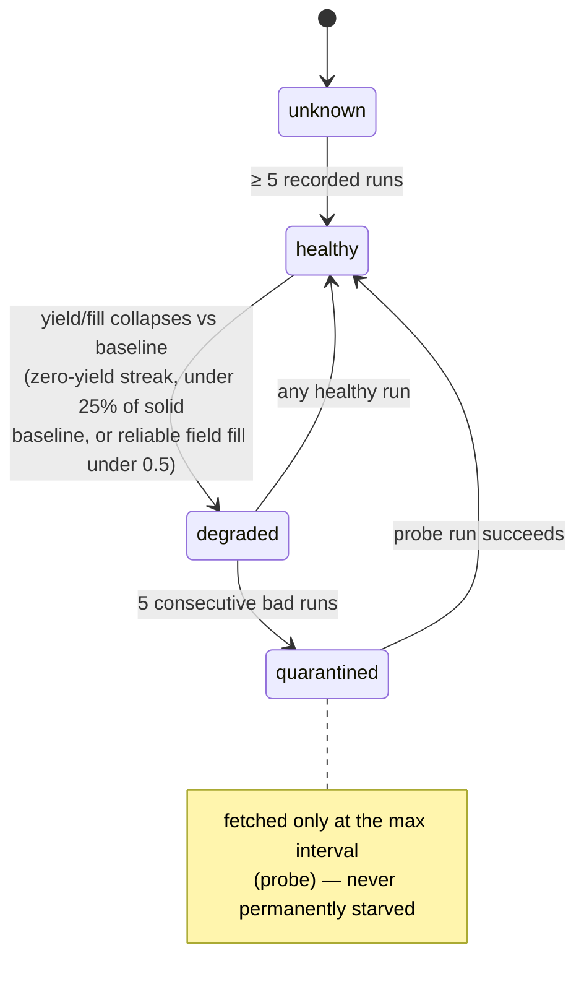
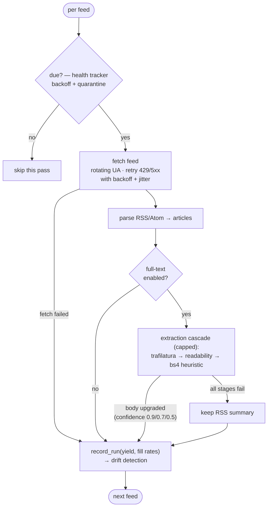

# Adaptive scraping

Scrapers fail silently: a site redesign breaks a CSS selector, the page still
returns 200, extraction yields nothing, and the source goes dark —
indistinguishable from "no news today". The adaptive layer turns each of
those failure modes into a detected, recoverable state. It was built as a
composable loop (issues #877–#884):

| Concern | Module |
|---|---|
| Detect breakage | `src/ingestion/source_health.py` — drift detection |
| Keep content flowing | `src/ingestion/extract.py` — extraction cascade |
| Handle JS-ification | `src/scraper/adaptive/escalation.py` |
| Respect server pressure | `src/scraper/adaptive/rate.py` — AIMD limiter |
| Fix the selectors | `src/scraper/adaptive/selector_repair.py` |
| One config to patch | `src/scraper/sources_config.py` (canonical `config_async.json`) |

## Source health: from silent failure to state machine

`SourceHealthTracker.record_run()` is called after every harvest pass with
the extraction yield and per-field fill rates. Deterministic thresholds
compare the recent window against the source's **own baseline** (median of
prior runs), so a quiet news day is not confused with breakage:



The same tracker drives **adaptive scheduling**: consecutive empty runs back
the recrawl interval off exponentially (bounded), a productive run snaps it
back to the base cadence, and quarantined sources get probe-only fetches.

## A harvest pass, end to end

The live feed harvester (`src/ingestion/scrapy_integration.py`) composes the
pieces per feed. Everything below the due-check is best-effort: failure at
any stage degrades (summary body, skipped feed) rather than aborting the run.



The cascade is the safety net for selector-based extraction everywhere: each
stage must clear a minimum-content bar or falls through, optional
dependencies degrade gracefully, and results carry a `method` + `confidence`
so downstream consumers can tell selector-extracted content (1.0) from
generic recovery (≤0.9).

## The async engine: escalation and pacing

Two static behaviors in `src/scraper/async_scraper_engine.py` became
outcome-adaptive, with the decisions in pure-logic policies:

- **HTTP → Playwright escalation.** An HTTP pass that extracts nothing is
  retried through the browser in the same run; `promote_after` consecutive JS
  successes sticky-promote the source to JS-first, and consecutive empty JS
  passes demote it (consecutive evidence both ways — no flapping).
- **AIMD rate limiting.** Each source has a learned inter-request delay:
  429/503/errors/slow responses multiply it (bounded), successes decay it
  back to the configured floor (`1 / rate_limit`). Sources are isolated — a
  hostile source backing off never slows the others.

## Closing the loop: selector self-repair

When drift detection flags a source, the repair pipeline can fix the
selectors themselves — auditable at every step, driven by any agent with an
LLM callable:

```mermaid
sequenceDiagram
    participant H as SourceHealthTracker
    participant A as Agent
    participant R as selector_repair
    participant L as LLM (injectable)
    participant G as extract.py (ground truth)
    participant C as config_async.json

    H-->>A: source degraded (drift alert)
    A->>R: repair_source(cfg, sample page HTML, llm)
    R->>G: extract_article(html) → reference text
    R->>L: reduced HTML + target fields
    L-->>R: candidate selectors (strict JSON)
    R->>R: validate: bs4-apply each candidate,<br/>token containment vs reference
    Note over R: wrong-block candidates<br/>(nav/boilerplate) rejected
    R-->>A: RepairResult(accepted, selectors, report)
    A->>C: apply_to_config(...) — explicit,<br/>separate step; never implicit
```

The proposal is only **accepted** when both `title` and `content` candidates
validate against the generic-cascade extraction of the same page; persisting
into the canonical config is a deliberate second call, so a bad proposal can
never silently rewrite scraping behavior.

## Operational entry points

```bash
# Live harvest with full-text bodies and adaptive scheduling
python -m src.ingestion.scrapy_integration --full-text --adaptive

# Source-health state (default JSON store)
cat data/source_health.json
```

Both flags are opt-in; without them the harvester behaves exactly as before.
