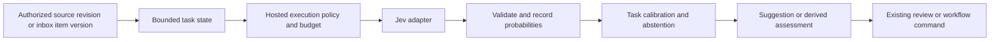

# Jev integration assessment

Reviewed 2026-09-23 against `/home/ik/Noesis`, HEAD `2f48b425`, including the current working tree. This is a source and documentation assessment, not a live Jev benchmark. No credentials, model installation, or hosted inference were used. Existing working-tree changes were left intact.

Implementation tracking: [Jev milestone](https://github.com/Ikey168/Noesis/milestone/41) and [complete issue checklist #1620](https://github.com/Ikey168/Noesis/issues/1620). The milestone contains 20 use-case issues, five shared implementation issues, and the tracker; bundled assessment areas are split into independently reviewable tasks.

## Implementation status by work group

Local audit recorded 2026-09-23. “Implementation verified” means the listed
local paths, authorization/failure behavior, and focused regression checks
were reviewed; it does not mean that a human evaluation gate passed. No issues
were closed by this audit.

| Group | Scope | Status |
|---|---|---|
| G1 | #1641–1645: source planning, claim detection, check-worthiness, sentiment, attribution | Pending owner verification |
| G2 | #1636–1640: review priority, methodology, identity, revision significance | Pending owner verification |
| G3 | #1630–1634: systematic-review screening and evidence adapters | Pending owner verification |
| G4 | #1620 and #1626–1629: Awareness, stance, frames, epistemic kind | G4 implementation verified locally; #1626–1629 human-label gates and #1620 parent acceptance remain open |
| G5 | #1579–1583: maintenance/workflow foundation, MCP, migration, acceptance | Pending owner verification |
| G6 | #1574–1578: problem-solving through iteration | Pending owner verification |
| G7 | #1569–1573: parent plus Awareness, Exploration, Deep Research, Decision Support | Pending owner verification |

G4 checklist review:

| Issue | Verified local behavior | Acceptance still unmet |
|---|---|---|
| #1626 | The semantic preview evaluates one bounded item against its Awareness objective, batches relevance/urgency/action questions, makes novelty unknown without versioned comparisons, returns source excerpts/reason codes, rechecks item and comparison versions, and only accepts via the existing transactional triage command. Unavailable results cannot become discard actions; discard also requires a pinned relevance calibration gate. | No independent human-labeled comparison with keyword preview exists, so missed-important recall, false-discard behavior, and operational gains are unmeasured. |
| #1627 | The stance adapter preserves the exact sentence/index/span, topic, bounded context, source binding, Choice distribution, vendor confidence, and durable receipt. Calibration requires matching model and rubric identities and supports abstention. | No held-out human labels establish minority-class precision/recall, per-content-type results, or performance on quoted positions, opposing speakers, implicit stance, and topic changes. |
| #1628 | Frames use independent per-label Noul questions over overlapping windows, keep raw scores separate, preserve tail coverage, derive `other`/dominant in code, abstain on incomplete coverage, and reject mixed model/rubric versions across windows. The evaluator reports multilabel and baseline metrics. | No held-out human labels establish macro/per-label F1, subset/dominant accuracy, or content-type performance. |
| #1629 | The public MCP suggestion path checks caller text against an authorized exact source version before remote disclosure and sends only the matched span. The callable-backed store adapter retains evidence assessment and review history; kind labels carry `truth_verified: false`, and selected-label probability is distinct from vendor confidence. | No human-labeled comparison with regex rules covers attribution, hedging, and quoted allegations. No live hosted quality/cost/latency evidence exists. |

Focused verification for G4: `PYTEST_DISABLE_PLUGIN_AUTOLOAD=1 python -m pytest -q tests/unit/kb/test_intake_decisions.py tests/unit/argument_mining/test_jev_adapters.py tests/unit/kb/test_epistemic_decisions.py tests/unit/kb/test_epistemic.py tests/unit/tools/test_jev_epistemic_mcp.py tests/unit/tools/test_jev_epistemic_registration.py tests/unit/evaluation/test_jev_evaluation.py tests/unit/evaluation/test_jev_epistemic.py` passed 56 tests. Targeted `ruff check` passed. The default global pytest entry point fails during plugin loading because installed `pytest-asyncio` imports the removed `pytest.FixtureDef` symbol; disabling plugin autoload allowed the focused synchronous tests to run. No live provider request was made. Keep #1626–1629 and #1620 open until their human-evaluation and parent-milestone gates pass.

Recommendation: introduce an optional hosted decision provider. Start with Awareness suggestions and evaluate stance/frames in parallel with their current local backends. Epistemic statement classification has the cleanest existing injection point. Research screening and evidence support are valuable subsequent applications, with stronger validation requirements.

## Verified provider capabilities

Jev evaluates text or structured textual state through `POST /v1/systemone`. Choice selects a supplied option; Score evaluates an ordered rubric; Noul estimates a yes/no probability. Independent questions can share one request. Questions cannot consume each other's answers within that request. [TypeSafe introduction](https://docs.typesafe.ai/introduction), [primitives](https://docs.typesafe.ai/primitives).

As checked today, the documented version is `jev-1.13.0`. Price is $0.042 per million input tokens, with free output tokens. Limits are 64k total request tokens and 32k for state plus the longest question. Published throughput is 1,200 requests/minute and 250,000 tokens/second, subject to change. English is its strongest language. The vendor says customer requests/responses are not training data; enterprise ZDR is separately described. Pin the version and verify account limits and data handling before deployment. [Models](https://docs.typesafe.ai/models).

Choice supports up to 255 options; Score supports 2–10 levels and may return a fractional value. Validate the response against the submitted question schema. [API reference](https://docs.typesafe.ai/api).

Choice/Score confidence summarizes distribution shape; it is distinct from the probability of the chosen label. Noul has no separate confidence field. Noesis must store these quantities separately and calibrate task thresholds. [Confidence](https://docs.typesafe.ai/confidence).

The vendor documents weaknesses with arithmetic, date comparisons, indirect reasoning, irrelevant long context, and adversarial input. Typed answers do not establish factual correctness or resistance to prompt injection. It does not generate explanations, summaries, or arbitrary extraction text. [Jev 1.13 limitations](https://docs.typesafe.ai/model-jaggedness/jev-1.13).

## Ranked integration map

Priorities are recommendations based on the inspected code, not measured Jev performance. Paths are relative to the repository root.

| Priority | Surface and existing behavior | Proposed Jev role | Integration boundary and acceptance concern |
|---|---|---|---|
| P1 | `src/kb/intake_inbox.py:signal_preview` performs literal keyword matching; `triage_awareness_batch` commits supplied decisions | Noul relevance, Choice recommendation, separate urgency/novelty judgments over an item plus a bounded session objective | Add a semantic suggestion operation alongside keyword preview. Return original item/version references. Use the existing transactional decision method only when the workflow accepts a suggestion. Measure missed important items, particularly false discard recommendations. |
| P1 evaluation | `src/argument_mining/models.py:StanceClassifier` uses fine-tuned or pinned NLI models | Choice over supportive/critical/neutral/ambiguous with an explicit topic and surrounding context | Evaluate a task-specific backend. Preserve original sentence indices, source references, abstention and model provenance. Compare minority-class performance, not just accuracy. |
| P1 evaluation | `src/argument_mining/frames.py:FrameClassifier` is multilabel | One Noul per frame, sharing bounded source text | Never replace multilabel frames with a single Choice. Learn individual thresholds; derive dominant frame in code. Compare the newer calibrated full-window path as well as the legacy wrapper. |
| P1 pilot | `src/kb/epistemic.py:classify_statement` has regex defaults and an injected classifier/pin interface | Choice over existing fact/report/allegation/estimate/forecast/opinion/hypothesis/normative/unknown | Use the existing callable seam. Classify how a statement is expressed; a `fact` label is not verification of its truth. Keep evidence support assessment separate. |
| P2 | `src/kb/systematic_reviews.py:screen` records independent reviewer decisions at title/abstract and full-text stages | Per-criterion satisfied/not-satisfied/not-reported suggestions, combined into include/exclude/pending advice | Publish a machine assessment, not a fabricated independent reviewer vote. Keep protocol revisions, missing-full-text rules, adjudication, reasons and source locators. Optimize inclusion recall before automating any exclusion. |
| P2 | `services/rag/retriever.py:_apply_reranking` and `src/kb/context.py` fuse, rank and select evidence | Score relevance for a retrieved shortlist; Noul direct relevance or answer-bearing content | Benchmark against MiniLM/Qwen and current fusion. Adapt the actual rerank result/interface and retain diversity, evidence policies, source independence, token limits and citations. No whole-corpus API scoring. |
| P2 | `src/kb/nli.py`, `nli_evidence.py`, `claim_links.py:_link_pair` assess entailment and contradiction | Choice for premise/hypothesis relation on candidate evidence pairs | Preserve both directions for duplicate detection, span coverage and abstention. Temporal correction/retraction logic remains in code. Start as a secondary assessment because errors propagate into the graph. |
| P2 | `src/kb/intake_modes.py:route_mode` maps explicit boolean answers with precedence and override | Infer suggested answers or a suggested mode from free-text intent | Add a free-text interpretation step before existing routing. Preserve explicit user choices. Asking Jev to remap already supplied booleans adds cost without benefit. |
| P2 | `src/kb/review_inbox.py:create` consumes declared impact/uncertainty and routes reviews | Score semantic impact; use measured task uncertainty and disagreement to prioritize review | Keep machine assessments visibly distinct from independent human votes. Existing source authorization, target hashes and review resolution remain authoritative. |
| P2 | `src/kb/methodology_provenance.py:extract/assess` processes supplied statements with locators | Classify supplied study passages/candidates by methodology, limitation or study-design category | Extract candidate spans first; Jev chooses labels/options. Exact values, statistics, locators and final assessment formulas stay in current code. |
| P3 | `src/integrations/entities.py`, `reuse.py`, `src/kb/source_identity.py` support entity/source matching | Choice/Noul adjudication over an existing small candidate set, with none/uncertain | Use after candidate generation. Queue merge/alias proposals through review; do not make Jev an identity authority or treat similarity as source independence. |
| P3 | `src/ingestion/corrections.py:classify_change` classifies revisions; `src/kb/diffs.py` aggregates changes | Semantic significance and changed-claim suggestions for bounded before/after passages | Keep byte hashes, revision identity, chronology and authoritative correction/retraction records. Evaluate whether the semantic signal improves brief relevance. |
| P3 | `src/kb/source_planner.py:preview` filters capabilities and optimizes acquisition | Score semantic relevance of already eligible sources to a stated objective | Apply only after permissions, credentials, license, availability and budget filters. Keep exact optimization and execution in code. |
| P3 | `src/argument_mining/models.py:ClaimDetector` already has a relatively strong recorded result | Optional factual-claim/check-worthiness judgments on presegmented sentences | Benchmark separately: check-worthiness and factual-claim presence are different tasks. Avoid replacing the local classifier without demonstrated gains. |
| P3 | `src/nlp/sentiment_analysis.py`, `src/argument_mining/metadata.py` | Sentiment classification or selection among already extracted attribution candidates | Lower priority than epistemic/stance/frame work; retain span extraction, authors and original attribution. Evaluate whether contextual gains justify a hosted dependency. |

## Evidence that changes the priority

The checked-in [argument mining benchmark](../subsystems/argument-mining-benchmarks.md), generated 2026-09-03, reports 1,076 held-out cases:

| Task | Recorded metric |
|---|---:|
| Claims | F1 0.9197 |
| Stance | Macro F1 0.3288 |
| Frames | Macro F1 0.4193 |

These historical figures motivate evaluating stance and frames first; they do not predict Jev's results. Current code also contains `src/evaluation/mining_runtime.py:CalibratedMiningBackend`, which uses full evidence windows and frozen calibration policies. Compare against that path rather than treating the historical report as the only baseline. The legacy frame wrapper takes a 1,500-character snippet, while the calibrated backend explicitly requires complete source coverage.

At the `2f48b425` review baseline, no Jev/TypeSafe integration was found in the searched Python sources, service code, project dependency manifest or YAML configuration. The current working-tree implementation status is recorded above.

## Recommended implementation structure

Proposed files below do not yet exist. Names describe a design, not completed work.

1. `src/integrations/decisions.py`: provider-neutral request/result types with explicit probability semantics, task/rubric identity and unavailable/abstain outcomes.
2. `src/integrations/typesafe.py`: the only component that knows the System One request schema, model ID and response validation. Prefer direct HTTP through Noesis's durable provider transport if practical. The official Python SDK is an alternative behind this adapter; keep it optional. [Python SDK](https://docs.typesafe.ai/sdk/python).
3. `src/kb/decision_runtime.py`: hosted execution authorization, source binding, durable result receipts, deadline and spend accounting, task-specific policy application, replay and artifact publication.
4. Small task adapters: start with `src/kb/intake_decisions.py` and an epistemic classifier adapter; add stance/frame adapters after their evaluation. Avoid provider HTTP calls spread across domain modules.
5. `contracts/schemas/jsonschema/noesis-typed-decision-v1.json` plus a registered contract: preserve task, source references, labels/distribution, vendor confidence, selected-label probability, applied policy, status and provenance.
6. Follow existing CLI and MCP conventions. `src/noesis_cli/optional.py` exposes current optional analysis; `tools/knowledge_engine_mcp/intake.py` owns intake tools. Add explicit suggestion/evaluation surfaces and schema/catalog entries only where needed. A new FastAPI router is unnecessary for the initial CLI/MCP pilot.

Suggested flow:

### Existing boundaries that need deliberate adaptation

`src/kb/optional_runtime.py:OptionalAnalysisStore` already implements useful source authorization, revision rechecks, idempotent runs and artifact publication. Reuse its design. Its allowlist does not accept Jev, and its source format requires committed document revisions. Awareness items instead have item/source versions, so the runtime needs an explicit binding variant or a separate intake adapter; inventing document revisions would break provenance.

`src/evaluation/runtime_jobs.py` deliberately removes provider credentials from worker environments and returns `hosted_inference_used=False`. Adding a dispatch branch alone would fail authentication and misreport execution. Use an explicit hosted executor with honest remote/hosted flags. Do not add general credential inheritance to local workers.

`src/ingestion/provider_execution.py:DurableHTTP` is the existing candidate for reusable host restrictions, durable budgets, request capture and secret separation; `src/ingestion/hosted_acquisition.py:HostedClient` demonstrates explicit hosted opt-in. Generalize shared transport pieces if necessary rather than identifying Jev as an ingestion source. Durable request/response storage must also respect retention and namespace access for private inference text. `DurableHTTP` has no implicit retry, whereas the SDK retries by default: one layer should own retries and reserve budget for every attempt.

`src/kb/epistemic.py` accepts pinned classifier metadata, but its callable receives only statement text. Source authorization and hosted data eligibility must be checked by the caller/runtime before invoking it. Do not manufacture a model weight SHA to satisfy a revision field; record the provider version and rubric revision with clear semantics.

### Result semantics and failure behavior

- Store selected-label probability and vendor confidence as different fields. For binary claim output, distinguish `p_claim` from probability of the predicted class. Existing claim implementations already warrant care: the pretrained and fine-tuned branches do not populate confidence identically for negative predictions.
- Keep unknown/not-reported/abstention distinct from a negative judgment. Frames need independent probabilities; mutually exclusive stance needs a categorical distribution. Do not transfer thresholds between these representations.
- Preserve model version returned by the API, task/rubric hash, calibration policy hash, exact source revisions or inbox versions, coverage/truncation details, usage, attempts, latency, and applied action policy.
- Cache by namespace/authorized ownership, source versions, model version, task and rubric. Authorization must still be checked on replay. Recheck source currency before publishing a result.
- Bound request size, concurrency, total elapsed time and spend. On timeouts, rate limits, invalid responses or overload, return an explicit unavailable result or a documented local fallback with separate provenance. Never convert an API failure into false, irrelevant, or discard.
- Batch related questions over the same bounded state. Keep unrelated documents and different access scopes separate; batching the entire inbox would increase distraction and disclosure.
- Derive explanatory text from fixed reason codes and source spans selected from known candidates. Jev cannot produce the free-text rationale demanded by some existing write APIs; do not invent a rationale or citation from confidence alone.

## Where Jev should not be added

- **Evidence authority:** source independence, corroboration counts, citation resolution, provenance hashes and evidence aggregation remain grounded in stored records. A model judgment can be an assessment of evidence, not a new independent source.
- **Exact operations:** quantitative claim checks, unit conversions, date ordering, revision/watermark comparison, budget enforcement and optimizer constraints remain deterministic.
- **Access and mutation authority:** scopes, allowed tool lists, review identities, entity merge approvals, namespace isolation and transaction rules remain existing code decisions.
- **Generation/extraction infrastructure:** summaries, authored reports, arbitrary entities/quotes/URLs, embeddings, OCR, transcription and translation continue to use suitable extractors/models. Jev may select or classify their outputs.
- **Notebook isolation:** `src/kb/analysis_runtime.py` runs credential-free notebooks with networking disabled. Keep hosted inference outside that container boundary.
- **OSINT presentation:** `src/osint/contradictions.py` joins already stored conflict edges to citations. Improve relation generation upstream, rather than introducing an extra model call in this read surface.

## Evaluation and rollout

Stage 1: build a small offline evaluation harness and source-bound adapter; run only on approved public or explicitly eligible data. Store Jev suggestions without letting them affect production decisions. Freeze prompts and task schemas before scoring a held-out split.

Stage 2: evaluate Awareness relevance/triage and stance/frames. Add epistemic classification as a small independent pilot. Use current human-reviewed cases across news, blogs, papers, transcripts, books and notes; stratify by language, length and rare labels. Add irrelevant text, embedded instructions, negation, quoted allegations and missing evidence cases. Check semantic decision accuracy separately from schema correctness.

Stage 3: enable suggestions in the inbox and review tools after quality and operating cost are measured. Evaluate research screening and retrieval next; require stronger precision for evidence-support assertions and stronger recall for screening exclusions. Broaden only when there is task-specific evidence of benefit.

Reuse `scripts/benchmark_models.py`, `src/evaluation/mining_runtime.py` policy fitting/evaluation, `src/evaluation/reranker_benchmark.py`, and the existing intake/systematic-review/NLI tests. For grounded answers, `src/kb/answer_support_eval.py` explicitly distinguishes human support judgments from structural correctness. Model-generated labels must not be passed off as human gold data.

Measure macro/per-label F1, critical false negatives, Brier score/calibration error, accuracy at accepted coverage, abstention and fallback rates, p50/p95 end-to-end latency, and actual tokens/cost including retries. Use separate calibration and test partitions. Set task-specific acceptance thresholds before the final comparison; no single vendor confidence threshold is sufficient.

Transport/contract tests should cover malformed or missing answers, extra labels, non-finite probabilities, incomplete distributions, timeout/429/529, deadline exhaustion, denied hosted processing, missing credentials, stale source versions, cross-namespace replay, and duplicate run IDs. Preserve existing workflow checks for registered independent reviewers and missing full text.

Illustrative input-only arithmetic at the published rate: 1,000 tokens cost $0.000042; 10,000 items at 2,000 tokens each cost $0.84. This excludes retries, repeated windows, storage, orchestration and human review. It is a planning estimate, not a measured Noesis bill. Given Noesis's existing local backends, the case for adoption should rest on quality or workflow gains as well as hosted token price.

## Concrete first implementation scope

One shared hosted decision adapter, one versioned receipt contract, an Awareness suggestion operation, and a stance/frame comparison harness. Add the small epistemic classifier pilot after the common runtime is working. Preserve local defaults, collect representative measurements, then decide task by task whether Jev should enter the accepted decision path.

Remaining uncertainties: Noesis-specific Jev accuracy/calibration, effective account access and throughput, private-data retention suitability, and real end-to-end latency/cost. These require a bounded live pilot; source inspection cannot resolve them.
