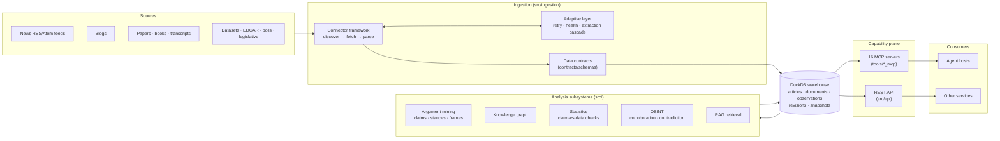
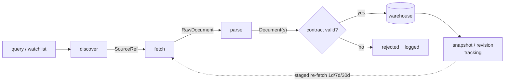
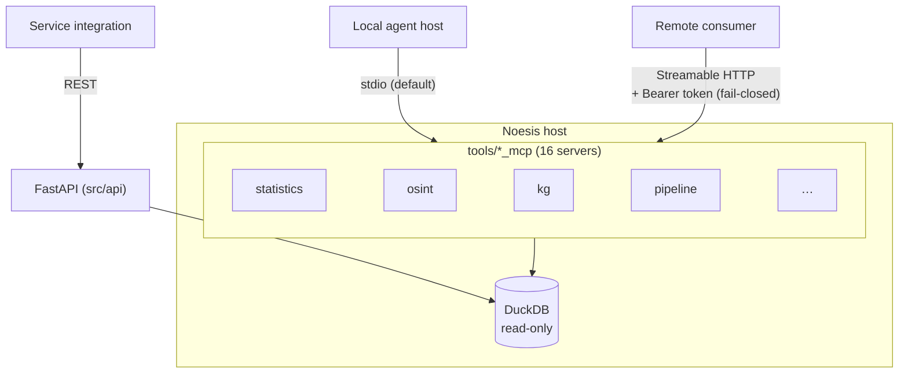
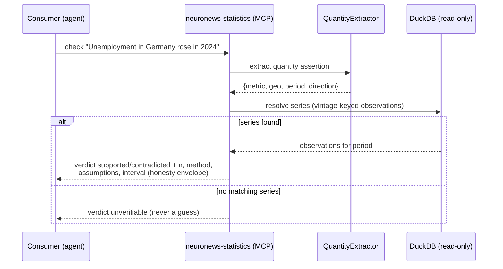

# System architecture

Noesis is a **headless knowledge engine**: it ingests documents from many
source types, mines evidence and arguments out of them, stores everything in a
local DuckDB warehouse, and exposes the results through two machine-facing
surfaces — **16 MCP tool servers** and a **FastAPI REST API**. There is no
bundled UI; consumers are agent hosts (Claude Desktop, custom agents) and
other services.

## The system at a glance

Key properties, enforced in code rather than by convention:

- **Read-only exposure.** MCP tools open the warehouse read-only and degrade
  to an empty-but-valid payload when a table is missing — they can never
  collide with a writer.
- **Statistical honesty.** Analytic tools return `n` / `method` /
  `assumptions` and an interval on any headline figure
  (`src/analytics/honesty.py`).
- **Evidence discipline.** OSINT outputs cite every rendered line; uncited
  items are flagged, never hidden (`src/osint/evidence.py`).
- **Three-valued verdicts.** Claim checks answer `supported` /
  `contradicted` / `unverifiable` — a claim with no matching data is
  *unverifiable*, never a guess.
- **Review gate.** Sensitive OSINT tools stay off unless
  `NOESIS_OSINT_GATED_TOOLS` is set ([osint-review-gate](../osint-review-gate.md)).

## Ingestion pipeline

Every source type implements the same connector contract
(`src/ingestion/connectors/base.py`), so the pipeline downstream of a
connector is uniform:

- Connectors exist for news feeds, blogs, papers, books, audio/video
  transcripts (with keyframe OCR), datasets, EDGAR filings, polls, and
  legislative sources; each registers via `@register_connector`.
- Fetched pages are snapshotted and revision-tracked
  (`src/ingestion/snapshots.py`, `corrections.py`); a staged re-fetch
  scheduler (`refetch.py`) revisits documents at 1d/7d/30d to catch silent
  edits and takedowns.
- The adaptive layer (health tracking, extraction fallback, escalation) is
  documented separately in [adaptive-scraping.md](adaptive-scraping.md).

## Capability plane: MCP + REST

Each subsystem ships as a standalone FastMCP server under
`tools/<name>_mcp/server.py`, declared in `.mcp.json`. Transport is decided
per process by `src/mcp_host/transport.py`:

- **stdio is the default** — a consuming project spawns the server process.
- **HTTP is opt-in** via `NOESIS_MCP_TRANSPORT=http`, one port per server;
  setting `NOESIS_MCP_AUTH_TOKEN` attaches a Bearer verifier and the server
  *refuses to start* if the installed fastmcp cannot enforce it (fail-closed).
- The REST API mirrors the same subsystems for non-MCP consumers; routes are
  feature-flag imported so a missing optional dependency degrades gracefully
  (`src/api/app.py`).

Connection examples and the full server table live in
[integrate-via-mcp.md](../integrate-via-mcp.md).

## Worked flow: checking a quantitative claim

The statistics plane shows how the disciplines compose end to end:

Observations are stored **vintage-keyed** (`series_id, period, as_of`), so a
check can be replayed against the data as it existed at any point in time.

## Where things live

| Layer | Code |
|---|---|
| Connectors + adaptive ingestion | `src/ingestion/` |
| Scraper engines (Scrapy + async/Playwright) | `src/scraper/` |
| Analysis subsystems | `src/argument_mining/`, `src/knowledge_graph/`, `src/analytics/`, `src/osint/`, `src/nlp/` |
| Warehouse access | `src/database/` |
| MCP servers | `tools/*_mcp/`, `.mcp.json`, `src/mcp_host/` |
| REST API | `src/api/` |
| Data contracts | `contracts/schemas/` |
| Agent host (provisioning + osint planes) | `src/agent/` |
