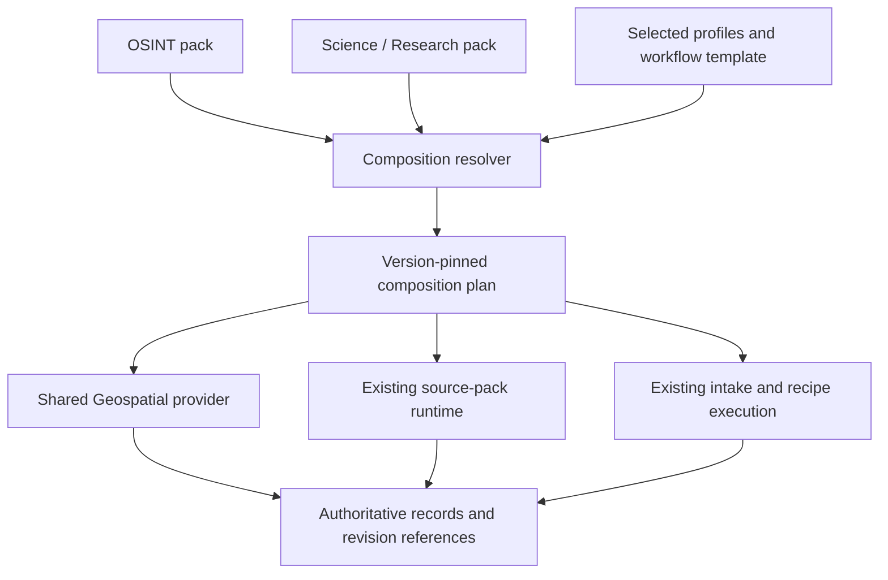

# Pack and workflow composition architecture

Status: implemented, 2026-09-26 (C01–C09, tracker
[#1788](https://github.com/Ikey168/Noesis/issues/1788)). Proposed 2026-09-25.
Implemented surfaces: the v2 manifest, provider descriptor, plan, readiness and
activation-receipt contracts with v1 adapters (`src/composition/contracts.py`);
the pure resolver (`resolver.py`); plan-derived catalog facts, readiness and
shadow mode (`readiness.py`, `src/mcp_host/catalog.py`); the lifecycle
coordinator with journal, generation switch, retention and one enablement
authority (`lifecycle.py`, `store.py`, ADR-003); source-upgrade, schedule,
shared-run and account-limit integration (`sources.py`); workflow templates and
the authorized dispatcher (`workflows.py`, `dispatcher.py`); and every shipped
bundle migrated under it (`bundles.py`, `migration.py`): OSINT, Science
(Research, cultural collections, mathematics, patents), Geospatial (with
transit), Legal, Economics (with LEI), Political, Technology (with standards),
Market, Products, Funding & Grants and the code-registered Research bundle.
What intentionally remains on the legacy path is listed under
[Legacy paths after migration](#legacy-paths-after-migration).

## Purpose and architectural decision

Introduce an explicit composition contract between existing packs, capabilities,
sources, and workflows while their integration boundaries are still tractable.
Users can enable useful bundles such as OSINT, Science/Research, or Music without
forcing each bundle to own independent stores, connectors, or workflow engines.

A pack is a versioned distribution and enablement bundle. It can contribute or
reference capabilities, source packs, ontology modules, profiles, and workflow
templates. These contributions may be used by several packs. A profile selects
vocabulary, sources, query defaults, and templates for a subject or task; it does
not become a storage boundary. Intake mode, subject, and capability are separate
choices: Deep Research can investigate music, mathematics, or company ownership.

OSINT remains a useful user-facing bundle of investigative capabilities, sources,
and templates. It can consume Geospatial alongside Science/Research. Geospatial
owns its spatial implementation; neither consumer owns the other consumer's data.
Existing names need not be renamed to fit an exclusive taxonomy.

## Current foundation and gaps

This is a bounded inspection of the following implementation surfaces, not a
claim that every subsystem has been audited.
The C01 ownership map is in [pack-composition-inventory.md](pack-composition-inventory.md);
journal storage and reconciliation are decided in
[ADR-003](decisions/ADR-003-composition-journal-storage.md).

| Current surface | Observed behavior | Composition gap or reuse |
| --- | --- | --- |
| [DomainPack](../../src/domains/base.py) and [registry](../../src/domains/registry.py) | Bundles routes, enrichers, flags, capability names, and ontology metadata; registration and enablement are process-local. | Capability strings do not resolve providers, dependencies, or compatible contracts. |
| [Manifest](../../src/domains/pack_format.py) and [installer](../../src/domains/pack_install.py) | Declarative v1 manifests; installation enables a pack, replacement uninstalls the old registration first. Panels and planner keywords are now advisory. | Need staged replacement, explicit contribution ownership, and shared dependency lifecycles. |
| [Source packs](../../src/ingestion/source_packs.py) and [runtime](../../src/ingestion/source_pack_runtime.py) | Durable versions, enablement, acquisition preflight, budgets, cursors, schedules, and receipts. | Reuse execution and persistence; connect pack dependencies to these authoritative records. |
| [Source upgrades](../../src/ingestion/source_pack_upgrades.py) | Inspect dependent projects, templates, schedules, and reports before applying a version change. | Extend impact analysis to compositions; preserve existing source upgrade controls. |
| [MCP catalog](../../src/mcp_host/catalog.py) | Discovers actual tools and evaluates authorization, backend, data, and transport state; some pack mapping is hard-coded. | Add explicit capability-to-provider bindings and composition explanations to this catalog. (Done in C04; the hard-coded mapping remains the fallback for tools no plan binds.) |
| [Schema registry](../../src/kb/schema_registry.py) and [ontology](../../src/kb/ontology.py) | Versioned modules, compatibility/dependency logic, and evidence-backed crosswalks. | Reuse contract identities and version semantics; avoid a parallel ontology registry. |
| [KB domains](kb-domains.md) | Content views can overlap; namespace backings have separate lifecycles. | Preserve this distinction. A pack or profile is not a namespace or authorization grant. |
| [Intake sessions](../subsystems/intake-modes.md) and [investigation templates](../guides/investigation-workflows.md) | Coordinate existing artifacts; templates pin source packs. | Reference a resolved composition alongside existing session/project state. |
| [Research recipes](../guides/research-recipes.md) | Python runner invokes supplied adapters. Public MCP runner records caller-supplied fixtures with `actions_executed: false`. | Real authorized dispatch is a separate required integration stage, not a capability unlocked by manifest changes. |

## Composition model

| Element | Responsibility | Example |
| --- | --- | --- |
| Capability contract | Stable behavior, input/output contracts, required context, and side-effect classification. | Spatial containment or scholarly citation lookup. |
| Provider binding | Concrete registered implementation of a capability, with version, contracts, scopes, and readiness probe. | Existing Geospatial service exposed through its MCP tools. |
| Source pack | Acquisition declarations, mappings, source revisions, and runtime configuration. | Existing Berlin vector source configuration. |
| Ontology module | Versioned concepts and explicit mappings onto canonical records. | Mathematical theorem or music recording vocabulary. |
| Workflow template | Parameters, required capabilities, ordered work, and expected artifacts. | Investigate an event's location or review place-related literature. |
| Profile | Optional reusable selection of sources, vocabulary, and workflow defaults. | Mathematics within Science/Research. |
| Pack | Installable bundle of the above contributions and references. | OSINT or Science/Research. |
| Composition plan | Exact resolved versions, provider choices, dependencies, and reasons for one selection. | OSINT and Research sharing one spatial provider. |

Profiles may be inline pack configuration until reuse warrants an independently
versioned artifact. Workflow templates reference the existing recipe/session
machinery. No new generic scheduler or parallel research-project ledger is needed.

This is a logical architecture. It does not require splitting the process,
adding a database, or creating one MCP server per capability or pack.

## Record ownership and cross-pack exchange

Each record type has one authoritative service/store. A composition references
records through that owner's API, even when the implementation remains in its
current directory. Logical ownership should be established before code moves.

- Places and geometry stay in the existing Geospatial stores. Acquired features
  retain links to their native source revisions and spatial projections.
- Documents, evidence, entities, and temporal records retain existing identities.
  An item can participate in several profiles without being ingested again merely
  because a second pack is enabled.
- Sessions, projects, decisions, and reports retain their current owners. Modulo
  keeps its planning and note state; Noesis composition references do not migrate it.
- Domain-specific objects may have typed extensions and dedicated stores when
  their invariants require them. The architecture does not force a proof
  dependency, recording, and legal case into one generic entity payload.

Cross-pack references identify owner capability, native record kind/ID, namespace,
and immutable revision where available. Compatibility adapters preserve existing
reference contracts; unsupported revision addressing is explicit. Resolve current
access at read/export time. Store source assertions and derived links with their
evidence, rather than copying another store's mutable rows into a pack-owned truth.

Identity sharing is bounded by namespace and source entitlement. Two owners may
legitimately retain separate records. Matching content does not authorize merging
private data, treating conflicting assertions as identical, or publishing it.

## Proposed contracts and resolution rules

The five contracts below are specified (C02): each has a JSON Schema under
`contracts/schemas/jsonschema/`, runtime validation in
`src/composition/contracts.py`, and an identity in the schema registry.

| Contract | Schema | Registry identity |
| --- | --- | --- |
| Pack composition manifest | `noesis-pack-v2.json` (`pack_format: noesis-pack-v2`) | `schema:pack-manifest@2.0.0` |
| Provider descriptor | `noesis-capability-provider-v1.json` | `schema:capability-provider@1.0.0` |
| Resolved composition | `noesis-composition-plan-v1.json` | `schema:composition-plan@1.0.0` |
| Readiness assessment | `noesis-composition-readiness-v1.json` | `schema:composition-readiness@1.0.0` |
| Activation receipt | `noesis-composition-activation-receipt-v1.json` | `schema:composition-activation-receipt@1.0.0` |

The shared fixture corpus is `tests/fixtures/composition/contracts/`. The v1
adapters (`adapt_v1`, `adapt_domain_pack`) express every existing `pack.json`
and code-registered `DomainPack` as a v2 manifest; fields v1 cannot express
are listed under `adapter.supplied_defaults` and the resolver treats them
conservatively.

1. **Pack composition manifest:** immutable ID/version/hash; contributed modules;
   required capability IDs and contract ranges; optional features; source,
   ontology, profile, and workflow references; compatibility aliases. Extend the
   v1 format through a versioned successor and explicit v1 adapter. Unrecognized
   critical requirements fail validation rather than silently disappearing.
2. **Provider descriptor:** implementation identity/version; capabilities and
   exact input/output contract references; registered tool/service bindings;
   store ownership; required scopes/context; side-effect, idempotency, and
   readiness declarations. Manifests cannot name arbitrary code to execute.
3. **Resolved composition:** root selections; complete dependency graph; exact
   manifest/schema/provider hashes; selected optional features; binding decisions;
   output contracts; compatibility aliases; canonical digest and resolver version.
4. **Readiness assessment:** caller/namespace context; assessed plan digest;
   observation time; per-operation prerequisites, blockers, and optional omissions.
   Dynamic credentials and live health are not immutable facts in the plan.
5. **Activation receipt:** previous/new composition generations; affected
   registrations; existing source upgrade references; applied or failed stages;
   idempotency key and recovery status. Execution receipts stay with their owners.

Resolution is read-only and deterministic for the same manifests and policy:

- Reuse the schema registry's version rules; preserve compatible retained pins.
  Resolve against an explicit candidate set, then lock exact versions and hashes.
- Resolve required dependencies transitively; reject cycles, incompatible ranges,
  missing contracts, conflicting store ownership, and undeclared bindings.
- Choose an explicitly configured provider, or the only compatible provider.
  Multiple compatible providers without a selection yield an ambiguity result;
  registration order is never a tie-breaker.
- Optional features join the graph only when selected. Unavailable optional
  branches are visible omissions; required failures block that workflow.
- A contract range is insufficient proof of compatibility: validate the actual
  input/output bindings and declared semantic constraints. Different spatial
  algorithms, units, or evidence meanings are not interchangeable by name alone.
- Do not resolve `latest` again on resume. A provider or contract change requires
  a new plan and impact assessment; an unavailable historical provider is reported
  as unavailable for replay rather than silently substituted.

The first implementation supports one active version per provider identity in a
deployment. Conflicting major versions block composition. Side-by-side runtime
versions and multi-host coordination are deferred until demonstrated necessary.

## Installation, enablement, and execution

Installed, selected, resolved, authorized, ready, and executed are distinct states.
Installing a pack retains its manifest. Selecting it expresses deployment intent.
Neither implies network acquisition, active schedules, granted scopes, or a
successful end-to-end workflow.

The lifecycle coordinator previews the dependency closure and affected consumers,
stages registrations, verifies them, then publishes a new composition generation.
Use a durable activation journal plus an atomic generation switch for composition
state; do not claim a database transaction makes Python registrations and external
actions atomic. Failed activation preserves the previous generation; restart
reconstructs its bindings and reconciles any staged source-owner operations from
their receipts. No provider requests are performed during activation.

Shared dependencies remain active while any selected root or pinned active run
needs them. Disabling OSINT removes its selection, subscriptions, and future
workflow entry points as applicable; it must not disable the spatial provider
still required by Research. Explicit administrative provider shutdown reports
affected consumers and makes their required operations unavailable.

Schedules need explicit ownership: remove a pack-owned schedule only when that
owner requests it; retain shared schedules with remaining consumers. Acquisition
deduplication keys include the source version, query, namespace/access context,
and mapping. Aggregate provider/account limits across consumers while preserving
per-run budgets. This needs coordination with the existing source runtime, not
another acquisition loop.

Uninstall removes unused registrations and manifests according to retention/pins;
it does not delete evidence. Data deletion remains a separate retention operation.
Provider schema migrations require explicit compatibility and rollback plans;
switching an activation pointer cannot reverse a destructive data migration.

## Workflow integration and authority

An intake session selects a mode, subject profile, and workflow template. The
template declares required behavior. Resolution chooses providers and source
versions; readiness preflight checks the specific operation under the caller's
namespace, permissions, credentials, terms, data, and network policy.

Bind the result to the existing project/session and recipe run. Preserve the
current parameter validation, snapshots, budgets, checkpoints, cancellation, and
artifact ownership. The planned dispatcher invokes only registered bindings,
validates arguments/results, and rechecks authorization at every step and resume.
An installed dependency cannot grant permissions, imply source-term acceptance,
or bypass an OSINT-specific gate through a shared capability.

Read-only lookup, local mutation, acquisition, and external publication require
distinct declared effects. A successful preflight is an observation, not durable
permission to execute future actions. Aggregate output restrictions from actual
referenced evidence and recheck access when exporting or rendering results.

Retry only operations whose owner supports idempotency or a durable execution
receipt. When a worker crashes after an external effect but before recording its
checkpoint, reconcile with that receipt; if the outcome is unknown, stop the
affected step for reconciliation. Do not promise generic exactly-once execution.

The public fixture recipe path remains explicitly identifiable. Live dispatch
must have separate acceptance evidence; changing the reported execution mode
without invoking and verifying the bound operations is not implementation.

## Discovery and readiness

Extend the existing MCP catalog to answer: what provides a capability, which packs
consume it, why it was selected, what version is pinned, what data it needs, and
why a workflow is blocked or degraded. Preserve current tool IDs and aliases.

Readiness is operation-specific. Local spatial queries can work while a remote
source refresh is unavailable. Empty data, inaccessible data, missing credentials,
disabled providers, unverified live access, and failed execution remain distinct.
Dependency diagnostics must not expose inaccessible records, private profiles,
credential values, or other users' workflow selections.

## First composition to prove the design

Status: proven for OSINT + Research + Geospatial (C08,
[#1796](https://github.com/Ikey168/Noesis/issues/1796)). The shipped
`packs/osint`, `packs/science` and `packs/geospatial` manifests carry
`composition.json` overlays: OSINT contributes the `osint.location-investigation`
template, Science contributes `science.place-evidence`, and Geospatial
contributes the `noesis.geospatial` provider descriptor. Both templates bind to
that one provider. The proof runs offline through real local adapters with
fixture provider input; see the acceptance matrix below for what it
establishes and what it does not.

Use existing OSINT, Research, and Geospatial surfaces before adding a new subject.

1. Register one spatial provider with explicit contracts for the actual query
   semantics, plus the existing source pack and authoritative stores.
2. Define an OSINT location-investigation template and a Research place-evidence
   template, each consuming the same spatial capability and permitted records.
3. Resolve both selections and prove they bind to one implementation and preserve
   the same record/revision identities. Profiles contribute defaults, not stores.
4. Execute a bounded offline journey through real local adapters: source fixture
   acquisition/projection, spatial query, evidence reference, and session artifact.
   Keep mocked provider input distinct from mocked tool execution.
5. Disable one selection, revise a source/provider, revoke access, and resume an
   interrupted run. Check the other consumer, historical references, and receipts.

The initial proof establishes composition and local execution behavior. Live
provider availability and the quality of investigative conclusions require their
own checks and cannot be inferred from this fixture journey.

## Incremental delivery plan

These slices are tracked in
[#1788](https://github.com/Ikey168/Noesis/issues/1788), with one sub-issue per
slice (C01 #1789 through C09 #1797). Dependencies refer to the identifiers in
this table.

| Slice | Deliverable and boundary | Depends on | Acceptance | Status |
| --- | --- | --- | --- | --- |
| C01 | Inventory capability providers, authoritative stores, routes/tools, and existing dependency/version rules. | — | OSINT, Research, Geospatial, sources, and intake have an ownership map; unknowns are recorded. | Delivered: `pack-composition-inventory.md`, preserved-identifier fixture |
| C02 | Specify composition manifest, provider, plan, readiness, and receipt schemas plus v1 adapters. | C01 | Valid/invalid examples cover aliases, ranges, conflicting owners, effects, and critical unknown fields. | Delivered: five JSON Schemas, registry identities, v1 adapters |
| C03 | Build pure dependency and binding resolution over retained manifests. | C02 | Deterministic pins; actionable cycle, ambiguity, and incompatibility failures; no mutations or network. | Delivered: `resolver.py` |
| C04 | Extend catalog discovery and operation-specific readiness with the plan. | C03 | Correct explanations for disabled, unauthorized, empty, offline, and optional states without private-data disclosure. | Delivered: catalog composition modes, readiness, shadow report |
| C05 | Add durable composition selection, activation journal, generation switch, and dependency retention. | C03, C04 | Failure/restart retains or reconstructs a working prior generation; disabling one consumer preserves another. | Delivered: coordinator, ADR-003 journal, authority hook |
| C06 | Integrate source upgrade impact, schedule ownership, acquisition reuse, and shared budgets. | C05 | Source pins/cursors remain authoritative; incompatible upgrades are blocked; callers cannot multiply account quotas. | Delivered: `sources.py`, upgrade impact, `run_shared`, account limits |
| C07 | Bind intake/templates/recipes to plans and implement authorized execution adapters. | C04, C05 | A real bounded local journey produces owner receipts; revocation, cancellation, retry, and unknown outcomes are handled. | Delivered: workflow templates, dispatcher, step receipts |
| C08 | Prove the OSINT + Research + Geospatial composition and migration parity. | C06, C07 | Shared identities, selective disablement, upgrade impact, rollback, and legacy behavior pass the matrix below. | Delivered: `tests/unit/composition/test_acceptance.py` |
| C09 | Migrate additional bundles and update source-expansion roadmaps using the proven contracts. | C08 | Each migration names ownership, retained compatibility, and acceptance evidence before retiring its legacy path. | Delivered: generated providers and overlays, `migration.py`, funding composition, roadmap delivery state |

V1 bundles initially adapt into composition without changing their runtime
behavior. Compare catalog/plan outputs in shadow mode before switching lifecycle
ownership for a bundle. During migration each mutable setting has exactly one
authority: the legacy path until cutover, the composition coordinator afterward.
Legacy API calls after cutover delegate or return a compatibility error; they
must not silently maintain a second enabled-state ledger. A compatibility flag
may roll back bindings while retained source versions and records stay intact.

### Migration procedure and results (C09)

Every shipped bundle follows the procedure proven in C08.6, run by
`scripts/migrate_composition.py` (`src/composition/migration.py`): install the
shipped manifests and descriptors, select the bundles the legacy registry has
enabled, activate one generation, cut every bundle over, and verify that
source-pack versions, pins, checkpoints, watermarks and runs are unchanged.

| Bundle | Ownership (provider → records) | Retained compatibility | Acceptance evidence |
| --- | --- | --- | --- |
| osint, science, geospatial | C08; plus generated `noesis.osint-investigation`, `noesis.scholarly`, `noesis.cultural`, `noesis.mathematics`, `noesis.patents`, `noesis.transit` | Tool IDs, aliases and required data unchanged (`preserved_identifiers.json`); declared labels aliased in each `composition.json` | `test_acceptance.py`, `test_migration.py` |
| legal, economics, political, technology | `noesis.legal`, `noesis.economics` + `noesis.lei`, `noesis.political`, `noesis.technology` + `noesis.standards` | The code-registered domain module keeps its routes and enrichers; the manifest adds only provisioning templates (`lifecycle._registration`) | `test_migration.py::test_code_registered_twins_keep_their_domain_pack_registration` |
| market, products, energy | `noesis.market`, `noesis.products`; energy contributes no provider (panels, planner keywords and an enricher only) | v1 runtime fields carried in `legacy_v1` | `test_migration.py`, shadow report |
| research (code-registered) | `noesis.research-analytics` | `src/domains/research/composition.json` overlays the adapted DomainPack | shadow report |
| funding-grants | `noesis.funding`; binds `noesis.research-projects`, `noesis.reports`, `noesis.quantitative`, `noesis.subscriptions`, `noesis.documents` | `set_funding_bundle_enabled` delegates to the coordinator after cutover | `tests/unit/funding/test_funding_composition.py` |
| news (code-registered) | none (no capability of its own) | Adapted from its DomainPack; managed like any other root | `test_migration.py` |

Every source-pack projector has one named owner (`bundles.PROJECTOR_OWNERS`,
checked against `PROJECTORS`) and no record kind or table has two owners. The
generated descriptors and overlays are rendered from the ownership table and
checked in CI (`scripts/generate_composition_bundles.py --check`). Declared
capability labels that only run inside another operation are listed per pack
under `metadata.unbound_capability_labels`, not bound. The shadow diff has 250
disagreements, all annotated: tool pack attribution for newly bound tools (pack
attribution is not a preserved identifier) plus the C08 entries.

### Legacy paths after migration

| Path | State | Reason and owner |
| --- | --- | --- |
| `registry.enable_pack`/`disable_pack` | Delegating shim for managed bundles | Callers keep working; the coordinator is the authority. Composition. |
| `pack_install.install_manifest`/`uninstall` | Refused (`CompatibilityError`) for managed bundles | Delegating would change install/uninstall semantics. Composition. |
| `registry.load_config` | Leaves managed bundles alone | `config/domain_packs.json` still enables unmanaged packs. Domains. |
| `funding_bundle_state` table | Written only while funding is legacy-managed | Per-namespace enablement before cutover or with `NOESIS_COMPOSITION_LIFECYCLE=legacy`. Funding. |
| Catalog pack/stem tables in `src/mcp_host/catalog.py` | Kept | Fallback for tools no plan binds and for deployments that have not run the migration; `composition_mode` defaults to `off` without a composition. MCP host. |
| `NOESIS_COMPOSITION_LIFECYCLE=legacy` | Kept | Process-wide compatibility flag; `Coordinator.rollback` restores one bundle. Composition. |

A test (`test_migration.py::test_no_retired_legacy_path_changes_enabled_state_independently`)
asserts that none of these paths changes a managed bundle's enabled state
without the coordinator.

## Acceptance matrix

| Scenario | Required result |
| --- | --- |
| Two packs consume Geospatial | One selected provider; shared permitted references; no duplicate store or automatic re-ingestion. |
| OSINT disabled, Research active | Research spatial operations still work; retained evidence remains addressable under current access. |
| Required provider missing or ambiguous | Workflow blocked before execution with a specific dependency/binding explanation. |
| Optional acquisition unavailable | Permitted local analysis can run with explicit missing-source coverage. |
| Contract/ontology conflict | No silent overwrite or implicit semantic conversion; the affected composition is rejected. |
| Upgrade changes a pinned provider/source | Impact preview lists accessible dependents; historical runs retain pins; new execution uses a new plan. |
| Crash during activation | Previous active generation survives; staged operations reconcile without duplicate registrations. |
| Crash after a workflow mutation | Owner idempotency/receipt reconciles it, or the step reports unknown outcome instead of blind retry. |
| Access revoked after preflight | Execution/resume/read/export recheck authority and deny or redact as the owner contract requires. |
| Several consumers acquire from one account | Existing per-run limits and aggregated provider limits both hold. |
| Legacy manifest/session/report | Existing identity, references, and public behavior remain valid through the adapter. |
| Fixture-only public recipe run | Receipt still declares fixture execution; no claim of tool dispatch or live validation. |

Each row maps to exactly one automated test marked `composition_acceptance`
(`python -m pytest -m composition_acceptance tests/unit/composition`), which
runs in the unit-test CI lane and gates C09.

| Scenario | Test |
| --- | --- |
| Two packs consume Geospatial | `tests/unit/composition/test_acceptance.py::test_two_packs_consume_geospatial_through_one_provider` |
| OSINT disabled, Research active | `tests/unit/composition/test_acceptance.py::test_osint_disabled_while_research_stays_active` |
| Required provider missing or ambiguous | `tests/unit/composition/test_acceptance.py::test_missing_or_ambiguous_provider_blocks_before_execution` |
| Optional acquisition unavailable | `tests/unit/composition/test_acceptance.py::test_optional_acquisition_unavailable_runs_local_analysis_with_missing_coverage` |
| Contract/ontology conflict | `tests/unit/composition/test_acceptance.py::test_contract_or_ontology_conflict_rejects_the_composition` |
| Upgrade changes a pinned provider/source | `tests/unit/composition/test_acceptance.py::test_upgrade_of_a_pinned_source_or_provider_keeps_history_and_needs_a_new_plan` |
| Crash during activation | `tests/unit/composition/test_acceptance.py::test_crash_during_activation_keeps_the_previous_generation` |
| Crash after a workflow mutation | `tests/unit/composition/test_acceptance.py::test_crash_after_a_workflow_mutation_reconciles_from_the_owner_receipt` |
| Access revoked after preflight | `tests/unit/composition/test_acceptance.py::test_access_revoked_after_preflight_is_rechecked_everywhere` |
| Several consumers acquire from one account | `tests/unit/composition/test_acceptance.py::test_several_consumers_on_one_account_share_its_limit` |
| Legacy manifest/session/report | `tests/unit/composition/test_acceptance.py::test_legacy_manifest_session_and_report_keep_identity_through_the_adapter` |
| Fixture-only public recipe run | `tests/unit/composition/test_acceptance.py::test_fixture_only_public_recipe_run_declares_fixture_execution` |

**What the proof does not establish.** The journeys use fixture provider input
served through the real source-pack adapters, so they say nothing about live
provider availability, and they check composition and local execution
behavior, not the quality of investigative conclusions. Both need their own
acceptance evidence.

## Effect on the existing expansion backlog

Geospatial work separates reusable spatial behavior from concrete source setup.
Mathematics remains a Science/Research expansion: new sources, ontology, and
formal-proof capabilities can be independently referenced. Cultural collections
compose Research with Geospatial. Patents, registries, standards, and transport
reuse existing owners wherever their records and operations already fit.

Music remains a possible future bundle, not approved implementation scope, and
is not migrated or scaffolded. Its identity model and optional audio processing
would be contributions under the same contract. Funding & Grants
([#1761](https://github.com/Ikey168/Noesis/issues/1761), scoped in the
[funding roadmap](../roadmaps/funding-grants-pack-scope.md)) is implemented and
composed under these contracts (C09.4); procurement remains a suggestion. This
architecture does not automatically add other proposed subjects to the
implementation backlog.

Existing expansion issues remain in place. C09.1 audited their delivery state on
2026-09-26: each roadmap under `docs/roadmaps/` now has a dated "Delivery state"
section naming what shipped, what is partial, and the composition dependency of
the remaining work. Only Funding #1775 needed composition features, and C09.4
delivered them.

## Tradeoffs and deferred decisions

Composition adds manifest and lifecycle complexity. Limit the first resolver to
known registered providers, explicit version rules, and one deployment; validate
it with two consumers before generalizing. Keep provider semantics explicit so
the catalog cannot advertise unsupported interchangeability.

The activation journal's storage location and the startup reconciliation
boundary are settled in
[ADR-003](decisions/ADR-003-composition-journal-storage.md): composition
metadata only (`composition_*` tables in the warehouse), not a duplicate
source, ontology, or session database.

Defer arbitrary third-party executable plugins, remote installation, automatic
provider substitution, distributed activation, concurrent provider major versions,
and automatic destructive schema migrations. None is required to establish
shared capability ownership and reliable cross-pack workflows.

Confirmed at C09.5 (2026-09-26): all six remain deferred and none has its own
issue. The implementation enforces the boundaries: manifests cannot name code
(only registered bindings dispatch), installation reads local files only, the
resolver reports ambiguity instead of substituting providers, the coordinator
serves one deployment, conflicting provider majors block composition, and
switching the generation pointer never reverses a data migration.
