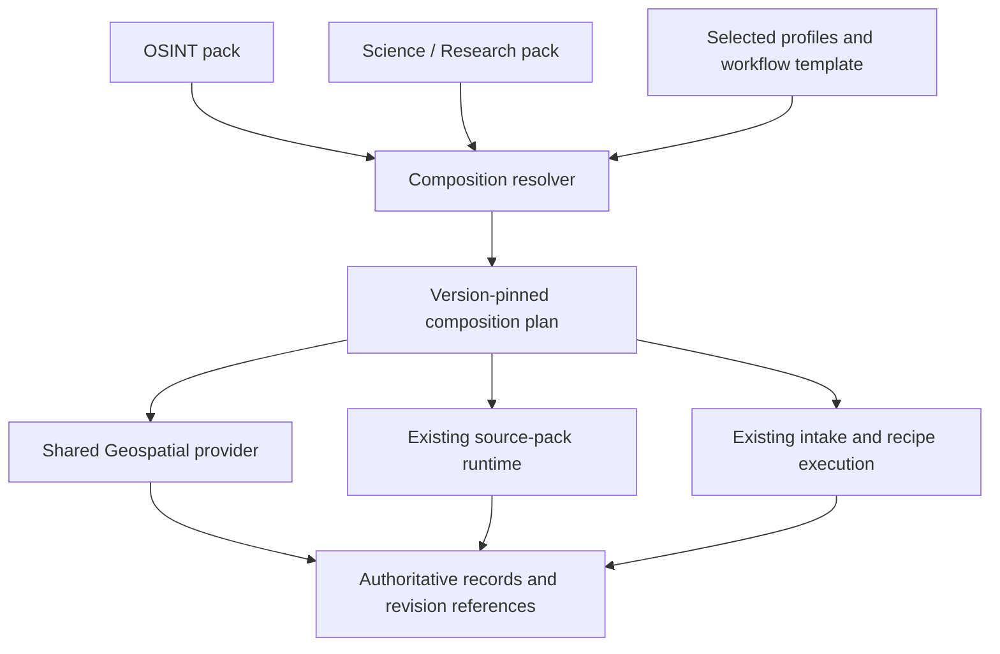

# Pack and workflow composition architecture

Status: implemented, 2026-09-26 (C01–C09, [#1788](https://github.com/Ikey168/Noesis/issues/1788)).

Implemented surfaces:
- contracts and adapter (`src/composition/contracts.py`, `adapter.py`);
- resolver (`resolver.py`);
- catalog discovery and readiness (`readiness.py`, `src/mcp_host/catalog.py`);
- lifecycle coordinator (`lifecycle.py`);
- source integration (`src/ingestion/source_pack_upgrades.py`, `source_pack_runtime.py`);
- workflow bindings and authorized dispatch (`workflows.py`, `local_adapters.py`).

All twelve bundles and all nine source-pack projectors are composition-managed.
[Composition migration](composition-migration.md) records the ownership
statements and the legacy paths intentionally kept, each with its reason and
owner. Live provider availability and the quality of conclusions remain outside
what the implementation proves.

## Purpose and architectural decision

Introduce an explicit composition contract between existing packs, capabilities,
sources, and workflows while their integration boundaries are still tractable.
Users can enable useful bundles such as OSINT, Science/Research, or Music without
forcing each bundle to own independent stores, connectors, or workflow engines.

A pack is a versioned distribution and enablement bundle. It can contribute or
reference capabilities, source packs, ontology modules, profiles, and workflow
templates. These contributions may be used by several packs. A profile selects
vocabulary, sources, query defaults, and templates for a subject or task; it does
not become a storage boundary. Intake mode, subject, and capability are separate
choices: Deep Research can investigate music, mathematics, or company ownership.

OSINT remains a useful user-facing bundle of investigative capabilities, sources,
and templates. It can consume Geospatial alongside Science/Research. Geospatial
owns its spatial implementation; neither consumer owns the other consumer's data.
Existing names need not be renamed to fit an exclusive taxonomy.

## Current foundation and gaps

The detailed ownership map, preserved identifiers and version rules are in the
[composition inventory](pack-composition-inventory.md); activation-journal
storage and startup reconciliation are settled in
[ADR-003](decisions/ADR-003-composition-activation-journal.md).

This is a bounded inspection of the following implementation surfaces, not a
claim that every subsystem has been audited.

| Current surface | Observed behavior | Composition gap or reuse |
| --- | --- | --- |
| [DomainPack](../../src/domains/base.py) and [registry](../../src/domains/registry.py) | Bundles routes, enrichers, flags, capability names, and ontology metadata; registration and enablement are process-local. | Capability strings do not resolve providers, dependencies, or compatible contracts. |
| [Manifest](../../src/domains/pack_format.py) and [installer](../../src/domains/pack_install.py) | Declarative v1 manifests; installation enables a pack, replacement uninstalls the old registration first. Panels and planner keywords are now advisory. | Need staged replacement, explicit contribution ownership, and shared dependency lifecycles. |
| [Source packs](../../src/ingestion/source_packs.py) and [runtime](../../src/ingestion/source_pack_runtime.py) | Durable versions, enablement, acquisition preflight, budgets, cursors, schedules, and receipts. | Reuse execution and persistence; connect pack dependencies to these authoritative records. |
| [Source upgrades](../../src/ingestion/source_pack_upgrades.py) | Inspect dependent projects, templates, schedules, and reports before applying a version change. | Extend impact analysis to compositions; preserve existing source upgrade controls. |
| [MCP catalog](../../src/mcp_host/catalog.py) | Discovers actual tools and evaluates authorization, backend, data, and transport state; some pack mapping is hard-coded. | Add explicit capability-to-provider bindings and composition explanations to this catalog. |
| [Schema registry](../../src/kb/schema_registry.py) and [ontology](../../src/kb/ontology.py) | Versioned modules, compatibility/dependency logic, and evidence-backed crosswalks. | Reuse contract identities and version semantics; avoid a parallel ontology registry. |
| [KB domains](kb-domains.md) | Content views can overlap; namespace backings have separate lifecycles. | Preserve this distinction. A pack or profile is not a namespace or authorization grant. |
| [Intake sessions](../subsystems/intake-modes.md) and [investigation templates](../guides/investigation-workflows.md) | Coordinate existing artifacts; templates pin source packs. | Reference a resolved composition alongside existing session/project state. |
| [Research recipes](../guides/research-recipes.md) | Python runner invokes supplied adapters. Public MCP runner records caller-supplied fixtures with `actions_executed: false`. | Real authorized dispatch is a separate required integration stage, not a capability unlocked by manifest changes. |

## Composition model

| Element | Responsibility | Example |
| --- | --- | --- |
| Capability contract | Stable behavior, input/output contracts, required context, and side-effect classification. | Spatial containment or scholarly citation lookup. |
| Provider binding | Concrete registered implementation of a capability, with version, contracts, scopes, and readiness probe. | Existing Geospatial service exposed through its MCP tools. |
| Source pack | Acquisition declarations, mappings, source revisions, and runtime configuration. | Existing Berlin vector source configuration. |
| Ontology module | Versioned concepts and explicit mappings onto canonical records. | Mathematical theorem or music recording vocabulary. |
| Workflow template | Parameters, required capabilities, ordered work, and expected artifacts. | Investigate an event's location or review place-related literature. |
| Profile | Optional reusable selection of sources, vocabulary, and workflow defaults. | Mathematics within Science/Research. |
| Pack | Installable bundle of the above contributions and references. | OSINT or Science/Research. |
| Composition plan | Exact resolved versions, provider choices, dependencies, and reasons for one selection. | OSINT and Research sharing one spatial provider. |

Profiles may be inline pack configuration until reuse warrants an independently
versioned artifact. Workflow templates reference the existing recipe/session
machinery. No new generic scheduler or parallel research-project ledger is needed.

```mermaid
flowchart TD
    O[OSINT pack] --> C[Composition resolver]
    R[Science / Research pack] --> C
    P[Selected profiles and workflow template] --> C
    C --> L[Version-pinned composition plan]
    L --> G[Shared Geospatial provider]
    L --> S[Existing source-pack runtime]
    L --> W[Existing intake and recipe execution]
    G --> E[Authoritative records and revision references]
    S --> E
    W --> E
```

This is a logical architecture. It does not require splitting the process,
adding a database, or creating one MCP server per capability or pack.

## Record ownership and cross-pack exchange

Each record type has one authoritative service/store. A composition references
records through that owner's API, even when the implementation remains in its
current directory. Logical ownership should be established before code moves.

- Places and geometry stay in the existing Geospatial stores. Acquired features
  retain links to their native source revisions and spatial projections.
- Documents, evidence, entities, and temporal records retain existing identities.
  An item can participate in several profiles without being ingested again merely
  because a second pack is enabled.
- Sessions, projects, decisions, and reports retain their current owners. Modulo
  keeps its planning and note state; Noesis composition references do not migrate it.
- Domain-specific objects may have typed extensions and dedicated stores when
  their invariants require them. The architecture does not force a proof
  dependency, recording, and legal case into one generic entity payload.

Cross-pack references identify owner capability, native record kind/ID, namespace,
and immutable revision where available. Compatibility adapters preserve existing
reference contracts; unsupported revision addressing is explicit. Resolve current
access at read/export time. Store source assertions and derived links with their
evidence, rather than copying another store's mutable rows into a pack-owned truth.

Identity sharing is bounded by namespace and source entitlement. Two owners may
legitimately retain separate records. Matching content does not authorize merging
private data, treating conflicting assertions as identical, or publishing it.

## Proposed contracts and resolution rules

The five artifacts below are **specified** (C02): each has a JSON Schema under
`contracts/schemas/jsonschema/`, a runtime validator in
`src/composition/contracts.py`, a built-in identity in the schema registry, and
cases in the shared fixture corpus (`tests/fixtures/composition/corpus.json`).

| Artifact | Contract | Schema-registry identity |
| --- | --- | --- |
| Pack composition manifest | `noesis-pack-composition-v1` (a new `pack_format` next to `noesis-pack-v1`) | `schema:pack-composition@1.0.0` |
| Provider descriptor | `noesis-provider-descriptor-v1` | `schema:provider-descriptor@1.0.0` |
| Resolved composition | `noesis-composition-plan-v1`, canonical digest `plan_digest()` (sorted keys, arrays as sets, SHA-256, `digest` excluded) | `schema:composition-plan@1.0.0` |
| Readiness assessment | `noesis-composition-readiness-v1` | `schema:composition-readiness@1.0.0` |
| Activation receipt | `noesis-composition-activation-receipt-v1` | `schema:composition-activation-receipt@1.0.0` |

Existing v1 bundles are read through a read-only adapter
(`src/composition/adapter.py`). Anything v1 cannot express is filled with
defaults listed in `adapter.supplied_defaults`.

1. **Pack composition manifest:** immutable ID/version/hash; contributed modules;
   required capability IDs and contract ranges; optional features; source,
   ontology, profile, and workflow references; compatibility aliases. Extend the
   v1 format through a versioned successor and explicit v1 adapter. Unrecognized
   critical requirements fail validation rather than silently disappearing.
2. **Provider descriptor:** implementation identity/version; capabilities and
   exact input/output contract references; registered tool/service bindings;
   store ownership; required scopes/context; side-effect, idempotency, and
   readiness declarations. Manifests cannot name arbitrary code to execute.
3. **Resolved composition:** root selections; complete dependency graph; exact
   manifest/schema/provider hashes; selected optional features; binding decisions;
   output contracts; compatibility aliases; canonical digest and resolver version.
4. **Readiness assessment:** caller/namespace context; assessed plan digest;
   observation time; per-operation prerequisites, blockers, and optional omissions.
   Dynamic credentials and live health are not immutable facts in the plan.
5. **Activation receipt:** previous/new composition generations; affected
   registrations; existing source upgrade references; applied or failed stages;
   idempotency key and recovery status. Execution receipts stay with their owners.

Resolution is read-only and deterministic for the same manifests and policy:

- Reuse the schema registry's version rules; preserve compatible retained pins.
  Resolve against an explicit candidate set, then lock exact versions and hashes.
- Resolve required dependencies transitively; reject cycles, incompatible ranges,
  missing contracts, conflicting store ownership, and undeclared bindings.
- Choose an explicitly configured provider, or the only compatible provider.
  Multiple compatible providers without a selection yield an ambiguity result;
  registration order is never a tie-breaker.
- Optional features join the graph only when selected. Unavailable optional
  branches are visible omissions; required failures block that workflow.
- A contract range is insufficient proof of compatibility: validate the actual
  input/output bindings and declared semantic constraints. Different spatial
  algorithms, units, or evidence meanings are not interchangeable by name alone.
- Do not resolve `latest` again on resume. A provider or contract change requires
  a new plan and impact assessment; an unavailable historical provider is reported
  as unavailable for replay rather than silently substituted.

The first implementation supports one active version per provider identity in a
deployment. Conflicting major versions block composition. Side-by-side runtime
versions and multi-host coordination are deferred until demonstrated necessary.

## Installation, enablement, and execution

Installed, selected, resolved, authorized, ready, and executed are distinct states.
Installing a pack retains its manifest. Selecting it expresses deployment intent.
Neither implies network acquisition, active schedules, granted scopes, or a
successful end-to-end workflow.

The lifecycle coordinator previews the dependency closure and affected consumers,
stages registrations, verifies them, then publishes a new composition generation.
Use a durable activation journal plus an atomic generation switch for composition
state; do not claim a database transaction makes Python registrations and external
actions atomic. Failed activation preserves the previous generation; restart
reconstructs its bindings and reconciles any staged source-owner operations from
their receipts. No provider requests are performed during activation.

Shared dependencies remain active while any selected root or pinned active run
needs them. Disabling OSINT removes its selection, subscriptions, and future
workflow entry points as applicable; it must not disable the spatial provider
still required by Research. Explicit administrative provider shutdown reports
affected consumers and makes their required operations unavailable.

Schedules need explicit ownership: remove a pack-owned schedule only when that
owner requests it; retain shared schedules with remaining consumers. Acquisition
deduplication keys include the source version, query, namespace/access context,
and mapping. Aggregate provider/account limits across consumers while preserving
per-run budgets. This needs coordination with the existing source runtime, not
another acquisition loop.

Uninstall removes unused registrations and manifests according to retention/pins;
it does not delete evidence. Data deletion remains a separate retention operation.
Provider schema migrations require explicit compatibility and rollback plans;
switching an activation pointer cannot reverse a destructive data migration.

## Workflow integration and authority

An intake session selects a mode, subject profile, and workflow template. The
template declares required behavior. Resolution chooses providers and source
versions; readiness preflight checks the specific operation under the caller's
namespace, permissions, credentials, terms, data, and network policy.

Bind the result to the existing project/session and recipe run. Preserve the
current parameter validation, snapshots, budgets, checkpoints, cancellation, and
artifact ownership. The planned dispatcher invokes only registered bindings,
validates arguments/results, and rechecks authorization at every step and resume.
An installed dependency cannot grant permissions, imply source-term acceptance,
or bypass an OSINT-specific gate through a shared capability.

Read-only lookup, local mutation, acquisition, and external publication require
distinct declared effects. A successful preflight is an observation, not durable
permission to execute future actions. Aggregate output restrictions from actual
referenced evidence and recheck access when exporting or rendering results.

Retry only operations whose owner supports idempotency or a durable execution
receipt. When a worker crashes after an external effect but before recording its
checkpoint, reconcile with that receipt; if the outcome is unknown, stop the
affected step for reconciliation. Do not promise generic exactly-once execution.

The public fixture recipe path remains explicitly identifiable. Live dispatch
must have separate acceptance evidence; changing the reported execution mode
without invoking and verifying the bound operations is not implementation.

## Discovery and readiness

Extend the existing MCP catalog to answer: what provides a capability, which packs
consume it, why it was selected, what version is pinned, what data it needs, and
why a workflow is blocked or degraded. Preserve current tool IDs and aliases.

Readiness is operation-specific. Local spatial queries can work while a remote
source refresh is unavailable. Empty data, inaccessible data, missing credentials,
disabled providers, unverified live access, and failed execution remain distinct.
Dependency diagnostics must not expose inaccessible records, private profiles,
credential values, or other users' workflow selections.

Implementation (C04): `src/composition/readiness.py` holds the plan-fed
`CompositionView`, `assess()` (a readiness document per bound operation, derived
through the catalog's own `_state` priority, adding an `unauthorized` blocker kind)
and caller-scoped explanations. `build_catalog(composition=...)` attributes bound
tools to packs and data prerequisites from the plan and descriptors; unbound tools
keep the legacy tables. `shadow_sink=` returns the legacy catalog unchanged and
collects disagreements; `scripts/composition_shadow_report.py` regenerates the
committed report in `tests/fixtures/composition/shadow-report.json`. The resolver
that produces plans (C03) is `src/composition/resolver.py`. Provider descriptors
ship with bundles as `packs/<bundle>/providers/*.json`.

Implementation (C05, C06):
- The lifecycle coordinator is `src/composition/lifecycle.py`; ADR-003 has the
  tables and the reconciliation boundary.
- Source upgrade impact previews list active and run-pinned composition plans
  that pin the source pack. An active plan whose declared source-pack `range`
  excludes the candidate blocks apply (`composition_incompatible`, naming the
  plan digest).
- Source-pack schedules record their owners in `source_pack_schedule_owners`. A
  shared schedule goes only when its last owner releases it, and legacy
  schedules are never removed by a composition release.
- `SourcePackRuntime.run_shared` deduplicates acquisitions. Its key is the
  source version, the query, the access context and the mapping. Joining
  consumers reference the same receipt.
- Account limits in `source_pack_account_limits` add an aggregate ceiling across
  consumers on top of the per-run budget. Exhaustion is the distinct
  `aggregate_limit_exhausted` blocker, both in shared-run receipts and in
  readiness.

## First composition to prove the design

Status: proven for OSINT + Research + Geospatial only (C08, `test_first_composition.py`). The
composition is proven offline, through real local adapters and captured provider input. Live provider
availability and the quality of conclusions are not established. The remaining bundles were then migrated
with the same procedure (see [composition migration](composition-migration.md)).

Use existing OSINT, Research, and Geospatial surfaces before adding a new subject.

1. Register one spatial provider with explicit contracts for the actual query
   semantics, plus the existing source pack and authoritative stores.
2. Define an OSINT location-investigation template and a Research place-evidence
   template, each consuming the same spatial capability and permitted records.
3. Resolve both selections and prove they bind to one implementation and preserve
   the same record/revision identities. Profiles contribute defaults, not stores.
4. Execute a bounded offline journey through real local adapters: source fixture
   acquisition/projection, spatial query, evidence reference, and session artifact.
   Keep mocked provider input distinct from mocked tool execution.
5. Disable one selection, revise a source/provider, revoke access, and resume an
   interrupted run. Check the other consumer, historical references, and receipts.

The initial proof establishes composition and local execution behavior. Live
provider availability and the quality of investigative conclusions require their
own checks and cannot be inferred from this fixture journey.

## Incremental delivery plan

These slices are tracked in [#1788](https://github.com/Ikey168/Noesis/issues/1788);
each is a GitHub issue broken into sub-issues (C0x.n) with their own
dependencies and acceptance criteria, listed in the
[delivery plan](../roadmaps/pack-composition-delivery-plan.md). Dependencies in
this table refer to slice identifiers.

| Slice | Deliverable and boundary | Depends on | Acceptance |
| --- | --- | --- | --- |
| C01 | Inventory capability providers, authoritative stores, routes/tools, and existing dependency/version rules. | — | OSINT, Research, Geospatial, sources, and intake have an ownership map; unknowns are recorded. |
| C02 | Specify composition manifest, provider, plan, readiness, and receipt schemas plus v1 adapters. | C01 | Valid/invalid examples cover aliases, ranges, conflicting owners, effects, and critical unknown fields. |
| C03 | Build pure dependency and binding resolution over retained manifests. | C02 | Deterministic pins; actionable cycle, ambiguity, and incompatibility failures; no mutations or network. |
| C04 | Extend catalog discovery and operation-specific readiness with the plan. | C03 | Correct explanations for disabled, unauthorized, empty, offline, and optional states without private-data disclosure. |
| C05 | Add durable composition selection, activation journal, generation switch, and dependency retention. | C03, C04 | Failure/restart retains or reconstructs a working prior generation; disabling one consumer preserves another. |
| C06 | Integrate source upgrade impact, schedule ownership, acquisition reuse, and shared budgets. | C05 | Source pins/cursors remain authoritative; incompatible upgrades are blocked; callers cannot multiply account quotas. |
| C07 | Bind intake/templates/recipes to plans and implement authorized execution adapters. | C04, C05 | A real bounded local journey produces owner receipts; revocation, cancellation, retry, and unknown outcomes are handled. |
| C08 | Prove the OSINT + Research + Geospatial composition and migration parity. | C06, C07 | Shared identities, selective disablement, upgrade impact, rollback, and legacy behavior pass the matrix below. |
| C09 | Migrate additional bundles and update source-expansion roadmaps using the proven contracts. | C08 | Each migration names ownership, retained compatibility, and acceptance evidence before retiring its legacy path. |

V1 bundles initially adapt into composition without changing their runtime
behavior. Compare catalog/plan outputs in shadow mode before switching lifecycle
ownership for a bundle. During migration each mutable setting has exactly one
authority: the legacy path until cutover, the composition coordinator afterward.
Legacy API calls after cutover delegate or return a compatibility error; they
must not silently maintain a second enabled-state ledger. A compatibility flag
may roll back bindings while retained source versions and records stay intact.

## Acceptance matrix

| Scenario | Required result | Test (C08.7) |
| --- | --- | --- |
| Two packs consume Geospatial | One selected provider; shared permitted references; no duplicate store or automatic re-ingestion. | `test_one_geospatial_binding_consumed_by_both_roots` in `test_first_composition.py` |
| OSINT disabled, Research active | Research spatial operations still work; retained evidence remains addressable under current access. | `test_disabling_osint_keeps_research_spatial_operations_and_evidence` in `test_first_composition.py` |
| Required provider missing or ambiguous | Workflow blocked before execution with a specific dependency/binding explanation. | `test_required_provider_missing_or_ambiguous_blocks_before_execution` in `test_first_composition.py` |
| Optional acquisition unavailable | Permitted local analysis can run with explicit missing-source coverage. | `test_optional_acquisition_unavailable_runs_local_analysis_with_missing_source_coverage` in `test_first_composition.py` |
| Contract/ontology conflict | No silent overwrite or implicit semantic conversion; the affected composition is rejected. | `test_contract_or_ontology_conflict_rejects_the_composition` in `test_first_composition.py` |
| Upgrade changes a pinned provider/source | Impact preview lists accessible dependents; historical runs retain pins; new execution uses a new plan. | `test_source_revision_preview_blocks_incompatible_and_keeps_historical_pins` in `test_first_composition.py` |
| Crash during activation | Previous active generation survives; staged operations reconcile without duplicate registrations. | `test_crash_during_activation_keeps_the_previous_generation` in `test_first_composition.py` |
| Crash after a workflow mutation | Owner idempotency/receipt reconciles it, or the step reports unknown outcome instead of blind retry. | `test_crash_after_a_workflow_mutation_reconciles_and_resumes_under_the_original_digest` in `test_first_composition.py` |
| Access revoked after preflight | Execution/resume/read/export recheck authority and deny or redact as the owner contract requires. | `test_access_revoked_after_preflight_is_rechecked_everywhere` in `test_first_composition.py` |
| Several consumers acquire from one account | Existing per-run limits and aggregated provider limits both hold. | `test_aggregate_account_limit_holds_across_consumers_and_is_a_distinct_blocker` in `test_sources.py` |
| Legacy manifest/session/report | Existing identity, references, and public behavior remain valid through the adapter. | `test_legacy_manifests_keep_identity_and_public_behavior_through_the_adapter` in `test_first_composition.py` |
| Fixture-only public recipe run | Receipt still declares fixture execution; no claim of tool dispatch or live validation. | `test_fixture_runs_cannot_claim_dispatch_and_dispatch_mode_needs_the_dispatcher` in `test_workflows.py` |
| Public-finance budget line to payments | Pinned budget, payment and statistics fixtures replay through the runtime into one cited dossier; plan, outturn and payment records stay distinct, figures on different bases get no difference, conflicts are flagged, identity links are reviewed and reversed, and a restart replay adds no record or event. | `test_budget_line_to_plans_outturns_payments_findings_acts_dossiers_and_award_context` in `test_public_finance_acceptance.py` |
| Demographic geography to series and definitions | Pinned Eurostat, UNHCR, IOM, Destatis and Berlin fixtures replay through the runtime (BAMF through the operator sheet) into series with definition, unit, level, vintage and comparability notes for a district, a Land and a member state; breaks stay marked, publishers stay side by side, an earlier vintage is selected as of a date and its pin turns stale, unresolved codes stay unresolved, citations come from explicit references only, and a restart replay adds nothing. | `test_geography_to_series_definitions_boundaries_and_citations` in `test_demographics_acceptance.py` |
| Address to housing dossier | Pinned BORIS, Bebauungsplan, Wohnlagen, Mietspiegel, Statistik Berlin-Brandenburg and Destatis fixtures replay through the runtime; a reviewed address resolution yields the containing zone with valuation date and prior revision, the plan with its stage history, the rent-index edition and cells, district statistics vintages and citation links, each with source and as-of basis; a boundary point, a point outside every zone and two disagreeing sources are reported, never resolved, re-acquisition adds nothing and a restart recovers from revisions and watermarks without duplicate events. | `test_address_to_housing_dossier_with_conflicts_unknowns_and_restart` in `test_housing_acceptance.py` |
| Condition to surveillance dossier | Pinned RKI, WHO GHO, Eurostat and Destatis fixtures replay through the runtime (the ECDC Atlas export through the operator import) into a cited dossier for a condition and a geography: series per source with kind, unit and interval, reporting and reference dates on every value, case-definition revisions as breaks, both vintages cited in comparisons, the source's reporting-delay note, MeSH/ICD alignment with the unmapped term listed, boundary projection and as-of selection by reporting date, explicit-citation links only and a user-threshold monitor; sources stay side by side, kinds stay separate and a restart replay adds nothing. | `test_condition_and_geography_to_a_cited_surveillance_dossier` in `test_surveillance_acceptance.py` |
| Medicine to regulatory timeline | Pinned EMA, Drugs@FDA, DailyMed and FDA DSC fixtures replay through the runtime with the Clinical trials and FAERS fixtures; RxNorm identity is resolved and the EU product reviewed, authorisation status and label text are answered as of a date per jurisdiction, label revisions are diffed section by section quoting both revisions, communications name the match used, trials are linked only by explicit citation, a medicine with no record is reported as none on record, a DSC update reaches a monitor once and re-acquisition adds nothing. | `test_medicine_to_a_cited_regulatory_timeline_with_label_diffs_and_linked_trials` in `test_medicines_acceptance.py` |
| Place to health-system capacity indicators | Pinned WHO GHO, OECD Health Statistics and Eurostat fixtures replay through the runtime (the health-capacity connector over the surveillance adapter and the SDMX connector); a Geospatial place resolves by its published codes (aggregates stay aggregates) to beds, workforce and expenditure indicators per source side by side with unit, definition revision per value, verbatim flags and citations; an accepted mapping and a definition-difference note citing both definitions are inline, an SHA edition change is a definition break, a missing value is unknown, the as-of date selects the vintage then published and a later vintage carries the comparison citing both, a place with no data is none on record, a revision reaches a monitor once and re-acquisition adds nothing. | `test_place_to_cited_capacity_indicators_with_definitions_notes_breaks_and_vintages` in `test_health_capacity_acceptance.py` |
| Product to safety-notice dossier | Pinned Safety Gate, CPSC, NHTSA and RASFF fixtures replay through the runtime beside the Products display fixtures and the cited acts; a Products model id, a GTIN and a brand plus model each reach a cited notice dossier with the reviewed match, both revisions of an updated alert (the first still inspectable), the as-of revision with later ones named, the authority's corrective action quoted verbatim and cited standards and acts resolved by exact identifier; two authorities naming one GTIN stay side by side, a contradicted GTIN match cannot be accepted, a sibling model has no notice on record, a review reversal detaches the notice and is heard by the monitor, and a crash replay adds no duplicate notice. | `test_product_gtin_and_brand_model_to_a_cited_notice_dossier` in `test_product_safety_acceptance.py` |
| Funder to aid activities | Pinned IATI and World Bank fixtures replay through the real clients on an injected DurableHTTP transport and the OECD CRS fixture through the runtime adapter; a funder, a country and a sector reach cited activities per publisher with revision, dataset and coverage; the same activity from two publishers stays side by side and is never summed, a CRS cell with two vintages is selected as of a date, an explicit World Bank link and a candidate-only case are distinguished, an amount without a cited rate stays unconverted, an unmatched organisation stays a source string, re-ingestion adds nothing and a restarted monitor resumes from its recorded watermark. | `test_funder_to_cited_activities_with_coverage_vintages_identity_and_monitoring` in `test_development_finance_acceptance.py` |
| GTIN to cited food composition | Pinned synthetic Open Food Facts (two label revisions), FoodData Central (Branded, Foundation, SR Legacy) and Ciqual fixtures replay through the `food-composition` adapter and the source-pack runtime beside the Products safety RASFF fixture, with the food feature selected and sockets blocked; through the MCP tools a GTIN reaches the label revision current at a date per provider with every value cited (provider, key, revision, retrieval time) and the ODbL attribution on Open Food Facts values, the full label history, crowd-sourced and reference values side by side with differences named and never converted, explicit unknowns (unmatched GTIN, absent units, no label history before a date), a GTIN conflict that cannot be accepted, a reviewed GTIN match, a RASFF notice linked by brand and exact designation with its hazard quoted beside the allergens, "no notice on record" for a product without a link, and a subscription hearing label, nutrient, allergen and notice events once; re-acquisition adds nothing. | `test_gtin_to_cited_composition_label_history_identity_and_linked_notices` in `test_food_composition_acceptance.py` |
| Title, creator or recording to cited authority records | Pinned synthetic Open Library, MusicBrainz, Wikidata, DNB and Library of Congress fixtures replay through the `media-metadata` adapter and the source-pack runtime with the media-metadata feature selected and sockets blocked; through the MCP tools a book title and creator reach ranked candidates with their evidence and the author's authority records (Wikidata, Open Library, GND, LCNAF) with source, provider revision (a Wikidata revision ID history, MARC 005) and as-of selection, the explicit identifier matches used (P227, P244, P648), an exact ISBN and ISRC resolution, a merged MBID with its redirect history, a reviewed decision on a conflicting DNB edition and an evidence bundle; an ambiguous title, a conflicting ISBN assertion, a deprecated (redirected) GND authority and unknown identifiers are reported as such; every source stays unverified-live and re-acquisition adds nothing. | `test_title_creator_and_recording_to_cited_authority_records_with_revisions` in `test_media_metadata_acceptance.py` |
| Country pair to trade flows | Pinned UN Comtrade, Eurostat Comext and WITS concordance fixtures replay through the `trade-flows` adapter (Comext through the extended Eurostat connector) with both trade features selected and sockets blocked; a country pair and product reach cited flows per provider with the release each figure used, the reporter's figure and the partner's mirror figure side by side with a displayed asymmetry, the revised release selected by a later as-of date, a mirror in an earlier HS edition matched through a cited, non-exact concordance, a confidential Comext cell kept without value, a pair with none reported, sanctions-covered products with the uncovered product none reported, an evidence bundle citing every figure, and no imputed, reconciled or nowcast value; re-ingestion adds nothing and a restarted monitor replays without duplicates. | `test_country_pair_and_product_to_cited_flows_with_release_vintages_and_mirror_asymmetries` in `test_trade_flows_acceptance.py` |
| Place to labour indicators | Pinned ILOSTAT, OECD, Eurostat LFS and BLS fixtures replay through the `labour-statistics` adapter (the SDMX sources through the SDMX connector) with the feature selected and sockets blocked; a place, a sector and an occupation reach cited indicators per source side by side with definition basis, estimate type, seasonal adjustment and vintage, a revised value selected by a later as-of date with the earlier vintage retained, a BLS benchmark revision, reviewed place and concordance mappings, source-stated breaks and reviewed comparability notes, explicit confidential and unpublished periods, unresolved citations, a subscription event without duplicates on restart, the MCP tools, and no derived, blended or forecast value. | `test_place_sector_and_occupation_to_cited_labour_indicators_with_definitions_and_vintages` in `test_labour_acceptance.py` |
| Institution and country to education statistics | Pinned IPEDS, ETER, UNESCO UIS, OECD Education at a Glance and Eurostat R&D fixtures replay through the `education-statistics` adapter (OECD and Eurostat through the SDMX connector) with the Science `education-statistics` feature selected and sockets blocked; a ROR institution reaches cited statistics through an exact identifier match or a reviewed name/location candidate (the rejected one unused), the provisional or final IPEDS vintage chosen by the as-of date with every vintage listed, a suppressed IPEDS value and ETER confidential and missing codes kept, a successor ROR record reported not re-pointed, Funding and scholarly-work records linked through the confirmed ROR match, an institution with no statistics none on record, and a country's UIS and OECD values side by side with definitions and quoted comparability notes; re-ingestion adds nothing and a restarted monitor replays without duplicates. | `test_ror_institution_and_country_to_cited_statistics_with_vintages_and_links` in `test_education_statistics_acceptance.py` |
| Organisation or researcher to research-entity records | Pinned ROR (two dump releases), ORCID, DataCite and CORDIS fixtures replay through the `research-entities` adapter with the four Science `research-entities-*` features selected and sockets blocked; nothing the RE01 minimisation decision excludes reaches any table; a ROR organisation reaches its lineage per release (a withdrawal kept with its successor), its CORDIS participation through reviewed identity (identifier matches accepted, name-only candidates rejected) with contributions per currency, its datasets and its Corporate Ownership match; a researcher reaches the ORCID-asserted works and employments of the version in force, linked to papers by DOI, and a deactivation is a revision; a paper reaches its datasets; subjects without records are none on record; re-acquisition adds nothing and a monitor stays quiet. | `test_organisation_and_researcher_to_cited_registry_records_asserted_works_datasets_and_projects` in `test_research_entities_acceptance.py` |
| Port to logistics series | Pinned UN/LOCODE, UNCTADstat, Eurostat maritime and BLS freight-index fixtures replay through the `logistics` adapter (Eurostat through the Eurostat connector) with the `logistics` feature selected and sockets blocked; a port reaches cited series per source side by side with its UN/LOCODE match basis (embedded, published crosswalk, reviewed name candidate), the revised release selected by a later as-of date, all vintages listed, a country reaches country-level series with trade-flow joins on shared codes (an unlinked country none on record), a port with no series is none on record, the in-scope freight index is cited and excluded indices are named with their licence reason; re-ingestion adds nothing and a restarted monitor replays without duplicates. | `test_port_and_country_to_cited_logistics_series_with_vintages_identity_and_trade_joins` in `test_logistics_acceptance.py` |
| Company to extractive payments | Pinned EITI, USGS Mineral Commodity Summaries and BGS World Mineral Statistics fixtures replay through the `extractives` adapter with the `extractives-eiti`, `extractives-usgs` and `extractives-bgs` features selected and sockets blocked, beside the Corporate Ownership fixtures; exact-identifier company matches are reviewed and name-only companies stay unmatched, a company group reaches cited payments per EITI report version with government- and company-reported figures and discrepancies as published, a record's revision history and as-of answers select the report version in force, a country lists its reports with the individual payer withheld, copper production shows USGS and BGS side by side with withheld values kept, trade links rest on an accepted HS match and infrastructure links on a shared identifier while an absent Energy store is reported, a company with no records gets no clean bill, the evidence bundle cites every item and a restarted monitor replays without duplicates. | `test_company_and_country_to_cited_extractive_payments_and_production_with_versions_identity_and_links` in `test_extractives_acceptance.py` |
| Place to business statistics | Pinned Eurostat STS, Eurostat business demography and Census CBP fixtures replay through the `business-statistics` adapter (Eurostat through the SDMX connector) with the `business-statistics` feature selected and sockets blocked, beside the Labour and Trade fixtures; Germany and California reach cited Eurostat and CBP figures side by side with definitions, statistical units, classifications, adjustment, base years, vintages and flags (a withheld CBP cell without value, noise flags never exact), enterprises and establishments paired only to state they differ, a classification request reaching the other classification only through an accepted NACE/NAICS candidate link, a later as-of date selecting the revised vintage, the history showing provisional periods confirmed, a rebase with its successor series and the NAICS vintage change, Labour and Trade links by shared code or reviewed places, a subscription event without duplicates on restart, the MCP tools, and no derived, blended or reconstructed value. | `test_place_to_cited_eurostat_and_cbp_figures_side_by_side_with_definitions_vintages_and_flags` in `test_business_statistics_acceptance.py` |
| Place and facility to waste and circularity figures | Pinned Eurostat waste, Eurostat circular-economy, EEA Industrial Reporting waste-transfer and OECD municipal-waste fixtures replay through the `waste` adapter (Eurostat and OECD through the SDMX connector) with the four waste features selected and sockets blocked, beside the `environment.core` Berlin facility records; Germany and France reach cited figures per source side by side with definitions, series keys, flags and vintages (biennial odd years absent, a confidential cell without value, OECD and Eurostat related but never reconciled), a later as-of date selects the resubmitted past year, a series the source no longer states is `removed_by_source`, a place with no records says so, one facility reaches its transfers per reporting year with a corrected row, a removed row (never a zero), method codes and both records cited, a truncated EEA page removes nothing, an unknown INSPIRE id stays unmatched without a facility being created, Chemicals link by published CAS number and Products by citation, subscriptions notify once, re-ingestion adds nothing, the MCP tools answer read-only and no derived, blended, summed or personal field appears. | `test_place_and_facility_to_cited_waste_figures_side_by_side_and_transfers_with_revisions` in `test_waste_acceptance.py` |
| Contract and address to cited ledger observations | Pinned Etherscan V2, Esplora and ethereum-lists fixtures replay through the receipted acquisition with sockets blocked. A contract reaches its cited deployer, creation transaction, first inbound funding and the deployer's first-funding chain, with the unacquired hop explicit. An address reaches its cited transfers in and out with coverage and unknowns, counterparties as of a block, and a probable cluster whose edges name their heuristic and cite their transactions, with the caveat, a null model and the FPR measured on the labelled fixture at the served threshold. An unknown address is an explicit unknown, observations trace through `trace_artifact`, and re-running the journey adds nothing. | `test_contract_and_address_to_cited_origin_transfers_and_probable_cluster` in `test_onchain_acceptance.py` |
| Substance to cited regulatory dossier | Pinned PubChem, ECHA CHEM (CLP, REACH lists) and CompTox fixtures replay through the source-pack runtime with sockets blocked. A name, CAS, EC, InChIKey or DTXSID reaches one reviewable substance through accepted identity decisions (the CLP group entry is never proposed); status as of a date before and after an ATP names the act that set it; the history lists every revision; the Annex XVII restriction links to its act by exact CELEX with the entry text; product notices link by stated CAS or own name; a later ATP reaches a monitor with prior and new citations; a substance with no entries has none on record, and replaying the acquisition adds nothing. | `test_substance_name_or_identifier_to_a_cited_regulatory_dossier` in `test_chemicals_acceptance.py` |
| Place and window to cited hazard events | Authored USGS, PAGER, EMSC, GDACS, NHC, EFFIS and key-gated GloFAS fixtures replay with sockets blocked: earlier states through the real adapter and projector, the pinned latest state through the source-pack runtime. A place, point or bbox and window reach the hazard events whose published geometry relates to it, each with the revision in force at the as-of date and its full parameter history; accepted cross-source correspondents are shown side by side without merging; NHC advisories carry their supersession chain and GDACS/GloFAS alerts their published validity; a covered place with no record answers none on record, an uncovered one source not covered; answers export as a cited evidence bundle and carry no prediction, risk score, derived damage estimate or advice; re-running adds nothing. | `test_place_and_window_to_cited_events_with_revision_history_correspondents_and_alerts_as_issued` in `test_natural_hazards_acceptance.py` |
| Multi-category product lookup, match and compare | The display fixtures, EPREL washing-machine and refrigerating-appliance groups with the overlapping Open Icecat categories, and manufacturer and supplier BMEcat capacitor catalogues replay through the runtime with the Products features uncomposed, off and on; per category a lookup finds provider-scoped records, match proposals stay inside the category (a fridge and a washing machine sharing a designation never pair), reviewed matches merge comparison columns, rows come from the category registry with exact unit conversion (0.54 kWh per cycle equals 54 kWh per 100 cycles), component values carry their tolerance and published lifecycle status, a contradicted rated voltage cannot be accepted, mixed-category comparisons are refused, and datasheets and information sheets are cited by link, content hash and page; display candidates are unchanged. | `test_multi_category_lookup_match_compare_and_cite` in `test_products_expansion_acceptance.py` |
| Subject to engineering-safety dossier | Pinned FAA, EASA, NTSB, PHMSA, CSB, NHTSA ODI and complaint, BFU and BEA fixtures replay through the runtime with sockets blocked, with later publications in later runs. An aircraft model reaches the directives in effect on a date with the revision used (a correction) and the supersession chain, the EASA AD cross-referencing the FAA AD, the final NTSB report with its probable cause quoted and located, and a recommendation whose status changed twice with its dated history. A vehicle reaches the PE upgraded to an EA through a reviewed Products match, with the cited recall linked to the Products safety notice; a rejected operator match connects nothing, an unmatched subject is none on record (never safe), monitors cite each revision and its predecessor, and a restart replay adds nothing. | `test_subject_to_cited_engineering_safety_dossier_with_reviews_citations_and_monitoring` in `tests/unit/engineering_safety/test_acceptance.py` |
| Material to cited property dossier | Pinned, fictional Materials Project, JARVIS-DFT, OQMD, NIST WebBook and COD fixtures replay through the runtime with sockets blocked, with and without pint. Values keep native and exactly normalised units, conditions (unstated stays unstated), method class and functional, uncertainty and release. Phase-level matches come from stated cross-references or structure and are reviewed; the anatase polymorph is never proposed. Comparison aligns only comparable computed values with their functionals labelled and lists measured vs evaluated values and different temperatures as not comparable; the range search is bounded and cited; citations link by DOI and standard designation only; the release diff cites both values; a restart replay adds nothing. | `test_material_to_cited_property_dossier_comparison_search_citations_and_release_diff` in `test_materials_acceptance.py` |
| Object to cited astronomy history | Authored MPC, JPL, Exoplanet Archive, GCAT, CelesTrak and SWPC fixtures naming fictional objects replay through the real adapter and projector with sockets blocked. A small body reaches its cited designations and MPC identification and two orbit solution vintages per publisher with epochs and arcs, never averaged; a candidate reaches its false-positive disposition and a planet its retraction across two dates each; launches reach their coded outcomes, payloads, reviewed provider and reviewed site place, with GCAT and SATCAT decay dates side by side; a window reaches the SWPC watch, warning, extension and cancellation; unresolved citations and unknowns stay visible and monitors notify each change. No answer carries a computed orbit, ephemeris, conjunction, risk verdict or disposition. | `test_object_to_cited_designations_vintages_dispositions_launches_alerts_and_monitors` in `test_astronomy_acceptance.py` |
| Object to cited registration, operator and re-entry | Authored UNOOSA index, UN registration document, DISCOS (permitted subset) and Aerospace re-entry fixtures naming fictional objects replay with the fictional SATCAT objects and sockets blocked. An object reaches its registration with symbol, paragraph locator, language and registered values, a later transfer of supervision beside the original, a reviewed operator match, cited Legal and Science links, and three predictions superseded (not deleted) by the confirmed re-entry with its published point projected into Geospatial; monitors notify the transfer, operator change and confirmation. Negative cases: no UN registration on record, a name-only registration left unlinked, DISCOS disabled without an account. No answer carries a Noesis prediction or attribution. | `test_object_to_cited_registration_operator_and_reentry_with_identity_and_revisions` in `test_astronomy_registration_acceptance.py` |
| Aircraft and vessel to cited movements | Authored FAA, G-INFO, OpenSky, GFW port-visit, open AIS and UNCTAD fixtures naming fictional aircraft, vessels, owners, airports and ports replay through the real adapter and projector with the Fisheries pack's GFW identity records, fictional facility polygons and authored sanctions snapshots, with sockets blocked. An aircraft reaches its registry revision, one bounded OpenSky window with a declared gap, OpenSky's estimated airports beside derived calls, a reviewed registration match and a listing citing its tail number; a vessel reaches its Fisheries identity segments by citation, an AIS window with gaps, a GFW port visit with GFW's confidence, a clean and an uncertain derived port call, reviewed time-bounded IMO/MMSI matches and IMO-cited listings. Negative cases: no coverage observed, a person-keyed identifier, an opted-out aircraft, an over-bound window, a natural-person aircraft, a movement subscription and the feature flag off. Offline evidence only. | `test_aircraft_and_vessel_to_cited_registry_records_sampled_movements_and_calls` in `test_osint_movements_acceptance.py` |
| Competition and date to a cited table | Pinned `sports-records` fixtures run through the source-pack runtime with sockets blocked; three football-data.org polls, a published table, an openfootball export, a governing-body forfeit and a points deduction build the Example League season. The table as of three dates changes for the correction and the forfeit only from their publication, is compared with the published table (a disagreement is listed, never resolved), the rescheduled fixture keeps its history, a team and a player are matched across two sources only by review, a forecast resolves only on the official vintage, monitor events cite both revisions, tennis records carry CC BY-NC-SA 4.0, and no answer has odds or a Noesis prediction. | `test_competition_and_date_to_a_cited_table_with_revisions_identity_forecast_and_monitor` in `test_sports_acceptance.py` |
| Place to cited weather record | Fictional DWD, MOSMIX, CAP, aviationweather.gov, NWS and Open-Meteo fixtures replay through the runtime and the Weather adapter with sockets blocked. A place reaches its observations with QC flags across a station relocation (each report placed by the location vintage valid at its time), a METAR correction and a historical revision; the forecasts issued for one valid time at several lead times; the warnings in force before and after an update and a cancellation; a verification table with hand-checked metrics, exclusions and no ranking; citations of the Climate & Environment station and series; and monitor events. Station identity is reviewed, not inferred; no answer carries a Noesis forecast or advice, no environment record other than stations is written, and re-acquisition adds nothing. | `test_place_to_cited_observations_forecasts_warnings_verification_links_and_monitors` in `test_weather_acceptance.py` |
| Word to cited lexeme dossier | Authored Wikidata lexeme, Wiktextract, Glottolog, WALS, CLDR and ISO 639-3 fixtures (a fictional language family) replay through the real adapters with sockets blocked, over two extract and Glottolog releases. A word reaches its lexemes in two languages from both sources, side by side, with forms, paradigms, senses and a definition revision answered as of a date; languages resolve to Glottocode and ISO 639-3 only through stated codes or reviewed candidates (a macrolanguage, a retired split code and a reclassified dialect); homographs never pair; the etymology chain cites every link and shows the disputed borrowing beside the inheritance, with the proto-form kept as cited text; the typological profile cites WALS with 'no value on record' visible; cross-language links, a candidate alias and an unreviewed machine translation go through the existing multilingual records; CC BY-SA attribution travels with Wiktionary output and non-SA exports are refused; monitors raise cited definition, classification, feature-value and sense events. | `test_word_to_cited_lexeme_dossier_offline` in `test_linguistics_acceptance.py` |
| Package to release history and dependency graphs | Pinned PyPI, npm, crates.io, Maven Central, deps.dev, SPDX and Software Heritage fixtures replay through the runtime and a second poll with sockets blocked. A package reaches its cited release history with a yank, a deprecation and an unpublish (reasons verbatim), its licence change as SPDX expressions with the list version, the deps.dev disagreement side by side, dependency graphs as of two dates that change through a new release and a yank with unresolved edges listed, the declaring organisation, a reviewed repository with an archive snapshot (the repository claimed by two packages flagged), advisories and a pinned inventory cited from the Technology records, and monitor events citing old and new revisions. No person appears, no Technology table is written, and re-acquisition or a late older poll adds nothing. | `test_package_to_cited_history_graphs_licences_identity_advisories_and_monitoring` in `test_oss_ecosystems_acceptance.py` |
| US or UK bill to cited legislative dossier | Pinned congress.gov, senate.gov, GovInfo, UK Bills, Votes and Hansard fixtures and the US LDA register replay through the source-pack runtime with sockets blocked and the legislation features selected; a US and a UK bill each become a dossier in the existing legislative dossier store whose as-of answers select the stage and text version by source dates and name the revision used, list member positions as published with only reviewed identity matches, show a congress.gov/BILLSTATUS disagreement unresolved, keep divisions as candidates until reviewed, link an LDA disclosure naming the bill and report one naming an untracked bill, link the Act by citation and report the uncovered public law, notify new actions and a cited law, answer none on record for an unknown bill, carry no prediction, score or legal-effect reading, and add nothing on replay. | `test_us_and_uk_bills_to_cited_dossiers_with_stages_versions_votes_and_linked_disclosures` in `test_legislation_acceptance.py` |
| Zone or country to cited energy series | Pinned ENTSO-E, EIA, Ember, Eurostat and Energy-Charts fixtures replay through the real adapters (ENTSO-E through the Climate and Environment `entsoe` adapter, Eurostat through the SDMX connector) with sockets blocked. A bidding zone and a country reach per-source generation, load, price, capacity and balance series, each cited to its release and acquisition receipt, through reviewed identity matches only; as-of selection returns the provisional figure before a revision and the revised one after it; plant capacity is answered as of a date with unknowns; prices are written through market storage with negative prices refused; a subject without data is reported as having none; re-running the journey adds nothing. | `test_zone_and_country_to_cited_energy_series_with_vintages_identity_and_monitoring` in `test_energy_acceptance.py` |
| Vessel and area to cited fisheries records | Pinned GFW, FAO FishStat, ICCAT, WCPFC, IOTC and Combined IUU Vessel List fixtures replay through the source-pack runtime with sockets blocked. A re-flagged, renamed vessel reaches its register authorisation with snapshot date and retrieval time, its IUU listing with the stated reason verbatim, the combined entry citing it (never an independent confirmation), the IMO matches that connected them and a time-bounded identity history; a delisted vessel shows its listing history and a sanctions designation stating its IMO; a vessel with no record has none on record in the covered registers; a name-only candidate is never used; an area returns effort and catch side by side with an unpublished cell; absent optional packs report provider_unavailable; monitors hear a removal, a new listing and a new release, and replaying adds nothing. | `test_vessel_and_area_to_cited_authorisations_listings_effort_and_catch` in `test_fisheries_acceptance.py` |
| Taxon or place to cited biodiversity records | Pinned Catalogue of Life (two releases with a status change), GBIF (three datasets under CC BY, CC0 and CC BY-NC, a generalised sensitive-species record and a withheld one) and IUCN reference-only fixtures replay through the source-pack runtime with sockets blocked; taxon identity is proposed with split/lump conflicts and accepted by a reviewer with both checklist versions; occurrences link to places at their published precision or by exact code; a taxon and a place reach cited occurrences with dataset, licence and retrieval time, uncertain records apart and explicit no-occurrence and not-assessed answers; status history is per scope with the assessor's designation and published changes; exports keep IUCN at citation level; a monitor hears a new assessment and a removed occurrence and a replay adds nothing; no abundance, modelled or derived-status field appears. | `test_taxon_and_place_to_cited_occurrences_and_conservation_status_history` in `test_biodiversity_acceptance.py` |
| Place to cited water levels, discharge and water-body status | Pinned PEGELONLINE (two stations with gauge zero, characteristic values and raw levels with a gap), USGS (provisional and approved daily values with qualifiers) and EEA WISE (status per reporting cycle with a published geometry) fixtures replay through the source-pack runtime with sockets blocked; station and water-body matches to places and rivers are proposed from published identifiers, coordinates and geometry with contains receipts and accepted by a reviewer, an undocumented water body stays unmatched; links to a flood event citing a gauge, a weather source stating a gauge and an infrastructure asset sharing an EU code record their basis and revisions while the absent dam and waterway classes are reported; a place and a river reach their stations and water bodies with the geometry version, latest values with quality states and status per cycle; a level at a time cites its revision and gauge zero, a gap stays missing, a place with no records says so, the export cites every item, a monitor hears approvals, withdrawals, station changes and a new cycle, and an as-of answer returns the provisional value with the later approved revision; no forecast, gap-filled, assessed, risk or personal field appears. | `test_place_to_gauging_stations_cited_observations_and_water_body_status_history` in `test_water_acceptance.py` |
| Place and operator to cited infrastructure assets | Pinned GPPD, GEM (two tracker releases), Overpass (two extracts), EIA and ENTSOG fixtures replay through the real adapters with sockets blocked. A district polygon and an operator reach per-source assets with status as of a date and its history (a GEM unit operating in 2025 and retired in 2026), capacities with a GPPD/OSM disagreement side by side, owner assertions as published and citations to release and receipt; identifier matches and reviewed proximity candidates group sources, an EIA/GEM status conflict stays visible, the operator is reached only through an accepted Corporate Ownership match, an EIA plant links to Energy Systems by plant code, a monitor hears the status change; an area outside coverage, an unmatched operator, an absent optional pack and an empty area are explicit, and re-running adds nothing. | `test_place_and_operator_to_cited_assets_with_status_history_identity_and_monitoring` in `test_infrastructure_acceptance.py` |
| Place or parcel to cited real-estate transactions | Pinned HM Land Registry PPD (additions, then change and deletion rows), UK HPI (two releases), INSPIRE WFS (France and Nordrhein-Westfalen, then a changed parcel geometry), DVF (two semi-annual releases) and Eurostat prc_hpi_q (two vintages) fixtures replay through the source-pack runtime with sockets blocked; DVF parcel ids match INSPIRE parcels exactly and an address match is accepted by a reviewer; a place and a parcel reach cited transactions with the revision known at each date (withdrawn and removed shown as such), indices side by side per source and edition, parcels with revision history and a recorded re-match after the geometry change; links rest on shared identifiers only; a place with no records is none on record; a monitor hears each release once; no owner data or valuation appears. | `test_place_and_parcel_to_cited_transactions_indices_and_parcels_with_vintages` in `test_real_estate_acceptance.py` |
| Place or crisis to humanitarian dossier | Pinned ReliefWeb, HDX and UCDP Candidate/GED fixtures replay through the runtime with sockets blocked; ACLED is declined and fetches nothing. A country, an admin place and a crisis reach cited reports, appeals, dataset revisions and conflict events as of a date with the revision used, each coder's precision codes and release history side by side; places are reached only through reviewed identity matches with the boundary vintage, a dropped candidate is a revision, a place with no record is none on record, and the export cites every revision. No merged counts, forecasts or personal-data fields; re-running adds nothing. | `test_place_and_crisis_to_a_cited_dossier_with_precision_history_identity_and_gaps` in `test_humanitarian_acceptance.py` |
| Commodity and place to cited series | Pinned FAOSTAT, NASS Quick Stats, FAS PSD, Eurostat (SDMX connector) and Agri-food portal fixtures replay through the source-pack runtime with sockets blocked. A commodity and place reach each source's series side by side with per-figure citations and flags verbatim; accepted crosswalks connect FAOSTAT, NASS and PSD, a rejected mapping reaches nothing and a broader/narrower mapping is shown beside, never summed; USDA projections and NASS withheld values stay labelled; as-of selection returns the figure published before a later domain update, which the revision history and a monitor both report with both citations; a RASFF alert links by explicit mention, trade flows are provider_unavailable, a commodity/place with no data is none on record, and a replay adds nothing. | `test_commodity_and_place_to_cited_series_with_vintages_and_flags` in `test_agrifood_acceptance.py` |
| Provision or party to cited dockets; place to cited justice statistics | Pinned CourtListener, FBI CDE, data.police.uk and Eurostat fixtures replay through the source-pack runtime with sockets blocked and the Legal courts and justice-statistics features selected; a provision reaches the docket revision current at the date with its citing entries and decisions with quoted dispositions, an organisational party reaches its docket only after a reviewed identity match, natural persons stay pseudonymised, unresolved citations are kept, a place reaches each source's statistics with definitions, flags, coverage notes and vintages, a cross-jurisdiction comparison without a comparability note is refused, monitors report new entries, vintages and revised observations, nothing is added on replay and no ranking, rating or score appears. | `test_provision_and_party_to_cited_dockets_and_place_to_cited_statistics` in `test_courts_justice_acceptance.py` |
| Company to cited competition cases and state aid | Pinned EC case search, TAM, GOV.UK CMA, FTC and DOJ fixtures replay through the source-pack runtime with sockets blocked beside the Corporate Ownership fixtures (a default ownership acquisition leaves the optional feature's sources out); parties and beneficiaries reach ownership entities only through reviewed candidates (identifiers first, names as low evidence), Northwind parties stay unmatched, a company and its group as of a date reach EC, CMA and FTC cases side by side with the stage in force and the identity match cited, a company without matches answers 'no case on record', legal acts and SA cases link by exact citation with SA.99003 unresolved, awards carry computed totals with inputs, a company monitor reports the final decision and the corrected award, and a second replay adds nothing; no outcome prediction or assessment appears. | `test_company_to_cited_cases_and_aid_awards_with_stage_history` in `test_competition_acceptance.py` |
| Committee or organisation to cited campaign-finance filings | Pinned OpenFEC (committees, candidates, filings, Schedules A, B and E) and Electoral Commission (donations, spending) fixtures replay through the source-pack runtime with sockets blocked and the campaign-finance features selected; a committee reaches its filing versions with the amendment chain, totals as of a date naming the version used and the differences between versions, and a derived sum only when asked, labelled and listing its versions; reviewable matches link donors, a connected organisation, a candidate and a party to Corporate Ownership, lobbying and elections records, affiliate donations follow only accepted matches and a cited ownership relation with the path shown, a contest reaches its committee filings and independent expenditures (24/48-hour and periodic kept apart), an amendment and a moved most-recent flag are notified, a Commission correction is a revision, a committee with no filing is none on record, no individual donor data survives acquisition, answers carry no influence score, and a replay adds nothing. | `test_committee_and_organisation_to_cited_filings_with_amendment_history_and_reviewable_donor_matches` in `test_campaign_finance_acceptance.py` |
| Treaty or state to cited treaty actions | Pinned UN Treaty Collection, CELLAR agreement and Council of Europe fixtures replay through the source-pack runtime with sockets blocked and the treaties-untc, treaties-eu and treaties-coe features selected; a later depositary status adds a corrected date as a new revision naming its predecessor and a row no longer shown as a removed-by-source revision, and monitors notify both; a treaty and a state reach their action chain as of a date by the dates as published, current and as the depositary published it earlier, with objections linked to the objected reservation and pending status with its source text; a state reaches its actions under several depositaries only through accepted identity matches; Legal works, sanctions legal bases and trade reporters link by citation, shared identifier or accepted match with missing targets reported; a subject with no records is answered as such; answers carry no advice, obligation or compliance reading, contact details stay withheld and a replay adds nothing. | `test_treaty_and_state_to_cited_actions_with_revision_history_identity_and_links` in `test_treaties_acceptance.py` |
| Claim or news article to cited fact-checks | Pinned Google Fact Check Tools, Data Commons ClaimReview and IFCN signatory fixtures replay through the source-pack runtime with sockets blocked and the three fact-checks features selected; a later acquisition revises a review, drops a review from a release and expires a signatory, all as revisions, and a replay adds nothing; claim matches are proposed and used only after review; a claim reaches its fact-checks as of a date with each publisher's rating verbatim, differing ratings side by side and the publisher's IFCN status at review time as known then and now; a claimant is reached through an accepted identifier match; a news article reaches the fact-checks citing it under the stated URL rule with an archived capture; links to news, claim timelines, OSINT corroboration and source identities cite both revisions; a subject with no records is none on record; no withheld personal field survives acquisition and answers carry no verdict. | `test_claim_or_article_to_cited_fact_checks_with_ratings_as_published_and_reviewable_matches` in `test_fact_checks_acceptance.py` |
| Company to cited regulatory enforcement actions | Pinned SEC release, FCA final-notice, EPA ECHO case and EDPB Article 60 register fixtures replay through the source-pack runtime with sockets blocked and the four Legal enforcement features selected, beside the Corporate Ownership fixtures; a company and its group reach cited actions across regulators only through reviewed respondent matches (identifiers before names), with outcomes and settlement admission wording as published, penalties never summed, the Upper Tribunal appeal, an amended notice and a settled case as revisions, a withdrawn register entry as a removed_by_source revision, answers as of a date, Legal work, competition case and SEC filer links with the absent courts provider reported, monitor notices citing before and after revisions, a company with no records that is not a clean bill, no individual stored or named, no score or inferred finding, and nothing added on replay. | `test_company_to_cited_enforcement_actions_with_outcome_and_appeal_history` in `test_enforcement_acceptance.py` |
| Protein to cited reference records and bioactivity | Pinned synthetic UniProt, NCBI Gene, NCBI Taxonomy, RCSB PDB and ChEMBL fixtures replay through the `life-sciences` adapter with the four Science life-sciences features selected and sockets blocked; a protein reaches its entry version in force at a UniProt release with its history, a merged accession resolved to its successor, a cross-reference graph labelled by asserting source, reviewed identity (published cross-references and an InChIKey accepted, a name-only taxon candidate rejected and left unmatched), links to Chemicals, Clinical, Biodiversity and literature records by accepted match, shared identifier or citation, ChEMBL activities per release with relation, unit and validity comment never converted or aggregated, a subject with no records, an evidence bundle citing every revision, no personal names or inferred values in any answer, a monitor restart without duplicates and idempotent re-acquisition. | `test_protein_to_cited_reference_records_structures_and_published_bioactivity` in `test_lifesci_acceptance.py` |
| Device or manufacturer to cited clearances, recalls and report counts | Pinned openFDA (510(k), PMA, classification, recall and MAUDE), AccessGUDID and EUDAMED (actors, devices, certificates) fixtures replay through the source-pack runtime with sockets blocked and the medical-devices-fda, -gudid and -eudamed features selected; a device reaches its clearances, PMA supplements, recalls and EU certificates as of a date with each event citing its record revision and US and EU kept apart, MAUDE report counts come with FDA's caveats, the query window and revisions and are never rates, devices match across FDA, GUDID and EUDAMED and a manufacturer matches a Corporate Ownership entity only through reviewed identifiers, recalls, combination products, trials and manufacturers link to Product safety, Medicines, trial and ownership records by identifier, a terminated recall, a suspended certificate and a new supplement are notified, a removal is a revision, a subject with no record says so, unavailable EUDAMED modules are stated, no personal field survives acquisition and a replay adds nothing. | `test_device_and_manufacturer_to_cited_clearances_recalls_and_report_counts_with_caveats` in `test_medical_devices_acceptance.py` |
| Country to cited poverty and inequality figures | Pinned World Bank PIP (country and regional, two PPP rounds), Eurostat EU-SILC and OECD IDD fixtures and their recorded later releases replay through the real adapters with sockets blocked; a country reaches a Geospatial place only through a reviewed identity match, and its poverty headcounts and Gini come back per source side by side as released by a date, with definitions, poverty lines, PPP rounds, welfare concepts and cited vintages, never combined; the series history shows revised periods, a PPP revision and comparability_unknown pairs; Demographics and Labour links are cited with pinned revisions; a place with no records is none on record; the export cites every figure; no personal fields or derived values. | `test_country_to_cited_poverty_and_inequality_figures_from_each_source` in `test_income_distribution_acceptance.py` |
| Advertiser or election to cited political ads; platform to cited moderation statements | Pinned DSA Transparency Database (light dumps), Meta Ad Library, Google political ads and Lumen fixtures replay through the source-pack runtime with sockets blocked and the four platform-transparency features selected; reviewable matches (a published FEC id first, then name and country) link advertisers and funding entities to campaign-finance, lobbying and ownership records while a person-named page stays unmatched; ads link to elections by declared selection or published label; an advertiser, a committee or a legal entity reaches cited ads with spend and impression ranges as published, an election reaches its ads by advertiser, and a platform reaches moderation counts over stored statements with the dump versions and days without a dump stated; a later publication revises ads, removes one as a not-returned revision and republishes a dump, monitors notify those changes, as-of answers cite the earlier revision, a subject with no records is none on record, nothing minimised survives acquisition, answers carry no point estimate, Lumen without a researcher token is reported as unavailable, and a replay adds nothing. | `test_advertiser_and_election_to_cited_political_ads_and_platform_to_cited_moderation_statements` in `test_platform_transparency_acceptance.py` |

`tests/unit/composition/test_acceptance_matrix.py` holds this mapping and fails
if a row loses its test.

What the proof does not establish:
- Live provider availability. Every journey uses captured fixture input for
  providers, even though tool execution is real.
- The quality of any investigative or scholarly conclusion drawn from the
  results.

The upgrade row is also exercised for the provider side by
`test_provider_revision_requires_a_new_plan_while_history_keeps_its_pin`.

## Effect on the existing expansion backlog

Geospatial work separates reusable spatial behavior from concrete source setup.
Mathematics remains a Science/Research expansion: new sources, ontology, and
formal-proof capabilities can be independently referenced. Cultural collections
compose Research with Geospatial. Patents, registries, standards, and transport
reuse existing owners wherever their records and operations already fit.

Funding & Grants ([#1761](https://github.com/Ikey168/Noesis/issues/1761)) and
the four bundles tracked in [#1846](https://github.com/Ikey168/Noesis/issues/1846),
[#1847](https://github.com/Ikey168/Noesis/issues/1847),
[#1848](https://github.com/Ikey168/Noesis/issues/1848) and
[#1849](https://github.com/Ikey168/Noesis/issues/1849) (Corporate Ownership,
Clinical Evidence, Public Procurement, Climate and Environment) are composed
bundles with their own scope documents under `docs/roadmaps/`. Their live
provider verification remains separate from their offline acceptance.

Subjects planned on 2026-09-27 are expansions of existing bundles, not new
packs: each adds a provider descriptor and an optional feature (default off) to
its host, in the way cultural collections expanded Science. Each has a scope
document under `docs/roadmaps/` and a tracking issue with granular sub-issues.

| Host bundle | Expansion | Tracking |
| --- | --- | --- |
| Technology | Software vulnerability and supply-chain advisories (`technology.vulnerabilities`) | [#1913](https://github.com/Ikey168/Noesis/issues/1913) |
| Political | Election results and public-opinion series (`political.elections`) | [#1908](https://github.com/Ikey168/Noesis/issues/1908) |
| Political | Lobbying and transparency registers (`political.lobbying`) | [#1911](https://github.com/Ikey168/Noesis/issues/1911) |
| Legal | Sanctions designations and trade-control lists (`legal.sanctions`) | [#1907](https://github.com/Ikey168/Noesis/issues/1907) |
| Geospatial | Housing, land-value and urban-planning layers (`geospatial.housing`) | [#1912](https://github.com/Ikey168/Noesis/issues/1912) |
| Economics | Public budgets, outturns and beneficiary payments (`economics.public-finance`) | [#1909](https://github.com/Ikey168/Noesis/issues/1909) |
| Economics | Migration and demographic statistics (`economics.demographics`) | [#1914](https://github.com/Ikey168/Noesis/issues/1914) |
| Funding & Grants | Development finance and aid activity data (`funding.development-finance`) | [#1932](https://github.com/Ikey168/Noesis/issues/1932) |
| Clinical Evidence | Public-health surveillance series (`clinical.surveillance`) | [#1917](https://github.com/Ikey168/Noesis/issues/1917) |
| Products | Product safety notices and recalls (`products.safety`) | [#1916](https://github.com/Ikey168/Noesis/issues/1916) |

Two features on one host (Political, Economics) stay independent optional
branches; enabling one never requires the other. Where an expansion consumes a
bundle that is itself still verifying live access (for example Corporate
Ownership identity from Legal sanctions and Political lobbying), the dependency
is recorded as not blocking.

Music remains a possible future bundle, not approved implementation scope. Its
identity model and optional audio processing would be contributions under the
same contract. This architecture does not automatically add other proposed
subjects to the implementation backlog.

Existing expansion issues remain in place. Do not assume earlier proposed
roadmaps still describe what has or has not shipped; each scope document
carries its own audited delivery state.

## Tradeoffs and deferred decisions

Composition adds manifest and lifecycle complexity. Limit the first resolver to
known registered providers, explicit version rules, and one deployment; validate
it with two consumers before generalizing. Keep provider semantics explicit so
the catalog cannot advertise unsupported interchangeability.

ADR-003 settled the activation journal's storage location and process
startup reconciliation boundary during C01/C02. Extend an existing registry where
its transaction/lifecycle contract fits; otherwise introduce only composition
metadata persistence, not a duplicate source, ontology, or session database.

Defer arbitrary third-party executable plugins, remote installation, automatic
provider substitution, distributed activation, concurrent provider major versions,
and automatic destructive schema migrations. None is required to establish
shared capability ownership and reliable cross-pack workflows.

Checked on 2026-09-26, all still deferred with no implementation in the
repository:
- **Third-party executable plugins:** manifests reject executable references (`executable_reference`).
- **Remote installation:** documents are installed only from the local candidate set.
- **Automatic provider substitution:** ambiguity is an error, and a revised provider needs `upgrade`.
- **Distributed activation:** ADR-003 assumes a single host.
- **Concurrent provider major versions:** a plan pins one version per provider identity (`conflicting_major`).
- **Automatic destructive schema migrations:** switching generations does not reverse a destructive migration (ADR-003 amendment).

Each needs its own issue before any work starts.
