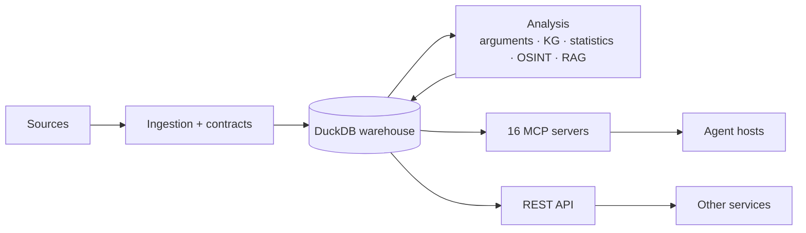

# Noesis Documentation

Noesis is a **headless knowledge engine**: it ingests documents (news, blogs,
papers, books, transcripts, datasets, filings), mines arguments and evidence
from them, and exposes everything through an **MCP capability plane** and a
**REST API** that agent hosts and other projects compose against.

For the project overview and local setup, start with the
[root README](../README.md).

## Start here

- **[System architecture](architecture/overview.md)** — the whole system with
  diagrams: ingestion pipeline, capability plane, worked claim-check flow
- **[Integrate via MCP + API](integrate-via-mcp.md)** — consuming Noesis from
  another project: server table, stdio/HTTP transport, auth, REST examples
- [Project structure](PROJECT_STRUCTURE.md) — directory layout, where things live

## Architecture & design

- [System architecture overview](architecture/overview.md) *(diagrams)*
- [Adaptive scraping](architecture/adaptive-scraping.md) *(diagrams)* — drift
  detection, extraction cascade, escalation, selector self-repair
- [MCP rearchitecture plan](architecture/MCP_REARCHITECTURE_PLAN.md) — the
  capability-plane design and its stages
- [Knowledge-engine pivot plan](architecture/KNOWLEDGE_ENGINE_PIVOT_PLAN.md) —
  claim/triple-centric knowledge-graph design
- ADRs: [tool panel annotation](architecture/ADR-001-tool-panel-annotation.md) ·
  [data plane stage 3](architecture/ADR-002-data-plane-stage3.md)
- [Exactly-once delivery design](EXACTLY_ONCE_DESIGN.md)
- [Naming conventions](naming.md) · [lineage naming](lineage_naming.md)

## Safety & security

- [Security](security.md) — API hardening, WAF, auth
- [OSINT review gate](osint-review-gate.md) — how sensitive tools are gated
- [OSINT abuse analysis](osint-abuse-analysis.md) — dual-use analysis behind
  the guardrails (no person identification, fail-closed)

## Subsystems

- **RAG:** [quickstart](rag/quickstart.md) ·
  [evaluation](rag/evaluation.md) ·
  [Qdrant / pgvector parity](rag/qdrant_parity.md)
- **MLOps:** [experiment tracking](mlops/experiments.md) ·
  [model registry](mlops/model_registry.md) ·
  [reproducibility](mlops/reproducibility_framework.md) ·
  [MLflow security](mlops/security.md)
- **Model quality:** [argument-mining benchmarks](model_benchmarks.md)
- **MCP server (legacy notes):** [noesis-mcp-server](noesis-mcp-server.md)

## Data platform

- [dbt quickstart](dbt_quickstart.md) ·
  [incremental strategy](incremental_strategy.md)
- Lakehouse: [Spark + Iceberg](lakehouse/spark-iceberg-integration.md) ·
  [Kafka → Spark → Iceberg streaming](lakehouse/kafka_spark_iceberg_streaming.md) ·
  [enrichment upsert/merge](lakehouse/enrichment_upsert_merge.md) ·
  [streaming backfill](streaming-backfill.md)

## Development

- [Test-suite repair plan](development/TEST_SUITE_REPAIR_PLAN.md) — status of
  the legacy whole-tree test job (the enforcing CI gate is
  `.github/workflows/unit-tests.yml`)
- [Graph-based search](development/GRAPH_BASED_SEARCH_IMPLEMENTATION.md) ·
  [Iceberg maintenance](development/ICEBERG_MAINTENANCE_IMPLEMENTATION.md) ·
  [OpenLineage + Marquez](development/OPENLINEAGE_MARQUEZ_IMPLEMENTATION.md)
- Milestone acceptance records:
  [agents](agent-m10-acceptance.md) ·
  [provisioning](provisioning-acceptance.md)
  ([M3](provisioning-m3-acceptance.md) ·
  [M4](provisioning-m4-acceptance.md) ·
  [P2](provisioning-p2-acceptance.md))

## Runnable examples

- [`examples/`](examples/) — tutorials and ML demos
- [`notebooks/`](notebooks/) — Jupyter notebooks

## Archive

Historical docs (Snowflake/Redshift era, the removed generative UI, per-issue
implementation writeups, old demos) live in [`archive/`](archive/README.md).
They describe past states of the system, not current guidance.
