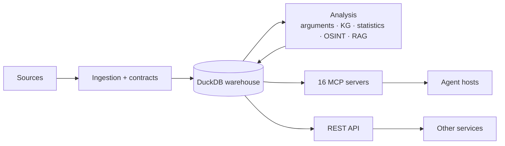

# Noesis Documentation

Noesis is a **headless knowledge engine**: it ingests documents (news, blogs,
papers, books, transcripts, datasets, filings), mines arguments and evidence
from them, and exposes everything through an **MCP capability plane** and a
**REST API** that agent hosts and other projects compose against.

For the project overview and local setup, start with the
[root README](../README.md). This page maps the documentation by topic.

## Start here

- **[Local-first CLI](guides/cli.md)** — install, initialize, ingest, ask,
  watch, export, verify, and serve without Docker or cloud credentials
- **[System architecture](architecture/overview.md)** — the whole system with
  diagrams: ingestion pipeline, capability plane, worked claim-check flow
- **[Integrate via MCP + API](integration/mcp-and-api.md)** — consuming Noesis
  from another project: server table, stdio/HTTP transport, auth, REST examples
- **[Knowledge Engine 1.0 workflow](guides/knowledge-engine-reference.md)** —
  deterministic ingest-to-export composition, receipts, recovery, and watermarks
- **[Production source packs](guides/source-packs.md)** — deployable connector
  execution, durable cursors, backfills, quarantine, schedules, and live gates
- **[Continuous knowledge maintenance](guides/knowledge-maintenance.md)** —
  lease-safe scheduled ingestion, incremental artifacts, committed generations,
  recovery, MCP operation, and the six-domain offline conformance run
- **[Snapshot-pinned research sessions](guides/research-snapshots.md)** —
  consistent multi-tool reads, generation vectors, retention pins, and expiry
- **[Epistemic status engine](guides/epistemic-status.md)** — statement kinds,
  evidence-calibrated assessments, reviewed overrides, filters, and explanations
- **[Hypothesis Workbench](guides/hypothesis-workbench.md)** — competing
  explanations, evidence links, honest comparisons, bounded plans, and replay
- **[Source identity and ownership graph](guides/source-identity.md)** — stable
  sources, reversible aliases, time-bounded control, dossiers, and independence
- **[Event-centric knowledge model](guides/event-model.md)** — immutable events,
  multilingual mentions, competing accounts, timelines, neighborhoods, and diffs
- **[Quantitative semantic layer](guides/quantitative-semantic-layer.md)** —
  versioned metrics and units, vintages, exact transformations, and comparability
- **[Unified knowledge query](guides/unified-knowledge-query.md)** — one bounded,
  evidence-preserving plane over local, temporal, memory, and federated data.
- [Project structure](development/project-structure.md) — where things live in
  the codebase

## Documentation map

| Section | What's in it |
|---|---|
| [Architecture](#architecture) | How the system works, plans, and decision records |
| [Integration](#integration) | Consuming Noesis over MCP and REST |
| [Security & safety](#security--safety) | API hardening and OSINT guardrails |
| [Subsystems](#subsystems) | Per-subsystem reference (RAG, MLOps, models) |
| [Data platform](#data-platform) | Warehouse, lakehouse, streaming, lineage |
| [Operations](#operations) | Deployment and operational guides |
| [Development](#development) | Conventions and internal deep-dives |
| [Milestones](#milestones) | Point-in-time acceptance records |

## Architecture

- [Overview](architecture/overview.md) *(diagrams)* — ingestion → warehouse →
  capability plane, with the in-code disciplines (honesty, evidence, review gate)
- [Adaptive scraping](architecture/adaptive-scraping.md) *(diagrams)* — drift
  detection, extraction cascade, escalation, selector self-repair
- [MCP rearchitecture](architecture/mcp-rearchitecture.md) — the
  capability-plane design and its stages
- [Knowledge-engine pivot](architecture/knowledge-engine-pivot.md) —
  claim/triple-centric knowledge-graph design
- [Exactly-once delivery](architecture/exactly-once-delivery.md) — streaming
  delivery guarantees
- Decision records:
  [ADR-001 tool-panel annotation](architecture/decisions/ADR-001-tool-panel-annotation.md) ·
  [ADR-002 data-plane stage 3](architecture/decisions/ADR-002-data-plane-stage3.md)

## Integration

- [CLI contract](../contracts/noesis-cli-v1.md) — stable commands, JSON
  envelopes, exit codes, privacy defaults, and compatibility policy
- [MCP + API](integration/mcp-and-api.md) — server list, stdio/HTTP transport,
  auth, and worked examples
- [MCP server notes](integration/mcp-server.md) — the standalone MCP server
- [Portable evidence bundles](../contracts/noesis-evidence-bundle-v1.md) —
  content-addressed answer, claim, integrity, and receipt exports with offline
  verification
- [Verifiable Answer v1](../contracts/noesis-answer-v1.md) — deterministic,
  statement-level answers with separate evidence, uncertainty, and refusal
  semantics
- [Claim Watch v1](../contracts/noesis-claim-watch-v1.md) — durable,
  principal-scoped evidence-change subscriptions with committed watermarks,
  replay, and opaque cursors
- [Evidence Independence Graph v1](../contracts/noesis-evidence-independence-v1.md)
  — probable reporting origins, inspectable dependency evidence, calibrated
  offline evaluation, and a truthful distinct-source fallback

## Security & safety

- [Security overview](security/overview.md) — API hardening, WAF, auth
- [OSINT review gate](security/osint-review-gate.md) — how sensitive tools are
  gated behind `NOESIS_OSINT_GATED_TOOLS`
- [OSINT abuse analysis](security/osint-abuse-analysis.md) — the dual-use
  analysis behind the guardrails (no person identification, fail-closed)

## Subsystems

- **RAG:** [quickstart](subsystems/rag/quickstart.md) ·
  [evaluation](subsystems/rag/evaluation.md) ·
  [Qdrant / pgvector parity](subsystems/rag/qdrant-parity.md)
- **MLOps:** [experiment tracking](subsystems/mlops/experiments.md) ·
  [model registry](subsystems/mlops/model-registry.md) ·
  [reproducibility](subsystems/mlops/reproducibility.md) ·
  [MLflow security](subsystems/mlops/security.md)
- **Models:** [argument-mining benchmarks](subsystems/argument-mining-benchmarks.md)

## Data platform

- [dbt quickstart](data-platform/dbt-quickstart.md) ·
  [incremental strategy](data-platform/incremental-strategy.md)
- [Lineage naming](data-platform/lineage-naming.md) — OpenLineage namespaces
- Lakehouse:
  [Spark + Iceberg](data-platform/lakehouse/spark-iceberg-integration.md) ·
  [Kafka → Spark → Iceberg streaming](data-platform/lakehouse/kafka-spark-iceberg-streaming.md) ·
  [enrichment upsert/merge](data-platform/lakehouse/enrichment-upsert-merge.md)
- [Streaming backfill](data-platform/streaming-backfill.md)

## Operations

- [AWS deployment](operations/aws-deployment.md) ·
  [CI/CD with Ansible](operations/cicd-ansible.md) ·
  [Lambda scraper automation](operations/lambda-scraper-automation.md)
- [Monitoring system](operations/monitoring-system.md) ·
  [Anti-detection scraping](operations/anti-detection.md) ·
  [Python integration](operations/python-integration.md)

## Development

- [Project structure](development/project-structure.md) ·
  [naming conventions](development/naming.md)
- [Test-suite repair plan](development/test-suite-repair-plan.md) — status of
  the legacy whole-tree test job (the enforcing gate is
  `.github/workflows/unit-tests.yml`)
- [Graph-based search](development/graph-based-search.md) ·
  [Iceberg maintenance](development/iceberg-maintenance.md) ·
  [OpenLineage + Marquez](development/openlineage-marquez.md)

## Milestones

Point-in-time acceptance records:
[agents (M10)](milestones/agent-m10.md) ·
[provisioning](milestones/provisioning.md)
([M3](milestones/provisioning-m3.md) ·
[M4](milestones/provisioning-m4.md) ·
[P2](milestones/provisioning-p2.md))

## Examples & archive

- [`examples/`](examples/) — runnable tutorials and ML demos ·
  [`notebooks/`](notebooks/) — Jupyter notebooks
- [`archive/`](archive/README.md) — historical docs (Snowflake/Redshift era,
  the removed UI, per-issue writeups, old demos); past states, not current
  guidance
