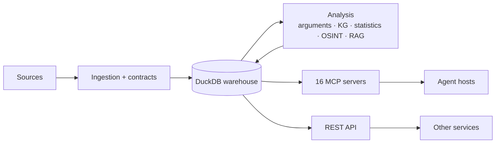

# Noesis Documentation

Noesis is a **headless knowledge engine**: it ingests documents (news, blogs,
papers, books, transcripts, datasets, filings), mines arguments and evidence
from them, and exposes everything through an **MCP capability plane** and a
**REST API** that agent hosts and other projects compose against.

```mermaid
flowchart LR
    SRC[Sources] --> ING[Ingestion + contracts] --> WH[(DuckDB warehouse)]
    WH --> AN["Analysis<br/>arguments · KG · statistics · OSINT · RAG"] --> WH
    WH --> MCP[16 MCP servers] & API[REST API]
    MCP --> HOSTS[Agent hosts]
    API --> SVCS[Other services]
```

For the project overview and local setup, start with the
[root README](../README.md). This page maps the documentation by topic.

## Start here

- **[Recurring investigation workflows](guides/investigation-workflows.md)** —
  reusable templates, cited-evidence alerts, and completed-run comparisons
- **[Local-first CLI](guides/cli.md)** — install, initialize, ingest, ask,
  watch, export, verify, and serve without Docker or cloud credentials
- **[System architecture](architecture/overview.md)** — the whole system with
  diagrams: ingestion pipeline, capability plane, worked claim-check flow
- **[Integrate via MCP + API](integration/mcp-and-api.md)** — consuming Noesis
  from another project: server table, stdio/HTTP transport, auth, REST examples
- **[Knowledge Engine 1.0 workflow](guides/knowledge-engine-reference.md)** —
  deterministic ingest-to-export composition, receipts, recovery, and watermarks
- **[Production source packs](guides/source-packs.md)** — deployable connector
  execution, durable cursors, backfills, quarantine, schedules, and live gates
- **[Continuous knowledge maintenance](guides/knowledge-maintenance.md)** —
  lease-safe scheduled ingestion, incremental artifacts, committed generations,
  recovery, MCP operation, and the six-domain offline conformance run
- **[Snapshot-pinned research sessions](guides/research-snapshots.md)** —
  consistent multi-tool reads, generation vectors, retention pins, and expiry
- **[Epistemic status engine](guides/epistemic-status.md)** — statement kinds,
  evidence-calibrated assessments, reviewed overrides, filters, and explanations
- **[Hypothesis Workbench](guides/hypothesis-workbench.md)** — competing
  explanations, evidence links, honest comparisons, bounded plans, and replay
- **[Source identity and ownership graph](guides/source-identity.md)** — stable
  sources, reversible aliases, time-bounded control, dossiers, and independence
- **[Event-centric knowledge model](guides/event-model.md)** — immutable events,
  multilingual mentions, competing accounts, timelines, neighborhoods, and diffs
- **[Quantitative semantic layer](guides/quantitative-semantic-layer.md)** —
  versioned metrics and units, vintages, exact transformations, and comparability
- **[Geospatial knowledge engine](guides/geospatial-knowledge.md)** — versioned
  places and boundaries, ambiguous geocoding, spatial receipts, and event maps
- **[Ontology alignment](guides/ontology-alignment.md)** — immutable concepts,
  sourced crosswalks, pinned validation, and bounded explainable expansion
- **[Claim evolution timelines](guides/claim-evolution-timelines.md)** — stable
  claim states, sourced lineage, successor matching, semantic diffs, and replay
- **[Evidence freshness and decay](guides/evidence-freshness.md)** — versioned
  domain policies, supersession provenance, explainable decay, safe simulation,
  and freshness propagation into knowledge products
- **[Research-gap discovery](guides/research-gaps.md)** — multidimensional
  coverage gaps, weak-support and citation-chain detection, lifecycle tracking,
  and deterministic budgeted research tasks
- **[Source acquisition planner](guides/source-acquisition-planner.md)** —
  credential-safe capabilities, constrained source selection, source-pack
  execution, checkpoints, fallbacks, and reproducible receipts
- **[Dataset intelligence](guides/dataset-intelligence.md)** — stable catalogs,
  release vintages, bounded tabular ingestion, safe joins, and exact lineage
- **[Methodology provenance](guides/methodology-provenance.md)** — versioned
  study designs, exact-locator extraction, bias reviews, and replication graphs
- **[Multimodal evidence](guides/multimodal-evidence.md)** — versioned media,
  bounded local extraction, cross-modal links, and authenticity provenance
- **[Citation preservation](guides/citation-preservation.md)** — policy-gated
  snapshots, support revalidation, link-rot monitoring, and exact archive repair
- **[Semantic change briefs](guides/change-briefs.md)** — ranked before/after
  changes, evidence-linked explanations, and deduplicated subscriber delivery
- **[Research recipes](guides/research-recipes.md)** — typed declarative DAGs,
  safe parameters, checkpointed execution, and deterministic replay receipts
- **[Knowledge quality](guides/knowledge-quality.md)** — auditable dimensions,
  calibrated aggregation, non-erasing ranking, and policy simulation
- **[Entity merge-and-split history](guides/entity-history.md)** — immutable
  identity decisions, reversible merges/splits, and selective rebuild impact
- **[Cross-language knowledge](guides/cross-language-knowledge.md)** — immutable
  original text, reviewed aliases, claim alignment, translation provenance, and
  language-fair search.
- **[Access-bound knowledge views](guides/access-bound-views.md)** — default-deny
  retrieval, safe redacted lineage, and recipient-bound portable exports.
- **[Knowledge anomalies and alerts](guides/knowledge-anomalies.md)** — replayable
  detectors, uncertain attribution, and deduplicated recoverable delivery.
- **[Knowledge retention and archival](guides/knowledge-retention.md)** — legal
  holds, verifiable checkpoints, atomic restore, and dependency-safe GC.
- **[Portable research packages](guides/research-packages.md)** — reproducible
  closure, signed/encrypted exchange, isolated import, replay, and rollback.
- **[Unified knowledge query](guides/unified-knowledge-query.md)** — one bounded,
  evidence-preserving plane over local, temporal, memory, and federated data.
- [Project structure](development/project-structure.md) — where things live in
  the codebase

## Documentation map

| Section | What's in it |
|---|---|
| [Architecture](#architecture) | How the system works, plans, and decision records |
| [Integration](#integration) | Consuming Noesis over MCP and REST |
| [Security & safety](#security--safety) | API hardening and OSINT guardrails |
| [Subsystems](#subsystems) | Per-subsystem reference (RAG, MLOps, models) |
| [Data platform](#data-platform) | Warehouse, lakehouse, streaming, lineage |
| [Operations](#operations) | Deployment and operational guides |
| [Development](#development) | Conventions and internal deep-dives |
| [Milestones](#milestones) | Point-in-time acceptance records |

## Architecture

- [Overview](architecture/overview.md) *(diagrams)* — ingestion → warehouse →
  capability plane, with the in-code disciplines (honesty, evidence, review gate)
- [Adaptive scraping](architecture/adaptive-scraping.md) *(diagrams)* — drift
  detection, extraction cascade, escalation, selector self-repair
- [MCP rearchitecture](architecture/mcp-rearchitecture.md) — the
  capability-plane design and its stages
- [Pack and workflow composition](architecture/pack-workflow-composition.md) —
  implemented shared capability architecture: resolver, readiness, lifecycle
  coordinator and authorized dispatch
- [Composition migration](architecture/composition-migration.md) — per-bundle
  ownership statements, projector record owners and the legacy paths kept
- [Knowledge-engine pivot](architecture/knowledge-engine-pivot.md) —
  claim/triple-centric knowledge-graph design
- [Exactly-once delivery](architecture/exactly-once-delivery.md) — streaming
  delivery guarantees
- Decision records:
  [ADR-001 tool-panel annotation](architecture/decisions/ADR-001-tool-panel-annotation.md) ·
  [ADR-002 data-plane stage 3](architecture/decisions/ADR-002-data-plane-stage3.md) ·
  [ADR-004 pack taxonomy](architecture/decisions/ADR-004-pack-taxonomy.md) ·
  [ADR-005 domain coverage program](architecture/decisions/ADR-005-domain-coverage-program.md)
- [Domain coverage program](roadmaps/domain-coverage-program.md) — the
  subdomain gaps in the pack taxonomy and the track that fills each one

## Integration

- [CLI contract](../contracts/noesis-cli-v1.md) — stable commands, JSON
  envelopes, exit codes, privacy defaults, and compatibility policy
- [MCP + API](integration/mcp-and-api.md) — server list, stdio/HTTP transport,
  auth, and worked examples
- [MCP server notes](integration/mcp-server.md) — the standalone MCP server
- [Information intake modes](subsystems/intake-modes.md) — durable ten-mode
  sessions, Modulo links, caller-scoped access, and outstanding native workflows
- [Portable evidence bundles](../contracts/noesis-evidence-bundle-v1.md) —
  content-addressed answer, claim, integrity, and receipt exports with offline
  verification
- [Verifiable Answer v1](../contracts/noesis-answer-v1.md) — deterministic,
  statement-level answers with separate evidence, uncertainty, and refusal
  semantics
- [Claim Watch v1](../contracts/noesis-claim-watch-v1.md) — durable,
  principal-scoped evidence-change subscriptions with committed watermarks,
  replay, and opaque cursors
- [Evidence Independence Graph v1](../contracts/noesis-evidence-independence-v1.md)
  — probable reporting origins, inspectable dependency evidence, calibrated
  offline evaluation, and a truthful distinct-source fallback

## Security & safety

- [Security overview](security/overview.md) — API hardening, WAF, auth
- [OSINT review gate](security/osint-review-gate.md) — how sensitive tools are
  gated behind `NOESIS_OSINT_GATED_TOOLS`
- [OSINT abuse analysis](security/osint-abuse-analysis.md) — the dual-use
  analysis behind the guardrails (no person identification, fail-closed)
- [OSINT passive DNS access decision](security/osint-passive-dns-access.md) —
  per-provider terms review; no passive DNS provider adopted
- [Legal sanctions guide](guides/legal-sanctions.md) — per-list designation
  statements as of a date, dual-use annex editions, reviewable identity matches
  and monitors; [source audit](roadmaps/legal-sanctions-source-audit.md)
- [Legal federal statutes guide](guides/legal-federal-statutes.md) — provisions as of a date
  (source-stated or observed), BGBl amendment acts, DIP dossiers, EU implementation links, citing
  decisions and monitors; [source audit](development/federal-statutes-evidence/source-audit.md)
- [Market BaFin notices guide](guides/market-bafin-notices.md) — voting-rights notifications with holder
  chains and corrections, managers' transactions, net short positions, the BaFin company database, warnings and
  measures as of a date under the Market publication cutoffs, issuer dossiers, ownership projection and monitors;
  [source audit](development/bafin-notices-evidence/source-audit.md)
- [Market insurance guide](guides/market-insurance.md) — EIOPA statistics by release vintage, SFCR figures
  quoted from the QRTs, NAIC under its metadata-only decision and catastrophe-loss estimates as publisher
  revisions, per insurer, market or event as of a date; [source audit](development/insurance-evidence/source-audit.md)
- [Technology vulnerabilities guide](guides/technology-vulnerabilities.md) — CVEs across NVD, OSV, GitHub,
  CVE Services, KEV and EPSS side by side, component identity review, affected-as-of impact answers and
  monitors; [source audit](roadmaps/technology-vulnerabilities-source-audit.md)
- [Political lobbying guide](guides/political-lobbying.md) — transparency-register declarations and meeting
  declarations linked to legislative dossiers, declared spend ranges as filed, reviewable identity and dossier
  links and monitors; [source audit](roadmaps/political-lobbying-source-audit.md)
- [Political elections guide](guides/political-elections.md) — contest results as published with preliminary and
  certified vintages kept apart, poll series beside (never blended into) results, reviewable party identity,
  constituency boundaries as of a date, certified-only forecast resolution, news evidence without causal reading
  and monitors; [source audit](roadmaps/political-elections-source-audit.md)
- [Political legislation guide](guides/political-legislation.md) — US Congress and UK Parliament bills as dossiers
  in the existing legislative dossier store: text versions, actions and stages, sponsors, roll calls and divisions and
  Hansard references as published, answered as of a date with reviewable member identity, lobbying and enactment
  links by citation and monitors; no passage prediction, member scoring or legal-effect summary;
  [source audit](development/legislation-evidence/source-audit.md)
- [Corporate Ownership competition guide](guides/corporate-ownership-competition.md) — European Commission, UK CMA,
  FTC and DOJ competition cases with stages, parties and decision documents as published and EU TAM state-aid awards,
  matched to ownership entities through reviewed identity: company or group to cited cases as of a date, stage history
  and aid for a beneficiary; no outcome prediction, market-power or aid-compatibility assessment;
  [source audit](development/competition-evidence/source-audit.md)
- [Political campaign finance guide](guides/political-campaign-finance.md) — FEC committees, filing versions with
  amendment chains, itemised receipts, disbursements and independent expenditures and UK Electoral Commission
  donations and spending, answered as reported totals per filing version as of a date, affiliate donations and contest
  filings with reviewable identity and monitors; individual donors minimised; no influence scoring or dark-money
  inference; [source audit and minimisation decision](development/campaign-finance-evidence/source-audit.md)
- [News fact-checks guide](guides/news-fact-checks.md) — ClaimReview fact-checks from the Google Fact Check
  Tools API and the Data Commons feed and IFCN signatory status history: a claim, claimant or news article to
  cited fact-checks as of a date with ratings as published side by side, reviewable claimant, claim and
  publisher matches, citation links and monitors; no truth verdict or rating normalisation;
  [source audit and minimisation decision](development/fact-checks-evidence/source-audit.md)
- [Legal courts and justice guide](guides/legal-courts-justice.md) — CourtListener dockets, docket entries and
  opinions on the Legal work model and FBI CDE, data.police.uk and Eurostat crime statistics: provision, court or
  party to cited dockets with quoted dispositions, place to cited statistics with definitions, vintages and
  comparability notes; no personal profiles, risk scores, safety ratings or rankings;
  [source audit](development/courts-justice-evidence/source-audit.md)
- [Economics public finance guide](guides/economics-public-finance.md) — budget plans, supplementary budgets and
  outturn vintages in each source's own hierarchy, beneficiary payments with reviewable identity, audit findings
  without verdicts, acts and dossiers linked by citation and basis-aware comparisons;
  [source audit](roadmaps/economics-public-finance-source-audit.md)
- [Economics demographics guide](guides/economics-demographics.md) — population, migration, asylum and displacement
  series with first-class definitions, geography levels and vintages, publishers side by side with comparability
  notes, boundary projections as of a release date and citation links to acts, decisions and dossiers;
  [source audit](roadmaps/economics-demographics-source-audit.md)
- [Products food composition guide](guides/products-food-composition.md) — Open Food Facts (crowd-sourced, ODbL),
  USDA FoodData Central and Ciqual (reference) ingredients, allergens, nutrient values and label claims per provider
  and label revision as of a date, reviewable GTIN identity, citation-only links to RASFF notices and monitors; no
  nutrition score, ranking or diet advice; [source audit](development/food-composition-evidence/source-audit.md)
- [Cultural media metadata guide](guides/cultural-media-metadata.md) — Open Library, MusicBrainz (CC0 core data),
  Wikidata, DNB and Library of Congress works, editions, recordings, releases, creators and authority links with
  provider revisions, reviewable identity, citation-only links to cultural objects and News entity candidates, as-of
  answers and monitors; [source audit](development/cultural-evidence/media-metadata-source-audit.md)
- [Economics trade-flows guide](guides/economics-trade-flows.md) — UN Comtrade and Eurostat Comext flows by reporter,
  partner and product as of a release, reporter and mirror figures side by side with displayed asymmetries,
  classification vintages and WITS/UNSD concordances, reviewable area and product identity, sanctions and ownership
  links by citation and monitors; no estimation, nowcast, reconciliation or evasion inference;
  [source audit](development/trade-evidence/source-audit.md)
- [Economics labour-statistics guide](guides/economics-labour-statistics.md) — ILOSTAT, OECD, Eurostat LFS and BLS
  labour indicators for a place, sector or occupation as of a release vintage, with definitions, seasonal
  adjustment, flags, comparability notes, reviewable place and classification mappings and monitors; no nowcast,
  forecast, blending or re-harmonisation; [source audit](development/labour-evidence/source-audit.md)
- [Science education-statistics guide](guides/science-education-statistics.md) — US IPEDS and ETER institution
  statistics and UNESCO UIS, OECD Education at a Glance and Eurostat R&D indicators with definitions, release
  vintages and comparability notes, ROR-keyed reviewable identity, citation links to Science and Funding records
  and monitors; no rankings, scores, merged values or derived ratios;
  [source audit](development/education-evidence/source-audit.md)
- [Economics shipping and logistics guide](guides/economics-shipping-logistics.md) — UN/LOCODE port records per
  release, UNCTADstat and Eurostat maritime series and openly licensed freight indices as of a vintage, reviewable
  port identity, trade-flow joins by shared code or citation and monitors; no freight-rate forecast or derived index;
  [source audit](roadmaps/economics-logistics-source-audit.md)
- [Clinical Evidence surveillance guide](guides/clinical-surveillance.md) — notifiable-disease and health-indicator
  series with case-definition revisions as breaks, reporting and reference dates kept apart, vintages and
  reporting-delay notes, MeSH/ICD alignment, boundary projections and explicit-citation links to trials and
  publications; [source audit](roadmaps/clinical-surveillance-source-audit.md)
- [Clinical Evidence medicines guide](guides/clinical-medicines.md) — EMA EPARs, Drugs@FDA submissions, DailyMed SPL
  versions and FDA Drug Safety Communications as authorisation, label-revision and safety-communication records with
  RxNorm identity review, section diffs, as-of answers, cited timelines and monitors;
  [source audit](roadmaps/clinical-medicines-source-audit.md)
- [Clinical Evidence health-system capacity guide](guides/clinical-health-capacity.md) — hospital beds, health
  workforce and expenditure by financing scheme from WHO GHO, OECD Health Statistics and Eurostat with definitions,
  definition breaks, comparability notes and vintages, place resolution, surveillance co-display and monitors;
  [source audit](roadmaps/clinical-health-capacity-source-audit.md)
- [Products pack guide: safety notices and recalls](guides/products-pack.md#safety-notices-and-recalls) — EU Safety
  Gate alerts, CPSC and NHTSA recalls and RASFF notifications with every revision, verbatim hazard, affected
  identification and corrective action, reviewable matches to Products identities on GTIN, brand and model,
  standards and acts linked by citation, as-of answers and monitors; no safety verdict or advice;
  [source audit](roadmaps/products-safety-source-audit.md)
- [Funding development-finance guide](guides/funding-development-finance.md) — IATI aid activities per publisher
  with transactions, participating organisations, allocations, results and version history, OECD CRS aggregates as
  vintaged statistics, World Bank projects linked by stated identifiers, reviewable organisation identity with an
  open-call cross-reference, as-of answers with publisher coverage and monitors; no totals across publishers and no
  impact judgement; [source audit](roadmaps/development-finance-source-audit.md)
- [Weather pack guide](guides/weather-pack.md) — operational observations with QC flags and location
  vintages, forecasts as issued, CAP warnings in force and verification of published forecasts;
  [source audit](development/weather-evidence/source-audit.md), [record contract](contracts/weather-records.md)
- [On-chain Observations guide](guides/onchain-observations.md) — cited public-ledger transactions, token
  transfers, contract deployer and first-funding chains for one explicit address, transaction or contract, quoted
  label assertions and probable address clustering with declared heuristics, a null model and a measured
  false-positive rate; no attribution verdicts, no person linkage, no wallet or submission capability;
  [source access audit](security/onchain-source-access.md)
- [Chemicals and Substances guide](guides/chemicals-substances.md) — from a substance name, CAS/EC number, InChIKey
  or DTXSID to a cited dossier: reviewable identity across PubChem, ECHA and CompTox, harmonised and notified CLP
  classifications with every ATP revision, REACH registration, SVHC and Annex XIV/XVII status as of a date, the
  regulation text and product notices linked by citation, published data points and monitors; no hazard verdict,
  safety advice or synthesis information; [source audit](roadmaps/chemicals-substances-source-audit.md)
- [Natural Hazards pack guide](guides/natural-hazards-pack.md) — earthquakes (USGS with PAGER, EMSC), GDACS
  multi-hazard episodes, NHC advisories as issued, EFFIS burnt areas and key-gated GloFAS notifications for a place
  and window, with every parameter revision, reviewable cross-source correspondences, alerts in force and monitors;
  no prediction, risk scores, damage estimates or safety advice;
  [source audit](development/hazards-evidence/source-audit.md)
- [Materials pack guide](guides/materials-pack.md) — condition-aware material properties from Materials Project,
  JARVIS-DFT, OQMD, the NIST WebBook and COD with measured vs computed provenance, exact units, reviewable
  phase-level identity (polymorphs never merge), comparison only of comparable values, cited papers and standards
  and release tracking; no averaging or prediction; [source audit](development/materials-evidence/source-audit.md)
- [Astronomy and Space guide](guides/astronomy-space.md) — a small body's MPC designations and identifications
  and MPC/JPL orbit solution vintages, quoted Sentry listings, NASA Exoplanet Archive dispositions per table, GCAT
  and CelesTrak launches and objects and NOAA SWPC alerts as of a date, linked to Science papers by bibcode or DOI,
  with reviewable identity and monitors; no orbit determination, risk verdict or disposition by Noesis;
  [source audit](development/astronomy-evidence/source-audit.md)
- [Space-object registration guide](guides/astronomy-space-object-registration.md) — an object's UN registration
  (document symbol, locator, verbatim entry), transfers of supervision, status notices, operators as published and
  Aerospace/DISCOS re-entry predictions and confirmed reports as of a date, linked to SATCAT objects and entities
  through reviewable identity; no re-entry prediction or attribution beyond published records;
  [source audit](development/astronomy-evidence/space-object-registration-audit.md)
- [Linguistics guide](guides/linguistics.md) — word-centred lexemes, forms, senses and definition revisions from
  Wikidata lexemes and Wiktionary, cited etymology chains, languages and dialects resolved to Glottocode and
  ISO 639-3 through reviewable identity, WALS typological profiles and monitors; CC BY-SA attribution travels
  with Wiktionary output, and no machine translation is presented as sourced;
  [source audit](development/linguistics-evidence/source-audit.md)
- [Energy Systems guide](guides/energy-systems.md) — generation by fuel, load, day-ahead prices, installed
  capacity (zone and plant/unit), cross-border flows and energy balances as published by ENTSO-E, US EIA, Ember,
  Eurostat and Energy-Charts, each release a vintage with status and as-of time, reviewable zone/country/plant
  identity, citation-only links to climate-environment and market, as-of answers with revision history and
  monitors; no forecasting, dispatch modelling, emissions estimation or trading advice;
  [source audit](roadmaps/energy-systems-source-audit.md)
- [Climate and Environment biodiversity guide](guides/climate-environment-biodiversity.md) — from a taxon or place to
  cited GBIF occurrences with dataset provenance, licence, coordinate uncertainty and publisher generalisation,
  Catalogue of Life names and releases, and IUCN conservation status history at citation level; reviewable taxon
  identity, as-of answers and monitors; no distribution modelling, abundance or derived threat status;
  [source audit](development/biodiversity-evidence/source-audit.md)
- [Climate and Environment water guide](guides/climate-environment-water.md) — from a place, river or station to
  cited PEGELONLINE and USGS water levels and discharge with quality state (provisional or approved), gauge zero and
  datum vintages, and EEA WISE water-body status per reporting cycle; reviewable place matches, cross-pack links,
  as-of answers and monitors; no forecasting, gap filling, own status assessment or flood-risk scoring;
  [source audit](development/water-evidence/source-audit.md)
- [Fisheries and Maritime Activity guide](guides/fisheries-maritime.md) — from a vessel, flag state, fishing area or
  species to cited ICCAT, WCPFC and IOTC authorisations with register snapshots, IUU listings and delistings (and the
  Combined IUU Vessel List citing them), GFW apparent fishing-effort aggregates and FAO FishStat catch per release,
  with reviewable vessel identity, sanctions and area citations and monitors; no illegal-fishing inference or
  enforcement recommendation; [source audit](development/fisheries-evidence/source-audit.md)
- [Humanitarian Response and Conflict Events guide](guides/humanitarian-response.md) — ReliefWeb situation
  reports, appeals and crises, HDX dataset revisions with HXL tags and UCDP conflict events with each coder's
  precision codes and release history, per place or crisis as of a date, with reviewable identity, citation links
  and monitors; no casualty estimation, merged counts, forecasts or personal data, ACLED not acquired (licence);
  [source audit](development/humanitarian-evidence/source-audit.md)
- [Agriculture and Food Systems guide](guides/agrifood-series.md) — from a commodity and place to published
  production, yield, area, prices and food balances per source (FAOSTAT, NASS Quick Stats, FAS PSD, Eurostat, Agri-food
  portal) with flags verbatim, release vintages and as-of selection, reviewable commodity crosswalks, citation links to
  trade flows, climate/weather and RASFF alerts, and monitors; no forecasting or food-security scoring;
  [source audit](roadmaps/agrifood-source-audit.md)
- [Geospatial critical infrastructure guide](guides/geospatial-infrastructure.md) — power plants, pipelines, LNG terminals,
  transmission lines and substations from WRI GPPD, Global Energy Monitor, OpenStreetMap (Overpass), EIA and ENTSOG
  with status and capacity revisions, owner assertions as published, reviewable reconciliation and operator matches,
  place and operator answers as of a date and monitors; no vulnerability assessment or valuation;
  [source audit](development/infrastructure-evidence/source-audit.md)
- [Geospatial housing guide](guides/geospatial-housing.md) — land-value zones with valuation dates, Mietspiegel
  editions and cells, development-plan stages, Wohnlagen, permit and completion statistics and Destatis vintages
  projected onto an address, parcel or district as of a date, with citation links and monitors; no valuation or
  advice and no interpolated value; [source audit](roadmaps/geospatial-housing-source-audit.md)
- [Web archive provenance guide](guides/platform-web-archives.md) — what a cited URL said on a date and according
  to which archive, across the Time Travel aggregator, Internet Archive, UK Web Archive, Arquivo.pt and Common Crawl
  (Memento, RFC 7089), with digests, reviewable URL matches, citation pins exported with evidence, link-rot monitors
  and Save Page Now behind a write scope (off by default); archive.today excluded by access decision;
  [archive audit](roadmaps/platform-web-archives-source-audit.md)
- [Geospatial real estate guide](guides/geospatial-real-estate.md) — from a place or parcel to HM Land Registry Price
  Paid transactions (with change and deletion rows), UK HPI and Eurostat house price indices by release vintage, French
  DVF mutations with parcel ids and INSPIRE cadastral parcels with revisions, as of a date with citations, reviewable
  identity, citation links and monitors; no valuation, owner profiling or investment advice;
  [source audit](roadmaps/geospatial-real-estate-source-audit.md)
- [OSINT pack guide](guides/osint-pack.md) — Admiralty grades, ownership
  dossiers, video reuse, registry and certificate history, infrastructure
  pivots and the gated imagery tier
- [Aircraft and vessel movements guide](guides/osint-movements.md) — the OSINT pack's optional movements
  feature: FAA and G-INFO registry revisions, bounded OpenSky and open AIS samples with receiver-coverage caveats,
  GFW port visits, derived calls, reviewable identity and sanctions citations for one named aircraft or vessel and
  window; no real-time tracking or mirroring; [access decision](security/osint-movements-access.md)

## Subsystems

- **RAG:** [quickstart](subsystems/rag/quickstart.md) ·
  [evaluation](subsystems/rag/evaluation.md) ·
  [Qdrant / pgvector parity](subsystems/rag/qdrant-parity.md)
- **MLOps:** [experiment tracking](subsystems/mlops/experiments.md) ·
  [model registry](subsystems/mlops/model-registry.md) ·
  [reproducibility](subsystems/mlops/reproducibility.md) ·
  [MLflow security](subsystems/mlops/security.md)
- **Models:** [argument-mining benchmarks](subsystems/argument-mining-benchmarks.md)

## Data platform

- [dbt quickstart](data-platform/dbt-quickstart.md) ·
  [incremental strategy](data-platform/incremental-strategy.md)
- [Lineage naming](data-platform/lineage-naming.md) — OpenLineage namespaces
- Lakehouse:
  [Spark + Iceberg](data-platform/lakehouse/spark-iceberg-integration.md) ·
  [Kafka → Spark → Iceberg streaming](data-platform/lakehouse/kafka-spark-iceberg-streaming.md) ·
  [enrichment upsert/merge](data-platform/lakehouse/enrichment-upsert-merge.md)
- [Streaming backfill](data-platform/streaming-backfill.md)

## Operations

- [AWS deployment](operations/aws-deployment.md) ·
  [CI/CD with Ansible](operations/cicd-ansible.md) ·
  [Lambda scraper automation](operations/lambda-scraper-automation.md)
- [Monitoring system](operations/monitoring-system.md) ·
  [Anti-detection scraping](operations/anti-detection.md) ·
  [Python integration](operations/python-integration.md)

## Development

- [Project structure](development/project-structure.md) ·
  [naming conventions](development/naming.md)
- [Test-suite repair plan](development/test-suite-repair-plan.md) — status of
  the legacy whole-tree test job (the enforcing gate is
  `.github/workflows/unit-tests.yml`)
- [Graph-based search](development/graph-based-search.md) ·
  [Iceberg maintenance](development/iceberg-maintenance.md) ·
  [OpenLineage + Marquez](development/openlineage-marquez.md)

## Milestones

Point-in-time acceptance records:
[agents (M10)](milestones/agent-m10.md) ·
[provisioning](milestones/provisioning.md)
([M3](milestones/provisioning-m3.md) ·
[M4](milestones/provisioning-m4.md) ·
[P2](milestones/provisioning-p2.md))

## Examples & archive

- [`examples/`](examples/) — runnable tutorials and ML demos ·
  [`notebooks/`](notebooks/) — Jupyter notebooks
- [`archive/`](archive/README.md) — historical docs (Snowflake/Redshift era,
  the removed UI, per-issue writeups, old demos); past states, not current
  guidance
