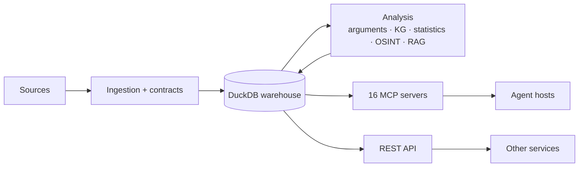

# Noesis Documentation

Noesis is a **headless knowledge engine**: it ingests documents (news, blogs,
papers, books, transcripts, datasets, filings), mines arguments and evidence
from them, and exposes everything through an **MCP capability plane** and a
**REST API** that agent hosts and other projects compose against.

```mermaid
flowchart LR
    SRC[Sources] --> ING[Ingestion + contracts] --> WH[(DuckDB warehouse)]
    WH --> AN["Analysis<br/>arguments · KG · statistics · OSINT · RAG"] --> WH
    WH --> MCP[16 MCP servers] & API[REST API]
    MCP --> HOSTS[Agent hosts]
    API --> SVCS[Other services]
```

For the project overview and local setup, start with the
[root README](../README.md). This page maps the documentation by topic.

## Start here

- **[Recurring investigation workflows](guides/investigation-workflows.md)** —
  reusable templates, cited-evidence alerts, and completed-run comparisons
- **[Local-first CLI](guides/cli.md)** — install, initialize, ingest, ask,
  watch, export, verify, and serve without Docker or cloud credentials
- **[System architecture](architecture/overview.md)** — the whole system with
  diagrams: ingestion pipeline, capability plane, worked claim-check flow
- **[Integrate via MCP + API](integration/mcp-and-api.md)** — consuming Noesis
  from another project: server table, stdio/HTTP transport, auth, REST examples
- **[Knowledge Engine 1.0 workflow](guides/knowledge-engine-reference.md)** —
  deterministic ingest-to-export composition, receipts, recovery, and watermarks
- **[Production source packs](guides/source-packs.md)** — deployable connector
  execution, durable cursors, backfills, quarantine, schedules, and live gates
- **[Continuous knowledge maintenance](guides/knowledge-maintenance.md)** —
  lease-safe scheduled ingestion, incremental artifacts, committed generations,
  recovery, MCP operation, and the six-domain offline conformance run
- **[Snapshot-pinned research sessions](guides/research-snapshots.md)** —
  consistent multi-tool reads, generation vectors, retention pins, and expiry
- **[Epistemic status engine](guides/epistemic-status.md)** — statement kinds,
  evidence-calibrated assessments, reviewed overrides, filters, and explanations
- **[Hypothesis Workbench](guides/hypothesis-workbench.md)** — competing
  explanations, evidence links, honest comparisons, bounded plans, and replay
- **[Source identity and ownership graph](guides/source-identity.md)** — stable
  sources, reversible aliases, time-bounded control, dossiers, and independence
- **[Event-centric knowledge model](guides/event-model.md)** — immutable events,
  multilingual mentions, competing accounts, timelines, neighborhoods, and diffs
- **[Quantitative semantic layer](guides/quantitative-semantic-layer.md)** —
  versioned metrics and units, vintages, exact transformations, and comparability
- **[Geospatial knowledge engine](guides/geospatial-knowledge.md)** — versioned
  places and boundaries, ambiguous geocoding, spatial receipts, and event maps
- **[Ontology alignment](guides/ontology-alignment.md)** — immutable concepts,
  sourced crosswalks, pinned validation, and bounded explainable expansion
- **[Claim evolution timelines](guides/claim-evolution-timelines.md)** — stable
  claim states, sourced lineage, successor matching, semantic diffs, and replay
- **[Evidence freshness and decay](guides/evidence-freshness.md)** — versioned
  domain policies, supersession provenance, explainable decay, safe simulation,
  and freshness propagation into knowledge products
- **[Research-gap discovery](guides/research-gaps.md)** — multidimensional
  coverage gaps, weak-support and citation-chain detection, lifecycle tracking,
  and deterministic budgeted research tasks
- **[Source acquisition planner](guides/source-acquisition-planner.md)** —
  credential-safe capabilities, constrained source selection, source-pack
  execution, checkpoints, fallbacks, and reproducible receipts
- **[Dataset intelligence](guides/dataset-intelligence.md)** — stable catalogs,
  release vintages, bounded tabular ingestion, safe joins, and exact lineage
- **[Methodology provenance](guides/methodology-provenance.md)** — versioned
  study designs, exact-locator extraction, bias reviews, and replication graphs
- **[Multimodal evidence](guides/multimodal-evidence.md)** — versioned media,
  bounded local extraction, cross-modal links, and authenticity provenance
- **[Citation preservation](guides/citation-preservation.md)** — policy-gated
  snapshots, support revalidation, link-rot monitoring, and exact archive repair
- **[Semantic change briefs](guides/change-briefs.md)** — ranked before/after
  changes, evidence-linked explanations, and deduplicated subscriber delivery
- **[Research recipes](guides/research-recipes.md)** — typed declarative DAGs,
  safe parameters, checkpointed execution, and deterministic replay receipts
- **[Knowledge quality](guides/knowledge-quality.md)** — auditable dimensions,
  calibrated aggregation, non-erasing ranking, and policy simulation
- **[Entity merge-and-split history](guides/entity-history.md)** — immutable
  identity decisions, reversible merges/splits, and selective rebuild impact
- **[Cross-language knowledge](guides/cross-language-knowledge.md)** — immutable
  original text, reviewed aliases, claim alignment, translation provenance, and
  language-fair search.
- **[Access-bound knowledge views](guides/access-bound-views.md)** — default-deny
  retrieval, safe redacted lineage, and recipient-bound portable exports.
- **[Knowledge anomalies and alerts](guides/knowledge-anomalies.md)** — replayable
  detectors, uncertain attribution, and deduplicated recoverable delivery.
- **[Knowledge retention and archival](guides/knowledge-retention.md)** — legal
  holds, verifiable checkpoints, atomic restore, and dependency-safe GC.
- **[Portable research packages](guides/research-packages.md)** — reproducible
  closure, signed/encrypted exchange, isolated import, replay, and rollback.
- **[Unified knowledge query](guides/unified-knowledge-query.md)** — one bounded,
  evidence-preserving plane over local, temporal, memory, and federated data.
- [Project structure](development/project-structure.md) — where things live in
  the codebase

## Documentation map

| Section | What's in it |
|---|---|
| [Architecture](#architecture) | How the system works, plans, and decision records |
| [Integration](#integration) | Consuming Noesis over MCP and REST |
| [Security & safety](#security--safety) | API hardening and OSINT guardrails |
| [Subsystems](#subsystems) | Per-subsystem reference (RAG, MLOps, models) |
| [Data platform](#data-platform) | Warehouse, lakehouse, streaming, lineage |
| [Operations](#operations) | Deployment and operational guides |
| [Development](#development) | Conventions and internal deep-dives |
| [Milestones](#milestones) | Point-in-time acceptance records |

## Architecture

- [Overview](architecture/overview.md) *(diagrams)* — ingestion → warehouse →
  capability plane, with the in-code disciplines (honesty, evidence, review gate)
- [Adaptive scraping](architecture/adaptive-scraping.md) *(diagrams)* — drift
  detection, extraction cascade, escalation, selector self-repair
- [MCP rearchitecture](architecture/mcp-rearchitecture.md) — the
  capability-plane design and its stages
- [Pack and workflow composition](architecture/pack-workflow-composition.md) —
  implemented shared capability architecture: resolver, readiness, lifecycle
  coordinator and authorized dispatch
- [Composition migration](architecture/composition-migration.md) — per-bundle
  ownership statements, projector record owners and the legacy paths kept
- [Knowledge-engine pivot](architecture/knowledge-engine-pivot.md) —
  claim/triple-centric knowledge-graph design
- [Exactly-once delivery](architecture/exactly-once-delivery.md) — streaming
  delivery guarantees
- Decision records:
  [ADR-001 tool-panel annotation](architecture/decisions/ADR-001-tool-panel-annotation.md) ·
  [ADR-002 data-plane stage 3](architecture/decisions/ADR-002-data-plane-stage3.md)

## Integration

- [CLI contract](../contracts/noesis-cli-v1.md) — stable commands, JSON
  envelopes, exit codes, privacy defaults, and compatibility policy
- [MCP + API](integration/mcp-and-api.md) — server list, stdio/HTTP transport,
  auth, and worked examples
- [MCP server notes](integration/mcp-server.md) — the standalone MCP server
- [Information intake modes](subsystems/intake-modes.md) — durable ten-mode
  sessions, Modulo links, caller-scoped access, and outstanding native workflows
- [Portable evidence bundles](../contracts/noesis-evidence-bundle-v1.md) —
  content-addressed answer, claim, integrity, and receipt exports with offline
  verification
- [Verifiable Answer v1](../contracts/noesis-answer-v1.md) — deterministic,
  statement-level answers with separate evidence, uncertainty, and refusal
  semantics
- [Claim Watch v1](../contracts/noesis-claim-watch-v1.md) — durable,
  principal-scoped evidence-change subscriptions with committed watermarks,
  replay, and opaque cursors
- [Evidence Independence Graph v1](../contracts/noesis-evidence-independence-v1.md)
  — probable reporting origins, inspectable dependency evidence, calibrated
  offline evaluation, and a truthful distinct-source fallback

## Security & safety

- [Security overview](security/overview.md) — API hardening, WAF, auth
- [OSINT review gate](security/osint-review-gate.md) — how sensitive tools are
  gated behind `NOESIS_OSINT_GATED_TOOLS`
- [OSINT abuse analysis](security/osint-abuse-analysis.md) — the dual-use
  analysis behind the guardrails (no person identification, fail-closed)
- [OSINT passive DNS access decision](security/osint-passive-dns-access.md) —
  per-provider terms review; no passive DNS provider adopted
- [Legal sanctions guide](guides/legal-sanctions.md) — per-list designation
  statements as of a date, dual-use annex editions, reviewable identity matches
  and monitors; [source audit](roadmaps/legal-sanctions-source-audit.md)
- [Technology vulnerabilities guide](guides/technology-vulnerabilities.md) — CVEs across NVD, OSV, GitHub,
  CVE Services, KEV and EPSS side by side, component identity review, affected-as-of impact answers and
  monitors; [source audit](roadmaps/technology-vulnerabilities-source-audit.md)
- [Political lobbying guide](guides/political-lobbying.md) — transparency-register declarations and meeting
  declarations linked to legislative dossiers, declared spend ranges as filed, reviewable identity and dossier
  links and monitors; [source audit](roadmaps/political-lobbying-source-audit.md)
- [Political elections guide](guides/political-elections.md) — contest results as published with preliminary and
  certified vintages kept apart, poll series beside (never blended into) results, reviewable party identity,
  constituency boundaries as of a date, certified-only forecast resolution, news evidence without causal reading
  and monitors; [source audit](roadmaps/political-elections-source-audit.md)
- [Economics public finance guide](guides/economics-public-finance.md) — budget plans, supplementary budgets and
  outturn vintages in each source's own hierarchy, beneficiary payments with reviewable identity, audit findings
  without verdicts, acts and dossiers linked by citation and basis-aware comparisons;
  [source audit](roadmaps/economics-public-finance-source-audit.md)
- [Economics demographics guide](guides/economics-demographics.md) — population, migration, asylum and displacement
  series with first-class definitions, geography levels and vintages, publishers side by side with comparability
  notes, boundary projections as of a release date and citation links to acts, decisions and dossiers;
  [source audit](roadmaps/economics-demographics-source-audit.md)
- [Clinical Evidence surveillance guide](guides/clinical-surveillance.md) — notifiable-disease and health-indicator
  series with case-definition revisions as breaks, reporting and reference dates kept apart, vintages and
  reporting-delay notes, MeSH/ICD alignment, boundary projections and explicit-citation links to trials and
  publications; [source audit](roadmaps/clinical-surveillance-source-audit.md)
- [Products pack guide: safety notices and recalls](guides/products-pack.md#safety-notices-and-recalls) — EU Safety
  Gate alerts, CPSC and NHTSA recalls and RASFF notifications with every revision, verbatim hazard, affected
  identification and corrective action, reviewable matches to Products identities on GTIN, brand and model,
  standards and acts linked by citation, as-of answers and monitors; no safety verdict or advice;
  [source audit](roadmaps/products-safety-source-audit.md)
- [Funding development-finance guide](guides/funding-development-finance.md) — IATI aid activities per publisher
  with transactions, participating organisations, allocations, results and version history, OECD CRS aggregates as
  vintaged statistics, World Bank projects linked by stated identifiers, reviewable organisation identity with an
  open-call cross-reference, as-of answers with publisher coverage and monitors; no totals across publishers and no
  impact judgement; [source audit](roadmaps/development-finance-source-audit.md)
- [On-chain Observations guide](guides/onchain-observations.md) — cited public-ledger transactions, token
  transfers, contract deployer and first-funding chains for one explicit address, transaction or contract, quoted
  label assertions and probable address clustering with declared heuristics, a null model and a measured
  false-positive rate; no attribution verdicts, no person linkage, no wallet or submission capability;
  [source access audit](security/onchain-source-access.md)
- [Geospatial housing guide](guides/geospatial-housing.md) — land-value zones with valuation dates, Mietspiegel
  editions and cells, development-plan stages, Wohnlagen, permit and completion statistics and Destatis vintages
  projected onto an address, parcel or district as of a date, with citation links and monitors; no valuation or
  advice and no interpolated value; [source audit](roadmaps/geospatial-housing-source-audit.md)
- [OSINT pack guide](guides/osint-pack.md) — Admiralty grades, ownership
  dossiers, video reuse, registry and certificate history, infrastructure
  pivots and the gated imagery tier

## Subsystems

- **RAG:** [quickstart](subsystems/rag/quickstart.md) ·
  [evaluation](subsystems/rag/evaluation.md) ·
  [Qdrant / pgvector parity](subsystems/rag/qdrant-parity.md)
- **MLOps:** [experiment tracking](subsystems/mlops/experiments.md) ·
  [model registry](subsystems/mlops/model-registry.md) ·
  [reproducibility](subsystems/mlops/reproducibility.md) ·
  [MLflow security](subsystems/mlops/security.md)
- **Models:** [argument-mining benchmarks](subsystems/argument-mining-benchmarks.md)

## Data platform

- [dbt quickstart](data-platform/dbt-quickstart.md) ·
  [incremental strategy](data-platform/incremental-strategy.md)
- [Lineage naming](data-platform/lineage-naming.md) — OpenLineage namespaces
- Lakehouse:
  [Spark + Iceberg](data-platform/lakehouse/spark-iceberg-integration.md) ·
  [Kafka → Spark → Iceberg streaming](data-platform/lakehouse/kafka-spark-iceberg-streaming.md) ·
  [enrichment upsert/merge](data-platform/lakehouse/enrichment-upsert-merge.md)
- [Streaming backfill](data-platform/streaming-backfill.md)

## Operations

- [AWS deployment](operations/aws-deployment.md) ·
  [CI/CD with Ansible](operations/cicd-ansible.md) ·
  [Lambda scraper automation](operations/lambda-scraper-automation.md)
- [Monitoring system](operations/monitoring-system.md) ·
  [Anti-detection scraping](operations/anti-detection.md) ·
  [Python integration](operations/python-integration.md)

## Development

- [Project structure](development/project-structure.md) ·
  [naming conventions](development/naming.md)
- [Test-suite repair plan](development/test-suite-repair-plan.md) — status of
  the legacy whole-tree test job (the enforcing gate is
  `.github/workflows/unit-tests.yml`)
- [Graph-based search](development/graph-based-search.md) ·
  [Iceberg maintenance](development/iceberg-maintenance.md) ·
  [OpenLineage + Marquez](development/openlineage-marquez.md)

## Milestones

Point-in-time acceptance records:
[agents (M10)](milestones/agent-m10.md) ·
[provisioning](milestones/provisioning.md)
([M3](milestones/provisioning-m3.md) ·
[M4](milestones/provisioning-m4.md) ·
[P2](milestones/provisioning-p2.md))

## Examples & archive

- [`examples/`](examples/) — runnable tutorials and ML demos ·
  [`notebooks/`](notebooks/) — Jupyter notebooks
- [`archive/`](archive/README.md) — historical docs (Snowflake/Redshift era,
  the removed UI, per-issue writeups, old demos); past states, not current
  guidance
